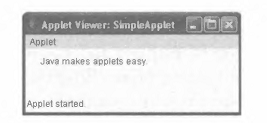
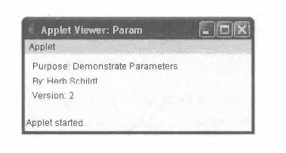

# Глава 14
# Апплеты, события и прочее
Основные навыки и понятия
* Представление об апплетах
* Архитектура апплетов
* Создание заготовок апплетов
* Инициализация и завершение апплетов
* Перерисовка содержимого окон апплетов
* Вывод данных в окне состояния
* Передача параметров апплетам
* Представление о классе Applet
* Применение модели делегирования событий
* Описание остальных ключевых слов Java

Цель данной книги — поведать читателю об основных элементах Java, и мы близки
к завершению этого повествования. Тринадцать предыдущих глав были посвящены тем средствам, которые определяют Java как язык программирования, в том числе
ключевым словам, синтаксису, блочной структуре, правилам преобразования типов
и т.д. Теперь у вас должно быть достаточно знаний, чтобы писать реальные программы
на Java. Но еще остаются вопросы программирования, которые невозможно разрешить
с помощью ключевых слов, и поэтому приходится обращаться к классам API и специальным технологиям. В этой главе речь пойдет об апплетах и событиях.
Следует, однако, иметь в виду, что темы апплетов и событий довольно обширны,
а полное и подробное их изложение выходит за рамки этой книги. Поэтому апплеты
и события будут рассмотрены в этой главе лишь в самых общих чертах, хотя и проиллюстрированы на ряде примеров. Но не следует забывать, что это только самые основы.
И тем не менее, усвоив эти основы, вы сможете опереться на них как на прочный фундамент для пополнения своих знаний и совершенствования навыков программирования
на Java.
В конце этой главы приводится описание ключевых слов Java, которые еще не рассматривались в данной книге, например instanceof и native. Эти языковые средства
предназначены для решения более сложных задач программирования на Java, а здесь
они рассматриваются ради полноты представления об этом языке.

## Общее представление об апплетах
Апплеты существенно отличаются от всех программ, примеры которых были рассмотрены в предыдущих главах. Как пояснялось в главе 1, апплеты — это небольшие прикладные программы, предназначенные для передачи через Интернет и выполнения в веббраузере. В виртуальной машине Java поддерживаются все типы программ на Java, в том
числе и апплеты, что дает возможность обеспечить достаточный уровень безопасности
при динамической загрузке апплетов и последующем их выполнении в веб-браузере.
Глава 14. Апплеты, события и прочее 489.
Прежде всего, апплеты подразделяются на две категории: те, что создаются на основе
библиотеки Abstract Window Toolkit (AWT), и те, что создаются на основе библиотеки
Swing. В апплетах обеих категорий поддерживается графический пользовательский интерфейс. Причем AWT позволяет работать с обычными элементами пользовательского
интерфейса, a Swing — с альтернативными им упрощенными компонентами. В этой главе рассматриваются апплеты, создаваемые на основе библиотеки AWT, тогда как библиотеке Swing посвящена глава 15. Следует, однако, иметь в виду, что в апплетах на основе
Swing используется та же самая архитектура, что и в апплетах на основе AWT. Более того,
библиотека Swing построена на основе библиотеки AWT. Поэтому сведения и приемы
программирования, представленные в этой главе, в равной степени относятся к обеим
категориям апплетов.
Перед тем как приступить к подробному изложению теоретических вопросов, рассмотрим простой пример апплета. Он выполняет лишь одно действие: отображает
в окне строку "Java makes applets easy" (Java упрощает создание апплетов).
// Апплет с минимальными функциональными возможностями,
import java.awt.*; // Обратите внимание на эти операторы.
import java.applet.*;
public class SimpleApplet extends Applet {
public void paint(Graphics g) {
// Вывод символьной строки в окне апплета.
g.drawstring("Java makes applets easy.", 20, 20);
}
}
В начале апплета находятся два оператора import. С помощью первого из них импортируются классы из библиотеки Abstract Window Toolkit. Благодаря тому что в состав
этой библиотеки входят средства поддержки оконного графического пользовательского
интерфейса, апплеты (прямо или косвенно) взаимодействуют с пользователями именно
через такой интерфейс, а не через консольный ввод-вывод. Как и следовало ожидать,
размеры библиотеки AWT достаточно велики, поэтому подробное обсуждение всех ее
возможностей выходит за рамки этой книги. Но поскольку в этой главе речь идет о создании лишь самых простых апплетов, то средства AWT будут использоваться в ней очень
ограниченно. Во втором операторе import импортируется пакет applet, в который
входит класс Applet. Любой апплет должен быть (прямо или косвенно) подклассом,
производным от этого класса.
В следующей строке кода объявляется класс SimpleApplet, который должен быть
открытым (public), поскольку доступ к нему будет осуществляться извне.
В классе SimpleApplet объявляется метод paint (). Этот метод является членом
класса Component из библиотеки AWT, являющегося суперклассом по отношению
к классу Applet, и должен переопределяться в апплете. Метод paint () вызывается всякий раз, когда в апплете должны быть обновлены выводимые данные. Такой вызов может быть сделан по разным причинам. Например, окно, в котором присутствует апплет,
может быть перекрыто другим окном, а затем снова переведено на передний план. Окно
может быть также свернуто, а затем развернуто до обычных размеров. Метод paint ()
всегда вызывается в начале выполнения апплета. Этому методу передается один параметр, который представляет собой объект типа Graphics. В этом объекте содержится
графический контекст, описывающий среду, в которой выполняется апплет. Этот контекст используется в тех случаях, когда требуется вывести данные в окне апплета.
В теле метода paint () вызывается метод drawstring (), который является членом
класса Graphics. Этот метод служит для вывода текстовой строки в окне апплета, начиная с точки с координатами X,Y. Общая форма его объявления имеет следующий вид:
void drawString(String сообщение, int х, int у) 1
где сообщение. — это символьная строка, которая должна быть выведена начиная с точки, имеющей координаты х,у. В Java верхний левый угол окна принято обозначать координатами 0,0. Вызов метода drawString () в рассматриваемом здесь апплете приводит к выводу в его окне сообщения, начиная с точки, имеющей координаты 20,20.
Обратите внимание на то, что в рассматриваемом здесь апплете отсутствует метод
main (). Выполнение апплета начинается не так, как выполнение программ из примеров, рассмотренных ранее в этой книге. Сигналом к началу работы апплета служит передача имени класса браузеру или другой программе, допускающей выполнение апплетов.
Исходный код класса SimpleApplet компилируется таким же образом, как и примеры предыдущих программ. А запуск апплета на выполнение осуществляется иначе:
средствами браузера или инструментального средства разработки, специально предназначенного для просмотра апплетов. Такое инструментальное средство входит в стандартный пакет JDK и называется appletviewer. Именно им следует пользоваться для
выполнения апплетов, примеры которых приведены в этой главе. Разумеется, ничто не
мешает вам употреблять для этой цели браузер, но на стадии разработки пользоваться
средством просмотра appletviewer намного удобнее.
Для выполнения апплета (средствами браузера или appletviewer) можно, в частности, составить небольшой файл HTML-документа, который содержит дескриптор для
загрузки апплета. В настоящее время компания Oracle рекомендует использовать для
этой цели дескриптор APPLET. (С той же целью можно также воспользоваться дескриптором OBJECT или другими доступными методиками развертывания прикладных программ. За более подробными сведениями по данному вопросу обращайтесь к документации на Java.) Ниже приведен код из HTML-документа, с помощью которого запускается
апплет SimpleApplet.
<applet code=MSimpleApplet" width=200 height=60>
</applet>
Атрибуты width и height задают размеры области отображения, используемой в апплете.
Для того чтобы запустить апплет SimpleApplet на выполнение средствами
appletviewer, последнему нужно передать для открытия файл соответствующего HTML-документа. Так, если приведенный выше код HTML находится в файле
StartApp. html, то для запуска апплета SimpleApplet в командной строке необходимо
ввести следующее:
С:\>appletviewer StartApp.html
И хотя пользоваться отдельным файлом HTML-документа для запуска апплета вполне допустимо, существует и более простой способ добиться той же самой цели. Для этого достаточно ввести в самом начале исходного кода Java строку комментариев и указать
в ней дескриптор APPLET. Если обратиться к примеру апплета SimpleApplet, то его
исходный код будет выглядеть следующим образом:
import java.awt.*;
import java.applet.*;
// Следующий код HTML используется в appletviewer для запуска апплета.
Глава 14. Апплеты, события и прочее 491
/*
<applet code="SimpleApplet" width=200 height=60>
</applet>
*/
public class SimpleApplet extends Applet {
public void paint(Graphics g) {
g.drawString("Java makes applets easy.", 20, 20);
}
Теперь апплет можно запустить на выполнение, передав имя его исходного файла
средству просмотра applet viewer. Для запуска на выполнение апплета SimpleApplet
в командной строке нужно ввести следующее:
С:>appletviewer SimpleApplet.j ava
Окно, формируемое апплетом SimpleApplet в appletviewer, будет выглядеть так,
как показано на приведенном ниже рисунке.

Applet Viewer: SimpleApplet i~ j|{
з IB
Applet
Java makes applets easy.
Applet started
Пользуясь appletviewer, не следует забывать, что это инструментальное средство
просмотра апплетов отображает окно с обрамлением. А при запуске апплета в браузере
обрамление у окна отсутствует.
Итак, подведем краткий итог того, что в настоящий момент известно об апплетах.
•   Каждый апплет является подклассом, производным от класса Applet.
•   Для выполнения апплета метод main () не требуется.
•   Апплет должен выполняться средствами специальной программы просмотра или
совместимого с Java веб-браузера.
•   Для обмена данными с пользователем апплета потоки ввода-вывода не используются.
Вместо этого применяются средства, предоставляемые библиотекой AWT или Swing.

### Организация апплета и его основные элементы
Несмотря на то что рассмотренный ранее апплет удовлетворяет всем требованиям,
он настолько прост, что ему вряд ли можно найти практическое применение. Но прежде
чем приступать к созданию апплета, пригодного для применения на практике, следует
дать хотя бы самое общее представление об организации апплетов, применяемых в них
методах, и об их взаимодействии с исполняющей системой.

## Архитектура апплетов
Как упоминалось ранее, апплет — это прикладная программа на Java с графическим
пользовательским интерфейсом. Его архитектура отличается от консольных программ
из примеров, рассмотренных ранее в этой книге. Если вы знакомы с основными принципами создания графических пользовательских интерфейсов, то можете считать себя
полностью готовыми к написанию апплетов. В противном случае вам придется сначала
усвоить эти принципы.
Прежде всего следует заметить, что апплет — это прикладная программа, управляемая событиями, и в этом отношении он сродни программе обработки прерываний.
Взаимодействие апплета с исполняющей системой и пользователем происходит следующим образом. Апплет ожидает наступления некоторого события. Исполняющая система
оповещает апплет о наступлении события, вызывая его обработчик, предусмотренный
в апплете. При наступлении события апплет должен предпринять соответствующие действия, а затем вернуть управление исполняющей системе, что очень важно. Как правило, апплет не выполняет продолжительные операции, а в ответ на событие предпринимает несложные действия и затем возвращает управление исполняющей системе. Если
же в апплете требуется выполнить конкретное повторяющееся задание (например, отображать сообщение, прокручиваемое в окне), то для этой цели придется запустить отдельный поток исполнения.
Следует также иметь в виду, что взаимодействие с апплетом происходит только по
инициативе пользователя, а не наоборот. Когда консольной программе требуются данные от пользователя, она выводит на экран специальное приглашение, а затем вызывает один из методов ввода данных с консоли. А в апплете все происходит иначе.
Пользователь обращается к апплету, когда у него есть в этом потребность. Запрос на
взаимодействие доставляется апплету в виде события, которое последний должен обработать. Так, если щелкнуть мышью в окне апплета, будет сформировано событие от
мыши. Если же нажать клавишу на клавиатуре в тот момент, когда фокус ввода находится в окне апплета, будет сформировано событие от клавиатуры. Кроме того, в окне
апплета могут присутствовать элементы управления пользовательского интерфейса, например кнопки или флажки. Когда пользователь активизирует такой элемент, наступает
соответствующее событие.
Несмотря на то что архитектура апплетов немного сложнее архитектуры консольной
программы, понять ее совсем не трудно. Если у вас имеется опыт написания прикладных программ для Windows (или аналогичных систем с графическим пользовательским
интерфейсом), значит, вам должно быть известно, каким сложным может быть их окружение. Правда, в Java предоставляется более простой подход к разработке прикладных
программ (в данном случае апплетов), который усваивается легче и быстрее.

## Заготовка апплета
Хотя рассмотренный ранее класс SimpleApplet представляет собой подлинный апплет, он все же не содержит всех тех элементов, которые требуются для большинства
апплетов. Почти во всех апплетах, кроме самых простых, переопределяется ряд методов, с помощью которых браузер или другая программа просмотра апплетов может контролировать их выполнение. Срок действия апплета определяется методами init (),
start(),stop() HdestroyO, которые относятся к классу Applet. Пятый метод,
paint (), часто переопределяется в апплетах, создаваемых на основе AWT. Этот метод
наследуется от класса Component из библиотеки AWT. Четыре упомянутых выше метода
собраны вместе с методом paint () в приведенной ниже заготовке апплета.
// Заготовка апплета,
import java.awt.*;
import java.applet.*;
/*
Глава 14. Апплеты, события и прочее 493
<applet code="AppletSkel" width=300 height=100>
</applet>
*/
public class AppletSkel extends Applet {
// Этот метод вызывается первым,
public void init() {
// инициализировать апплет
}
/* Этот метод вызывается вторым после метода init(). Он вызывается
и в тех случаях, когда требуется возобновить работу апплета. */
public void start() {
// запустить или возобновить выполнение апплета
}
// Этот метод вызывается для остановки работы апплета,
public void stop() {
// приостановить выполнение апплета
}
/* Этот метод вызывается последним для завершения работы апплета. */
public void destroy()   {
// выполнить действия, завершающие выполнение апплета.
}
/* Этот метод вызывается для обновления данных в окне апплета. */
public void paint(Graphics g) {
// обновить содержимое окна апплета
}
}
Несмотря на то что код этой заготовки не выполняет никаких действий, его можно
скомпилировать и запустить на выполнение, а в дальнейшем создавать на его основе настоящие апплеты.
На заметку
Переопределять метод paint () приходится главным образом в апплетах, создаваемых на
основе библиотеки AWT. А в апплетах, создаваемых на основе библиотеки Swing, для перерисовки содержимого окна апплета чаще всего используется другой механизм.

## Инициализация и завершение апплетов
Необходимо ясно представлять себе, в каком именно порядке вызываются методы,
входящие в состав заготовки апплета. При запуске апплета на выполнение вызываются
три метода в следующей последовательности.
1.  Метод init().
2.  Метод start ().
3.  Метод paint ().
По завершении работы апплета вызываются следующие методы.
1.  Метод stop ().
2.  Метод destroy ().
Рассмотрим все эти методы более подробно.
Метод init () вызывается первым при запуске апплета на выполнение. В теле этого
метода, как правило, инициализируются переменные и выполняются другие действия,
связанные с подготовкой апплета к выполнению.
После метода init () вызывается метод start (). С его помощью выполнение апплета возобновляется после остановки. Обычно это происходит в тех случаях, когда
пользователь возвращается к ранее посещавшейся веб-странице, содержащей апплет.
Таким образом, в течение срока действия апплета метод start () может быть вызван
несколько раз.
Метод paint () вызывается всякий раз, когда данные, выводимые апплетом, должны
быть обновлены в его окне, как пояснялось ранее.
Когда пользователь покидает веб-страницу, содержащую апплет, вызывается метод
stop (). Это может быть сделано для того, чтобы приостановить любые порожденные
потоки, созданные в апплете, а также выполнить другие действия для благополучного перевода апплета в режим простоя. Не следует, однако, забывать, что вызов метода
stop () совсем не означает завершение работы самого апплета. Когда пользователь вернется к веб-странице с апплетом, его выполнение будет возобновлено благодаря вызову
метода start ().
Метод destroy () вызывается в том случае, когда апплет больше не нужен. Этот метод служит для выполнения операций по завершении работы апплета.

## Запрос на перерисовку окна апплета
Вывод данных в окне апплета происходит только в том случае, если исполняющая
система вызывает метод paint (). В связи с этим возникает вопрос: можно ли по инициативе апплета произвести перерисовку окна? Необходимость в этом чаще всего возникает при изменении данных, предназначенных для отображения. Допустим, в апплете
отображается движущееся рекламное сообщение. Какой механизм должен быть использован для обновления окна всякий раз, когда внешний вид сообщения должен измениться? Напомним, что одним из основных ограничений, налагаемых на апплет, является
требование как можно быстрее возвращать управление исполняющей системе. Поэтому
в методе paint () нельзя создать цикл, в котором постоянно изменялся бы вид сообщения. Принимая во внимание это ограничение, можно прийти к заключению, что вывод
данных в окне апплета — дело непростое. К счастью, это совсем не так. Если требуется
изменить данные, отображаемые в окне апплета, достаточно вызвать метод repaint ().
Этот метод определен в классе Component, входящем в состав библиотеки AWT. Он
сообщает исполняющей системе о том, что метод paint () должен быть вызван из апплета при первой же возможности. Если, например, в апплете возникнет потребность
вывести данные, их нужно сначала сохранить, а затем вызвать метод repaint (). В итоге будет вызван метод paint (), чтобы отобразить сохраненные изменившиеся данные.
Так, если в апплете требуется вывести символьную строку, ее нужно сначала сохранить в переменной типа String, а затем вызвать метод repaint (). А в самом методе
paint () символьная строка будет выведена с помощью метода drawstring ().
Ниже приведена простейшая форма вызова метода repaint ().
void repaint()
Глава 14. Апплеты, события и прочее 495
Этот метод производит перерисовку всего окна апплета.
В другой форме вызова метода repaint () задается конкретная область для перерисовки.
void repaint(int слева, int сверху, int ширина, int высота)
Координаты верхнего левого угла перерисовываемой области задаются с помощью
параметров слева и сверху, а параметры ширина и высота определяют конкретную ширину и высоту этой области. Все размеры задаются в пикселях. Указывая области для перерисовки, можно значительно увеличить быстродействие программы, поскольку для обновления содержимого окна требуется немало времени. Если же требуется перерисовать
лишь небольшую область, то задавать обновление всего окна нет никакой надобности.
Применение метода repaint () будет продемонстрировано в примере для опробования 14.1.

### Метод update ()
Перерисовку окна апплета можно организовать и с помощью метода update (),
который переопределяется во многих апплетах. Этот метод объявляется в классе
Component и вызывается в том случае, если требуется перерисовать часть окна апплета. В используемом по умолчанию варианте метода update () просто вызывается метод
paint (). Но, переопределив метод update (), можно выполнить и более сложные операции, рассмотрение которых, впрочем, выходит за рамки этой книги. Переопределение метода update () осуществляется только в апплетах, создаваемых на основе библиотеки AWT.

**Пример для опробования 14.1.**
Простой апплет для формирования крупного заголовка на веб-странице

Работу метода repaint () удобно продемонстрировать на примере следующего простого апплета. Он
выполняет прокрутку крупного заголовка в окне слева направо. А поскольку такую прокрутку нужно выполнять постоянно, то реализовать ее следует в отдельном потоке, который создается при инициализации апплета. Подобные крупные заголовки называются
еще баннерами и часто встречаются на веб-страницах, а в этом проекте демонстрируется,
каким образом можно создать такой заголовок, используя апплет Java.

Последовательность действий
1.  Создайте файл Banner. j ava.
2.  Начните создание апплета со следующих строк кода:
/*
Пример для опробования 14.1.
Простой апплет, отображающий крупный заголовок.
В этом апплете создается поток, управляющий прокруткой
крупного заголовка, хранящегося в переменной msg,
справа налево в окне апплета.
*/
import java.awt.*;
import java.applet.*;
/*
<applet code="Banner" width=300 height=50>
</applet>
*/
public class Banner extends Applet implements Runnable {
String msg = " Java Rules the Web "; // "Java правит Паутиной"
Thread t;
boolean stopFlag;
// инициализировать переменную t пустым значением null
public void init() {
t = null;
}
Обратите внимание на то, что класс Banner не только является подклассом, производным от класса Applet, но и реализует интерфейс Runnable. Это необходимо потому, что апплет создает еще один поток исполнения, который служит для прокрутки крупного заголовка по горизонтали. Текст крупного заголовка хранится в переменной msg типа String, ссылка на поток, в котором выполняется апплет, хранится
в переменной t, а логическая переменная stopFlag служит для остановки апплета.
В методе init () переменной t исходно присваивается пустое значение null.
3.  Введите метод start (), исходный код которого приведен ниже.
// запустить поток
public void start() {
t = new Thread(this);
stopFlag = false;
t.start();
}
Исполняющая система вызывает метод start () для запуска апплета на выполнение. В этом методе создается новый поток исполнения, а ссылка на него присваивается переменной t типа Thread. Затем переменная stopFlag инициализируется
логическим значением false. Далее поток запускается при вызове t. start (). Это,
в свою очередь, приводит к вызову метода run (). Следует, однако, иметь ввиду, что
метод start () из класса Thread не имеет ничего общего с одноименным методом,
определенным в классе Applet.
Глава 14. Апплеты, события и прочее 497.
4.  Введите метод run (), исходный код которого приведен ниже.
// Точка входа в поток, манипулирующий крупным заголовком,
public void run () {
// отобразить крупный заголовок снова
for( ; ; )  {
try {
repaint ();
Thread.sleep(250);
if(stopFlag)
break;
} catch(InterruptedException exc) {}
}
}
В методе run () вызывается метод repaint (), что в конечном итоге приводит к вызову метода paint () и отображению текущего содержимого переменной msg на
экране. Между последовательными шагами цикла выполнение метода run () приостанавливается на четверть секунды. В результате содержимое переменной msg постоянно прокручивается справа налево. На каждом шаге цикла проверяется содержимое переменной stopFlag. И как только она примет логическое значение true,
выполнение метода run () завершится.
5.  Введите методы stop () и paint (), исходный код которых приведен ниже.
// остановить выполнение апплета
public void stop() {
stopFlag = true;
t = null;
}
// отобразить крупный заголовок
public void paint(Graphics g) {
char ch;
ch = msg.charAt(0);
msg = msg.substring(1, msg.length());
msg += ch;
g.drawstring(msg, 50, 30);
}
Если пользователь браузера переходит на другую веб-страницу, вызывается метод
stop (), в котором переменной stopFlag присваивается логическое значение true,
завершая тем самым выполнение метода run (). В этом же методе переменной t
присваивается пустое значение null. После этого она уже не ссылается на объект
типа Thread, а следовательно, этот объект будет удален системой “сборки мусора”.
Этот механизм используется для остановки потока, когда страница с апплетом не
просматривается. Когда же она снова появляется в окне браузера, вызывается метод
start (), запускающий новый поток манипулирования крупным заголовком.
В методе paint () символы строки крупного заголовка, хранящегося в переменной msg, постоянно сдвигаются влево. После каждого сдвига вызывается метод
drawstring (), выводящий текущее содержимое переменной msg на экран.
6.  Ниже приведен весь исходный код апплета для формирования крупного заголовка
на веб-странице.
498... Java 7: руководство для начинающих, 5-е издание
/*
Пример для опробования 14.1.
Простой апплет, отображающий крупный заголовок.
В этом апплете создается поток, управляющий прокруткой
крупного заголовка, хранящегося в переменной msg,
справа налево в окне апплета.
*/
import j ava.awt.*;
import java.applet.*;
/*
<applet code=,,Banner,f width=300 height=50>
</applet>
public class Banner extends Applet implements Runnable {
String msg = " Java Rules the Web "; // "Java правит Паутиной"
Thread t;
boolean stopFlag;
// инициализировать переменную t пустым значением null
public void init() {
t = null;
}
// запустить поток
public void start() {
t = new Thread(this) ;
stopFlag = false;
t.start();
// Точка входа в поток, манипулирующий крупным заголовком,
public void run() {
// отобразить крупный заголовок снова
for( ; ; ) {
try {
repaint ();
Thread.sleep(250);
if(stopFlag)
break;
} catch(InterruptedException exc) {}
}
}
// остановить выполнение апплета
public void stop() {
stopFlag = true;
t = null;

}
Глава 14. Апплеты, события и прочее 499
// отобразить крупный заголовок
public void paint(Graphics g) {
char ch;
ch = msg.charAt(0) ;
msg = msg.substring(1, msg.length());
msg += ch;
g.drawstring(msg, 50, 30);
}
Ниже приведен результат выполнения данного апплета.

### Применение строки состояния
Помимо отображения информации в основном окне, апплет может также выводить сообщения в строке состояния браузера или другого средства просмотра апплетов. Для вывода сообщения в строке состояния следует вызвать метод showStatus (),
определенный в классе Applet. При вызове этому методу в качестве параметра передается выводимая символьная строка. Ниже приведена общая форма объявления метода
showStatus().
void showStatus(String сообщение)
где сообщение обозначает выводимую символьную строку.
В строке состояния удобно отображать сведения о том, что происходит при выполнении апплета, подсказывать пользователю дальнейшие действия или выводить сообщения об ошибках. Строка состояния незаменима при отладке, поскольку дает возможность без труда выводить всю необходимую информацию об апплете.
Ниже приведен пример апплета, демонстрирующий применение метода
showStatus().
// Использование строки состояния,
import java.awt.*;
import java.applet.*;
/*
<applet code="StatusWindow" width=300 height=50>
</applet>
*/
public class StatusWindow extends Applet{
// отобразить содержимое переменной msg в окне апплета
public void paint(Graphics g) {
g.drawString("This is in the applet window.", 10, 20);
showStatus("This is shown in the status window.");
}
Выполнение этого апплета дает приведенный ниже результат.

## Передача параметров апплету
По мере необходимости апплету можно передать один или более параметр. Для этой
цели предусмотрен атрибут PARAM дескриптора APPLET. С его помощью задается имя
и значение параметра. А для извлечения параметра служит метод getParameter (),
определенный в классе Applet. Он объявляется следующим образом:
String getParameter(String имя_параметра)
где имя_параметра обозначает конкретное имя передаваемого параметра. Этот метод
возвращает значение указанного параметра в виде объекта типа String. Так, если апплету требуется передать числовое или логическое значение, его строковое представление
придется преобразовать во внутренний формат. Если же указанный параметр не найден, метод возвращает пустое значение null. Поэтому в исходный код апплетов следует
включать проверку правильности значений, возвращаемых методом getParameter ().
Желательно также проверять, правильно ли было выполнено преобразование числового
значения параметра, передаваемого апплету.
Ниже приведен пример, демонстрирующий процесс передачи параметров апплету.
// Передача параметров апплету,
import java.awt.*;
import java.applet.*;
// Параметры передаются апплету в коде HTML.
/*
<applet code=nParamu width=300 height=80>
<param name=author value="Herb Schildt">
<param name=purpose value="Demonstrate Parameters'^
<param name=version value=2>
</applet>
*/
public class Param extends Applet {
String author;
String purpose;
int ver;
public void start() {
String temp;
author = getParameter("author");
// Важно убедиться в существовании параметра.
if(author == null) author = "not found";
purpose = getParameter("purpose");
if(purpose == null) purpose = "not found";
Глава 14. Апплеты, события и прочее 501
temp = getParameter("version");
try {
if(temp != null)
ver = Integer.parselnt(temp);
else
ver = 0;
//He менее важно убедиться, что преобразование
// числового значения параметра выполнено правильно.
} catch(NumberFormatException exc) {
ver = -1; // Код ошибки
}
public void paint(Graphics g) {
g.drawstring("Purpose: " + purpose, 10, 20);
g.drawString("By: " + author, 10, 40);
g.drawstring("Version: " + ver, 10, 60);
}
Выполнение этого апплета дает приведенный ниже результат.

## Класс Applet
Как пояснялось ранее, все апплеты представляют собой подклассы, производные
от класса Applet. Класс Applet наследует переменные и методы следующих классов
из библиотеки AWT: Component, Container и Panel. В результате апплет получает все
функциональные возможности, доступные в библиотеке AWT.
Помимо методов, рассмотренных в предыдущих разделах, класс Applet содержит
ряд других методов, которые предоставляют средства для более полного управления
процессом выполнения апплетов. Все методы, определенные в классе Applet, приведены в табл. 14.1.

Таблица 14.1. Методы, определенные в классе Applet
Метод
Описание
void destroy ()
AccessibleContext
getAccessibleContext()
AppletContext
getAppletContext()
String getAppletlnfо ()
Вызывается браузером непосредственно перед завершением апплета. Если же перед завершением апплета требуется освободить
ресурсы или выполнить какие-нибудь другие подготовительные действия, этот метод следует переопределить
Возвращает контекст доступности для вызывающего объекта
Возвращает контекст, связанный с апплетом
Возвращает строку, описывающую апплет
Продолжение табл. 14.1
Метод
Описание
AudioClip
getAudioClip(URL url)
AudioClip
getAudioClip(URL url,
String clipName)
URL getCodeBase ()
URL getDocumentBase()
Image getlmage (URL url)
Image getlmage (URL url,
String imageName)
Locale getLocale ()
String
getParameter(String
paramName)
String[][]
getParameterlnfо()
void init ()
boolean isActive ()
boolean
isValidateRoot()
static final AudioClip
newAudioClip(URL url)
void play (URL url)
void play (URL url,
String clipName)
Возвращает объект типа AudioClip, инкапсулирующий аудиоклип,
доступный по адресу, задаваемому параметром url
Возвращает объект типа AudioClip, инкапсулирующий аудиоклип,
доступный по адресу, задаваемому параметром иг 1, и называемый
по имени, которое указывает параметр clipName
Возвращает веб-адрес (URL), связанный с апплетом
Возвращает веб-адрес (URL) того HTML-документа, который вызывает апплет
Возвращает объект типа Image, инкапсулирующий изображение,
доступное в месте, определяемом параметром url
Возвращает объект типа Image, инкапсулирующий изображение,
доступное в месте, определяемом параметром url, и называемое
по имени, указываемому параметром imageName
Возвращает объект типа Locale, который используется классами
и методами, реагирующими на настройки региональных и языковых
параметров системы
Возвращает параметр по имени, указываемому параметром
paramName. Если параметр не найден, возвращается пустое значение null
Переопределенный вариант этого метода возвращает таблицу объектов типа String с описанием параметров, распознаваемых
апплетом. Каждый элемент таблицы должен состоять из трех строк,
содержащих имя параметра, описание его типа и/или диапапзона
допустимых значений, а также краткое пояснение назначения параметра. В исходном варианте реализации этот метод возвращает
пустое значение null
Этот метод выполняется первым при запуске любого апплета на выполнение
Возвращает логическое значение true, если апплет выполняется.
А если выполнение апплета приостановлено, то возвращает логическое значение false
Возвращает логическое значение true, указывающее на то, что
апплет является достоверным корнем, т.е. он прошел проверку на достоверность. (Добавлен в версии JDK 7.)
Возвращает объект типа AudioClip, инкапсулирующий аудиоклип,
доступный по адресу, задаваемому параметром url. Этот метод
подобен методу getAudioClip (), за исключением того, что он
является статическим и для его вызова не требуется ссылка на объект
типа Applet
Воспроизводит аудиоклип, если он найден по адресу, задаваемому
параметром url
Воспроизводит аудиоклип, если он найден по адресу, задаваемому параметром url, под именем, обозначаемым параметром
clipName
Метод
Описание
void resize(Dimension
dim)
void resize (int width,
int height)
final void
setStub(AppletStub
s t ubObj)
void showStatus(String
str)
void start ()
void stop ()
Изменяет размеры апплета по значениям, указываемым параметром
dim. Класс Dimension входит в пакет java.awt. В нем содержатся два целочисленных поля, width и height, в которых задаются
ширина и высота апплета соответственно
Изменяет размеры апплета по значениям, указываемым параметрами width и height
Задает stubObj в качестве заглушки для апплета. Используется
в основном исполняющей системой и не вызывается из апплета.
Заглушкой называется фрагмент кода, устанавливающий связь между апплетом и браузером
Отображает символьную строку str в строке состояния браузера
или другом средстве просмотра апплетов. Если строка состояния отсутствует в браузере, никакие действия не выполняются
Вызывается браузером в том случае, если апплет должен начать (или
возобновить) свое выполнение. Этот метод вызывается при запуске
апплета на выполнение после метода init ()
Вызывается браузером с целью приостановить выполнение апплета.
Выполнение приостановленного апплета может быть возобновлено
вызовом метода start ()

## Обработка событий
Все программы, написанные на Java с графическим пользовательским интерфейсом,
в том числе и апплеты, управляются событиями. Следовательно, обработка событий
служит основанием для успешного программирования графического пользовательского
интерфейса. Большинство событий, на которые должна реагировать подобная программа, наступают в результате действий пользователя. Эти события передаются программе
разными способами. События разделяются на отдельные категории, например события от мыши, клавиатуры, а также события, наступающие в результате взаимодействия
пользователя с элементами пользовательского интерфейса. Классы поддержки событий
в библиотеке AWT относятся к пакету j ava. awt. event.
Прежде чем приступить к подробному рассмотрению событий, следует заметить,
что обсудить столь обширную тему более или менее подробно в рамках этой книги
просто невозможно. Тем не менее приведенный ниже краткий обзор данной темы позволит вам успешно создавать несложные обработчики событий при написании реальных программ.

## Модель делегирования событий
Современный подход к обработке событий основывается на модели делегирования событий. Эта модель описывает стандартный механизм формирования событий и их обработки. Она действует по очень простому принципу: событие формируется источником
и передается одному или нескольким приемникам. В соответствии с этим принципом
приемники лишь ожидают события. При наступлении событий они обрабатывают их
и возвращают управление. Преимущество такого подхода заключается в том, что логика
обработки событий четко отделена от логики пользовательского интерфейса, ющего эти события. Элемент пользовательского интерфейса способен делегировать (т.е.
поручать) обработку события отдельному фрагменту кода. В модели делегирования событий их приемники должны быть зарегистрированы в источнике, чтобы получать уведомления о событиях для их последующей обработки.

## События
Согласно модели делегирования, событие является объектом, описывающим изменения в состоянии источника. Событие может быть сформировано в результате действий
пользователя, в том числе активизации элементов графического пользовательского интерфейса. Такими действиями может быть нажатие кнопки, ввод символа с клавиатуры,
выбор пункта списка или щелчок кнопкой мыши.

### Источники событий
Источник события — это объект, сформировавший его. Для того чтобы приемник
получил уведомление о конкретном виде события, он должен быть зарегистрирован
в его источнике. Для каждого вида события определен собственный метод регистрации.
Ниже приведена общая форма объявления методов регистрации.
public void addTnnListener(TnnListener элемент)
где Тип — это имя события, а элемент — ссылка на приемник события. Например,
метод, регистрирующий приемник событий от клавиатуры, объявляется как
addKeyListener (). А для регистрации приемника событий от перемещения мыши
служит метод addMouseMotionListener (). При наступлении события все приемники
оповещаются и получают копию, описывающую его объект.
Источник должен также предоставлять метод, позволяющий отменить регистрацию
приемника событий определенного вида. Ниже приведена общая форма объявления такого метода.
public void removeTnnListener(TmiListener элемент)
Здесь, как и прежде, Тип — это имя события, а элемент — ссылка на его приемник.
Например, для того чтобы удалить приемник событий от клавиатуры, следует вызвать
метод removeKeyListener().
Методы, добавляющие или удаляющие приемники событий, предоставляются источниками, формирующими эти события. Например, в классе Component предоставляются методы, позволяющие добавлять или удалять приемники событий от клавиатуры
и мыши.

### Приемники событий
Приемник — это объект, уведомляемый о наступлении события. К нему предъявляются два основных требования. Во-первых, он должен быть зарегистрирован в одном
или нескольких источниках, чтобы получать от них уведомления о конкретных видах
событий. И во-вторых, он должен реализовать методы для получения и обработки уведомлений о событиях.
Методы, получающие уведомления о событиях из библиотеки AWT и обрабатывающие их, определены в интерфейсах, относящихся к пакету j ava. awt. event. Например,
в интерфейсе MouseMotionListener объявлены методы, получающие уведомления
о перемещении и перетаскивании мыши. Всякий объект, реализующий этот интерфейс,
может получать уведомления о подобных событиях и обрабатывать их.

### Классы событий
Классы, представляющие события, положены в основу механизма обработки событий в Java. Они образуют иерархическую структуру, на вершине которой находится класс
EventOb j ect, относящийся к пакету j ava. util. Он служит суперклассом для всех событий. Класс AWTEvent, относящийся к пакету j ava. awt, является подклассом, производным от класса EventOb j ect. Он, в свою очередь, выступает в роли родительского класса
для всех событий из библиотеки AWT, используемых в модели делегирования событий.
В пакете j ava. awt. event определено несколько видов событий, формируемых различными элементами пользовательского интерфейса. Краткое описание некоторых из
наиболее употребительных событий подобного рода приведено в табл. 14.2.

Таблица 14.2. Основные классы событий из пакета java.awt.event
Класс события   Описание
ActionEvent
AdjustmentEvent
ComponentEvent
ContainerEvent
FocusEvent
InputEvent
ItemEvent
KeyEvent
i
MouseEvent
TextEvent
WindowEvent
Формируется после щелчка на кнопке, двойного щелчка на элементе списка
или выбора пункта меню
Формируется при манипулировании полосой прокрутки
Формируется, когда компонент становится видимым или невидимым, а также
при изменении его размеров и перемещении
Формируется, когда компонент добавляется в контейнер или удаляется из него
Формируется, когда компонент получает или теряет фокус ввода
Абстрактный суперкласс для всех классов событий, связанных с вводом данных
Формируется по щелчку на флажке или элементе списка, а также наступает
при выборе или отмене выбора пункта меню
Формируется при вводе данных с клавиатуры
Формируется при перемещении или перетаскивании мыши, а также по нажатию, отпусканию или щелчку кнопкой мыши или же в том случае, когда курсор
мыши наводится на элемент интерфейса или перемещается с него
Формируется при изменении содержимого области или поля ввода текста
Формируется, если окно делается активным или неактивным, сворачивается
или разворачивается, открывается или закрывается либо покидается

### Интерфейсы приемников событий
Приемники событий получают уведомления об их наступлении. Приемники событий
из библиотеки AWT реализуют один или несколько интерфейсов, относящихся к пакету
j ava. awt. event. При наступлении события источник вызывает соответствующий метод, определенный приемником, и передает ему объект события в качестве аргумента.
В табл. 14.3 перечислены наиболее употребительные интерфейсы приемников событий
и кратко описаны объявленные в них методы.
Таблица 14.3. Наиболее употребительные интерфейсы приемников событий
Интерфейс
Описание
ActionListener  Определяет один метод для получения событий действий. Такого рода события наступают при нажатии кнопки, выборе пункта меню и т.д.
AdjustmentListener  Определяет один метод для получения событий настройки, подобных
тем, которые наступают при манипулировании полосой прокрутки
Окончание табл. 14.3
Интерфейс
Описание
ComponentListener
ContainerListener
FocusListener
ItemListener
KeyListener
MouseListener
MouseMotionListener
MouseWheelListener
TextListener
WindowListener
Определяет четыре метода для выявления факта сокрытия, показа, изменения размеров или перемещения компонента пользовательского
интерфейса
Определяет два метода для выявления факта добавления компонента
в контейнер или удаления из него
Определяет два метода для выявления факта получения и потери компонентом фокуса ввода
Определяет один метод для выявления факта изменения состояния элемента пользовательского интерфейса. Событие от элемента может формироваться, например, флажком
Определяет три метода для выявления нажатия, отпускания клавиши
и ввода с клавиатуры
Определяет пять методов для выявления щелчка кнопкой мыши, ее нажатия и отпускания, а также наведения курсора мыши на элемент пользовательского интерфейса или перемещения с него
Определяет два метода для выявления факта перемещения или перетаскивания мыши
Определяет один метод для выявления факта прокрутки колесика мыши
Определяет один метод для выявления факта изменения текстового значения
Определяет семь методов для выявления факта открытия и закрытия,
сворачивания и разворачивания, активизации и деактивизации или покидания окна

## Применение модели делегирования событий
А теперь, когда вы имеете общее представление о модели делегирования событий,
перейдем к вопросам ее практического применения. Создавать апплеты, используя эту
модель, совсем не трудно. По существу, написание кода для обработки событий сводится к следующему.
1.  Реализация соответствующего интерфейса в приемнике событий нужного вида.
2.  Написание кода для регистрации приемника событий, а если потребуется, то и отмены его регистрации.
Не следует, однако, забывать, что источник, как правило, может формировать несколько видов событий. И для каждого из этих видов событий требуется регистрация
отдельного приемника. Кроме того, один объект можно зарегистрировать для приема на
обработку событий нескольких видов, но тогда он должен реализовать все интерфейсы,
соответствующие этим видам событий.
Для того чтобы стало понятнее, как пользоваться моделью делегирования событий
на практике, рассмотрим простой пример, в котором обрабатывается одни из самых
распространенных видов событий: события от мыши. Этот пример демонстрирует порядок обработки элементарных событий от мыши. (Следует также иметь в виду, что обрабатывать можно и события от прокрутки колесика мыши. Но эта возможность оставляется вам в качестве упражнения для самостоятельного выполнения.)

### Обработка событий от мыши
Для обработки событий от мыши следует реализовать интерфейсы MouseListener
и MouseMotionListener. В интерфейсе MouseListener объявлено пять методов. По
щелчку кнопкой мыши вызывается метод mouseClicked (). Если курсор мыши наводится на компонент пользовательского интерфейса, вызывается метод mouseEntered (),
а если курсор мыши перемещается с этого компонента — метод mouseExited ().
Методы mousePressed () и mouseReleased () вызываются, когда кнопка мыши нажимается и отпускается соответственно.
Ниже приведены общие формы объявления упомянутых выше методов.
void mouseClicked(MouseEvent те)
void mouseEntered(MouseEvent me)
void mouseExited(MouseEvent me)
void mousePressed(MouseEvent me)
void mouseReleased(MouseEvent me)
В интерфейсе MouseMotionListener объявлены два метода. Метод mouseDragged ()
многократно вызывается при перетаскивании мыши, когда нажата ее левая кнопка.
А обычное перемещение мыши приводит к такому же многократному вызову метода
mouseMoved (). Ниже приведены общие формы объявления этих методов.
void mouseDragged(MouseEvent те)
void mouseMoved(MouseEvent me)
Событие описывается объектом типа MouseEvent, передаваемым каждому из методов в качестве параметра те. В классе MouseEvent определен целый ряд методов, которые можно использовать для получения подробных сведений о наступившем событии.
Вероятно, наиболее употребительными в классе MouseEvent являются методы getx ()
и getY (), возвращающие координаты текущего положения курсора мыши (относительно окна) в момент наступления события. Ниже приведены общие формы объявления
этих методов.
int getX()
int getY ()
В примере, приведенном в следующем разделе, эти методы будут использованы для
отображения сведений о текущем положении курсора мыши.

### Простой пример апплета, демонстрирующий
обработку событий от мыши
В этом разделе представлен пример апплета, в котором обрабатываются элементарные события от мыши, а в строке состояния отображаются координаты текущего положения курсора мыши. При нажатии кнопки мыши в месте расположения курсора
на экран выводится слово "Down" (Нажато), а при отпускании кнопки — слово "Up"
(Отпущено). И наконец, по щелчку кнопкой мыши в верхнем левом углу окна апплета
появляется сообщение "Mouse clicked" (Произведен щелчок кнопкой мыши).
Когда курсор мыши наводится на окно апплета или отводится от него, в левом
верхнем его углу выводится соответствующее сообщение. При перетаскивании курсора мыши его сопровождает символ *. Кроме того, при нажатии и отпускании кнопки
мыши или перетаскивании курсора координаты его текущего положения сначала сохраняются в переменных mouseX и mouseY, а затем используются в методе paint () для
вывода сообщения в той точке экрана, где произошло событие от мыши.
// Демонстрация обработки событий от мыши,
import java.awt.event.*;
import java.applet.*;
/*
<applet code="MouseEvents" width=300 height=100>
</applet>
*/
public class MouseEvents extends Applet
implements MouseListener, MouseMotionListener {
String msg = "";
int mouseX = 0, mouseY =0; // Координаты курсора мыши
public void init() {
// Этот класс регистрируется в качестве приемника событий от мыши.
addMouseListener(this);
addMouseMotionListener(this);
}
// обработать событие, наступающее по щелчку кнопкой мыши
// Этот и другие методы обработки событий вызываются при
// наступлении разных событий от мыши.
public void mouseClicked(MouseEvent me) {
mouseX = 0;
mouseY = 10;
msg = "Mouse clicked.";
repaint();
}
// обработать событие, наступающее при наведении курсора
// мыши на компонент пользовательского интерфейса
public void mouseEntered(MouseEvent me) {
mouseX = 0;
mouseY = 10;
msg = "Mouse entered.";
Глава 14. Апплеты, события и прочее 509
repaint();
}
// обработать событие, наступающее при отведении курсора
// мыши от компонента пользовательского интерфейса
public void mouseExited(MouseEvent me) {
mouseX = 0;
mouseY = 10;
msg = "Mouse exited.";
repaint();
}
// обработать событие, наступающее при нажатии кнопки мыши
public void mousePressed(MouseEvent me) {
// сохранить координаты текущего положения курсора
mouseX = me.getX();
mouseY = me.getYO;
msg = "Down";
repaint();
}
// обработать событие, наступающее при отпускании кнопки мыши
public void mouseReleased(MouseEvent me) {
// сохранить координаты текущего положения курсора
mouseX = me.getXO;
mouseY = me.getYO;
msg = "Up";
repaint();
}
// обработать событие, наступающее при перетаскивании курсора мыши
public void mouseDragged(MouseEvent me) {
// сохранить координаты текущего положения курсора
mouseX = me.getXO;
mouseY = me.getYO;
msg = "*"; .
showStatus("Dragging mouse at " + mouseX + ", " + mouseY);
repaint();
}
// обработать событие, наступающее при перемещении курсора мыши
public void mouseMoved(MouseEvent me) {
// отобразить текущее положение курсора в строке состояния
showStatus("Moving mouse at " + me.getXO + "t " +
me.getY () ) ;
}
// отобразить сообщение из переменной msg в окне апплета
// по координатам текущего положения курсора
public void paint(Graphics g) {
g.drawString(msg, mouseX, mouseY);
Выполнение этого апплета дает приведенный ниже результат.
Г
Applet Viewer: MouseEvents
Applet
Mouse clicked.
Moving mouse at 127, 53
Рассмотрим приведенный выше исходный код апплета более подробно. Класс
MouseEvents расширяет класс Applet и реализует интерфейсы MouseListener
и MouseMotionListener. В этих интерфейсах объявлены методы, получающие и обрабатывающие различные виды событий от мыши. В данном примере апплет одновременно выступает в роли источника и приемника событий. И это вполне допустимо, поскольку Applet является подклассом, производным от суперкласса Component,
в котором определены методы addMouseListener () и addMouseMotionListener ().
Ситуация, когда один и тот же класс одновременно служит источником и приемником
событий, является типичной для апплетов.
В методе init () апплет регистрируется как приемник событий от мыши. Для этой
цели используются методы addMouseListener () и addMouseMotionListener (), являющиеся членами класса Component. Ниже приведены общие формы объявления этих
методов.
void addMouseListener(MouseListener ml)
void addMouseMotionListener(MouseMotionListener mml)
где ml и mml — ссылки на объекты, принимающие события от мыши и перемещения
мыши соответственно. В данном примере для приема и обработки обоих видов событий
используется один и тот же объект.
В рассматриваемом здесь апплете реализованы все методы, объявленные в интерфейсах MouseListener и MouseMotionListener. Они выступают в роли обработчиков
разных событий, после чего возвращают управление.

## Другие ключевые слова Java
И в завершение этой главы будет сделан краткий обзор остальных, не упоминавшихся ранее ключевых слов Java. К их числу относятся следующие ключевые слова:
•   transient
•   volatile
•   instanceof
•   native
•   strictfp
•   assert
Перечисленные выше ключевые слова используются в более сложных программах,
чем те, которые представлены для примера в этой книге. Рассмотрим эти ключевые слова вкратце, чтобы дать хотя бы самое общее представление об их назначении.

### Модификаторы transient и volatile
Ключевые слова transient и volatile имеют весьма специфическое назначение.
Если переменная экземпляра объявляется как transient, то при сохранении объекта ее
содержимое не запоминается. Иными словами, поле transient не влияет на состояние
объекта.
Модификатор volatile упоминался в главе И, но он заслуживает более пристального внимания. Объявив переменную как volatile, вы сообщаете компилятору, что ее
значение может быть неожиданно изменено в результате действий, выполняемых в других частях программы. В главе 11 было показано, что подобная ситуация может возникнуть в многопоточных программах. В них одна и та же переменная часто используется
несколькими потоками. Из соображений эффективности каждый поток может содержать собственную копию разделяемой переменной. Подлинная копия (или оригинал)
переменной обновляется в различные моменты времени, например, при выполнении
метода, объявленного как synchronized. Как правило, такой подход себя оправдывает,
но иногда он оказывается неуместным. Ведь иногда требуется, чтобы оригинал переменной отражал текущее состояние, используемое во всех потоках. И для того чтобы обеспечить выполнение этого условия, переменную нужно объявить как volatile.

### Ключевое слово instanceof
Иногда в процессе выполнения программы требуется выяснить тип того или иного объекта. Допустим, в одном потоке формируются объекты разных типов, а в другом
потоке они обрабатываются. В таком случае обрабатывающему потоку должен быть известен тип того или иного объекта. Об этом должно быть известно и в том случае, когда
приведение типов производится в процессе выполнения программы. В Java недопустимое приведение типов вызывает ошибку при выполнении программы. Многие недопустимые попытки приведения типов могут быть выявлены еще на стадии компиляции.
Но если в приведение типов вовлекается иерархия классов, то такое приведение типов
может оказаться недопустимым, хотя обнаружить его удастся лишь после запуска программы на выполнение. Так, переменная ссылки на суперкласс может ссылаться и на
объекты его подклассов, поэтому на стадии компиляции не всегда удается определить,
допустимо ли приведение типов, в которое вовлечена ссылка на суперкласс. В качестве
выхода из подобных ситуаций служит использование ключевого слова instanceof.
Ниже приведена общая форма оператора с этим ключевым словом.
экземпляр instanceof тип
Здесь экземпляр обозначает ссылку на экземпляр класса, а тип — имя класса или
интерфейса. Если экземпляр имеет заданный тип или может быть приведен к нему, то
в результате вычисления оператора instanceof получается логическое значение true,
в противном случае — логическое значение false. Таким образом, с помощью ключевого слова instanceof можно получать сведения о типе объекта в процессе выполнения
программы.

### Ключевое слово strictfp
Ключевое слово strictfp относится к числу самых скрытых средств языка. После
выпуска версии Java 2 модель вычислений с плавающей точкой претерпела некоторые
изменения, став менее строгой. В частности, эта модель теперь не требует усечения промежуточных результатов вычислений. В ряде случаев это позволяет избежать нения или потери значимости. Указав перед классом, методом или интерфейсом модификатор strictfp, можно сообщить системе, что вычисления с плавающей точкой
(и усечение промежуточных результатов соответственно) должны выполняться точно так
же, как это происходило в ранних версиях Java. Если же класс помечен ключевым словом strictfp, то им же автоматически помечаются и все методы этого класса.

### Ключевое слово assert
Ключевое слово assert используется на стадии разработки программ для создания
утверждений, т.е. условий, которые, как предполагается, должны быть истинными при
выполнении программы. Допустим, создан метод, который должен возвращать только
положительное целочисленное значение. Проверить выполнение этого условия можно
с помощью утверждения в операторе assert. Если при выполнении программы условие
становится истинным, то никакие специальные меры не принимаются. А если условие
становится ложным, то генерируется исключение AssertionError. Утверждения зачастую используются при тестировании программ, а в готовом коде они обычно не применяются.
Утверждение, создаваемое с помощью ключевого слова assert, может быть записано в двух общих формах. Первая из них выглядит следующим образом:
assert условие;
где условие обозначает выражение, результатом вычисления которого является логическое значение. Так, если условие оказывается истинным (true), то и утверждение истинно, и никаких действий не предпринимается. А если условие оказывается ложным
(false), то и утверждение ложно, и в этом случае по умолчанию генерируется исключение AssertionError. Рассмотрим следующий пример:
assert п > 0;
В данном примере исключение возникнет лишь в том случае, если значение переменной п окажется меньше или равно нулю. В противном случае программа будет выполнена в обычном порядке.
Вторая общая форма утверждения имеет следующий вид:
assert условие : выражение;
В данном случае выражение дает значение, которое передается конструктору класса
AssertionError. Это значение преобразуется в свое строковое представление и выводится в том случае, если утверждение оказывается ложным. Обычно выражение указывается в виде символьной строки, но оно может быть любого типа, кроме void, лишь
бы оно допускало корректное преобразование его результата в строковое представление.
Для того чтобы утверждения проверялись при выполнении программы, интерпретатор нужно запустить с параметром -еа. Так, если требуется разрешить проверку утверждений в программе Sample, в командной строке необходимо указать следующее:
java -еа Sample
Утверждения очень полезны на стадии разработки программ, поскольку они упрощают и ускоряют поиск ошибок, что и является целью тестирования. Но, применяя данное
средство, нужно соблюдать осторожность. В частности, нельзя полагаться на утверждения, собираясь выполнить любые операций, фактически требующиеся в программе.
Дело в том, что готовый код может быть запущен и без параметра, разрешающего проверку утверждений, а следовательно требуемые действия не будут выполнены, поскольку выражения в утверждениях не вычисляются.

### Собственные методы
Иногда при выполнении программ на Java приходится вызывать подпрограммы, написанные на других языках программирования. Чаще всего такие подпрограммы существуют в исполняемом коде для конкретного ЦП и рабочей среды, т.е. в собственном
коде. В одних случаях подпрограммы в собственном коде вызываются для ускорения
работы приложения, а в других случаях приходится обращаться к средствам специализированных библиотек независимых производителей, например, к пакету для статистических расчетов. Но поскольку программы на Java компилируются в байт-код, а затем интерпретируются исполняющей системой (или компилируются динамически),
то на первый взгляд может показаться, что вызвать подпрограмму в собственном коде
из программы на Java невозможно. К счастью, это совсем не так. Для этой цели в Java
предусмотрено ключевое слово native, с помощью которого объявляются собственные
методы. Если метод объявлен как собственный (native), он может быть вызван из программы на Java точно так же, как и обычный метод.
Для того чтобы объявить собственный метод, перед его именем следует указать ключевое слово native, но не определять тело метода, как показано ниже,
public native int meth();
Как только собственный метод будет объявлен, необходимо предоставить сам этот
метод и предпринять ряд сложных действий по его связыванию с кодом Java.

## Упражнение для самопроверки по материалу главы 14
1.  Какой метод вызывается первым в начале выполнения апплета? Какой метод вызывается, когда апплет должен быть удален из системы?
2.  Почему в апплете, который должен работать постоянно, следует организовать многопоточный режим?
3.  Видоизмените апплет, созданный в примере для опробования 14.1, таким образом, чтобы в нем отображалась символьная строка, передаваемая ему в качестве параметра. Добавьте еще один параметр, чтобы задавать время задержки (в миллисекундах) между последовательными сдвигами символов строки.
4.  Дополнительное задание. Создайте апплет, который отображал бы текущее время, обновляя содержимое своего окна каждую секунду. Для того чтобы справиться с этим заданием, вам придется провести дополнительные изыскания. Для начала примите к сведению следующую подсказку: получить текущее время можно, воспользовавшись объектом класса Calendar, относящегося к пакету java.util.(Напомним, что компания Oracle предоставляет оперативно доступную документацию на все стандартные классы Java.) Приобретенных вами до сих пор знаний должно быть достаточно для того, чтобы самостоятельно изучить класс Calendar и использовать его методы для выполнения этого задания.
5.  Поясните вкратце, каким образом действует модель делегирования событий в Java.
6.  Должен ли приемник событий быть зарегистрирован в их источнике?
7.  Дополнительное задание. Среди языковых средств Java для отображения информации имеется метод drawLine (). Он рисует текущим цветом прямую линию между двумя точками. Этот метод относится к классу Graphics. Используя метод drawLine (), напишите апплет, отслеживающий перемещение мыши. Если кнопка мыши нажата, апплет должен рисовать на экране непрерывную линию до тех пор, пока кнопка не будет отпущена.
8.  Объясните назначение ключевого слова assert.
9.  Приведите хотя бы одну причину, по которой может возникнуть потребность в использовании собственного метода в некоторых программах.
10. Дополнительное задание. Попробуйте ввести поддержку события типа MouseWheelEvent в пример апплета MouseEvents, рассмотренный ранее в разделе “Применение модели делегирования событий”. С этой целью реализуйте интерфейс MouseWheelListener и сделайте апплет приемником события, связанного с прокруткой колесика мыши, воспользовавшись методом addMouseWheelListener (). Для выполнения этого задания вам придется обратиться к документации на API языка Java и ознакомиться с упомянутыми выше средствами обработки подобных событий. На этот вопрос ответа не дается, поэтому вам придется призвать на помощь свои знания и навыки, чтобы найти собственное решение.