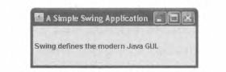
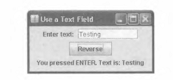
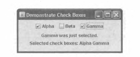
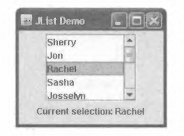
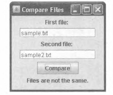
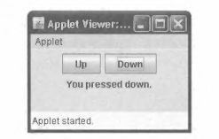

# Глава 15
# Введение в Swing
Основные навыки и понятия
* Происхождение и принципы конструирования Swing
* Представление о компонентах и контейнерах Swing
* Основные положения о диспетчерах компоновки
* Написание, компиляция и запуск на выполнение простого Swing-приложения
* Применение компонента JButton
* Работа с компонентом JTextField
* Создание флажков с помощью компонента JCheckBox
* Работа с компонентом JList
* Применение анонимных внутренних классов для обработки событий
* Создание апплета средствами Swing
Все программы, приведенные в предыдущих главах в качестве примера, за исключени¬
ем апплетов, рассмотренных в главе 14, были консольными. Это означает, что в них
не применялись средства графического пользовательского интерфейса. Консольные
программы очень удобны для изучения основ Java, но в реальных программах без гра¬
фического пользовательского интерфейса просто не обойтись. Поэтому в последней
главе этой книги будет рассмотрена библиотека Swing современных инструментальных
средств Java, предназначенных для создания пользовательских интерфейсов в програм¬
мах на Java.
Библиотека Swing предоставляет богатую коллекцию классов и интерфейсов для
создания визуальных компонентов, в том числе кнопок, полей ввода текста, полос про¬
крутки, флажков и таблиц, способных придать пользовательскому интерфейсу программ
на Java современный вид. Средствами Swing можно разработать на высоком профессио¬
нальном уровне графический интерфейс прикладной программы, в наибольшей степени
удовлетворяющий потребностям пользователей.
Тема Swing весьма обширна, и для подробного ее рассмотрения потребовалась бы
отдельная книга, поэтому в одной главе удастся коснуться лишь самых основных во¬
просов применения Swing. Но и представленного здесь материала окажется достаточ¬
но, чтобы составить общее представление о Swing. В этой главе будут рассмотрены пять
наиболее употребительных компонентов пользовательского интерфейса, создаваемых
средствами Swing: метки, кнопки, поля ввода текста, флажки и списки. А в конце главы
будет создан апплет на основе Swing. И хотя в данной главе описана лишь небольшая
часть инструментальных средств Swing, изучив их, вы сможете писать простые програм¬
мы с графическим пользовательским интерфейсом. А полученные знания послужат вам
прочным основанием для дальнейшего изучения Swing.
На заметку
Более подробные сведения о Swing можно найти в книге Swing: Руководство для начинающих,
ИД "Вильямс", 2007 г.

## Происхождение и принципы
конструирования Swing
В ранних версиях Java средства Swing отсутствовали. Можно считать, что они появи¬
лись в результате попытки преодолеть трудности, связанные с использованием в Java пер¬
вой оконной подсистемы — библиотеки Abstract Window Toolkit (AWT). В этой библиотеке
определен базовый набор компонентов для создания вполне работоспособных пользова¬
тельских интерфейсов, но с ограниченными возможностями. Одним из ограничений AWT
стало превращение ее визуальных компонентов в платформенно-зависимые эквиваленты,
или равноправные компоненты. Это означает, что внешний вид компонентов AWT опреде¬
лялся не средствами Java, а используемой платформой. А поскольку в компонентах AWT
применялся в качестве ресурса собственный код, то они назывались тяжеловесными.
Применение собственных равноправных компонентов послужило причиной цело¬
го ряда осложнений. Во-первых, из-за отличий в операционных системах компоненты
по-разному выглядели и даже иначе вели себя на разных платформах. Это было пря¬
мым нарушением главного принципа Java: код, написанный один раз, должен работать
везде. Во-вторых, внешний вид каждого компонента был фиксированным, и изменить
его было очень трудно (причина та же — зависимость от конкретной платформы).
И в-третьих, на применение тяжеловесных компонентов накладывался целый ряд об¬
ременительных ограничений. В частности, такие компоненты всегда имели прямоуголь¬
ную форму и были непрозрачны.
Потребовалось не слишком много времени, чтобы осознать, что ограничения AWT
слишком серьезны и нужен новый подход. В результате в 1997 году появилась библио¬
тека компонентов Swing, включенная в состав библиотеки классов JFC (Java Foundation
Classes). Первоначально Swing использовалась в версии Java 1.1 как отдельная библио¬
тека. Но начиная с версии Java 1.2 средства,Swing (как, впрочем, и остальные элементы
JFC) были полностью интегрированы в Java.
Swing устраняет ограничения, присущие компонентам AWT, благодаря использова¬
нию двух основных средств: легковесных компонентов и подключаемых стилей оформле¬
ния. И хотя эти средства практически незаметны для программирующего на Java, имен¬
но они составляют основные принципы конструирования Swing и в значительной мере
обусловливают возможности и удобство применения этой библиотеки. Рассмотрим каж¬
дое из них в отдельности.
Все компоненты Swing, за небольшим исключением, являются легковесными, а это озна¬
чает, что они полностью написаны на Java и не зависят от конкретной платформы, посколь¬
ку не опираются на платформенно-зависимые равноправные компоненты. Легковесные
компоненты обладают рядом существенных преимуществ, к числу которых относятся эф¬
фективность и гибкость. Например, легковесный компонент может быть прозрачным и не¬
прямоугольным по форме. Легковесные компоненты не преобразуются в платформенно-за¬
висимые равноправные компоненты, и поэтому их внешний вид определяет библиотека
Swing, а не базовая операционная система. Следовательно, элементы пользовательского
интерфейса, созданные средствами Swing, выглядят одинаково на разных платформах.
Благодаря тому что каждый компонент Swing воспроизводится в коде Java, а не опи¬
рается на платформенно-зависимые равноправные компоненты, стиль оформления
компонента можно отделить от логики его функционирования, что и делается средства¬
ми Swing. Такое разделение позволяет изменить внешний вид компонента, не затрагивая
других его свойств. Иными словами, появляется возможность менять стиль оформления
любого компонента без побочных эффектов, оказывающих влияние на его применение.
520 Java 7: руководство для начинающих, 5-е издание
Каждому пользователю Swing изначально доступны различные стили оформления,
к числу которых относятся металлический (Metal) и Motif (стандартный для ОС UNIX).
Металлический стиль называется также стилем оформления Java. Это платформенно¬
независимый стиль оформления, доступный во всех средах выполнения программ на
Java. Он же принимается по умолчанию, поэтому именно он и будет использоваться
в примерах, представленных в этой главе.
Реализация подключаемых стилей оформления в Swing стала возможной благодаря
тому, что при создании Swing был использован видоизмененный вариант классической
архитектуры модель—представление—контроллер (MVC). В терминологии MVC модель
определяет состояние компонента. Например, для флажка модель содержит поле, обо¬
значающее состояние установки или сброса флажка. Представление определяет порядок
отображения компонента на экране, не исключая ничего, на что может оказывать вли¬
яние текущее состояние модели. А контроллер определяет порядок реагирования ком¬
понента на действия пользователя. Так, если пользователь щелкнет кнопкой мыши на
флажке, контроллер отреагирует, изменив модель таким образом, чтобы отразить выбор
пользователя (установку или сброс флажка). В ответ на действия пользователя обнов¬
ляется и представление. Разделяя компонент на модель, представление и контроллер,
можно добиться того, что реализация одной из этих составляющих компонента не будет
оказывать влияние на две другие. Например, в некоторых реализациях представления
один и тот же компонент может отображаться разными способами, а модель и контрол¬
лер — оставаться без изменения.
Несмотря на то что принципы построения архитектуры MVC выглядят очень при¬
влекательно, для компонентов Swing разделение функций между представлением и кон¬
троллером не дает ощутимых преимуществ. Поэтому в Swing применяется видоизме¬
ненный вариант MVC, в котором представление и контроллер объединены в единую
логическую сущность, называемую представителем пользовательского интерфейса.
В связи с этим принятый в Swing подход называется архитектурой модель—представи¬
тель, а иначе — архитектурой с разделенной моделью. Таким образом, компоненты Swing
нельзя рассматривать как классическую реализацию архитектуры MVC, хотя их архитек¬
тура и опирается на нее. В процессе разработки вам не придется иметь дело непосред¬
ственно с моделями или представителями пользовательского интерфейса, но они будут
незримо присутствовать в создаваемых вами программах.
Прорабатывая материал этой главы, вы обнаружите, что библиотека Swing очень
проста в использовании, несмотря на то, что она построена на довольно сложных прин-
ципах конструирования. Одним из аргументов в пользу Swing служит то обстоятельство,
что эта библиотека позволяет сделать вполне управляемым такой сложный процесс, как
построение пользовательского интерфейса. Это дает разработчикам возможность сосре¬
доточить основное внимание на самом графическом пользовательском интерфейсе при¬
ложения, не отвлекаясь на детали его реализации.

## Компоненты и контейнеры
В состав графического пользовательского интерфейса, создаваемого средствами
Swing, входят две основные разновидности элементов: компоненты и контейнеры. Такое
разделение во многом условно, поскольку контейнеры являются в то же время компо¬
нентами, а отличаются друг от друга своим назначением. Компонент — это независи¬
мый элемент (например, кнопка или поле ввода текста), а контейнер может содержать
в себе несколько компонентов. Следовательно, контейнер — это особая разновидность
компонента. Для того чтобы отобразить компонент на экране, его следует поместить
в контейнер. Поэтому в графическом пользовательском интерфейсе должен присутство¬
вать хотя бы один контейнер. А так как контейнеры являются в то же время компонен¬
тами, то один контейнер может содержать в себе другой. Это дает возможность сформи¬
ровать так называемую иерархию контейнеров, на вершине которой должен находиться
контейнер верхнего уровня.
Компоненты
Подавляющее большинство компонентов Swing создаются с помощью классов, про¬
изводных от класса JComponent. (Единственным исключением из этого правила явля¬
ются четыре контейнера верхнего уровня, которые будут описаны в следующем разде¬
ле.) В классе JComponent реализуются функциональные возможности, общие для всех
компонентов. Например, в классе JComponent поддерживаются подключаемые стили
оформления. Этот класс наследует свойства классов Container и Component из библи¬
отеки AWT. Таким образом, компоненты Swing создаются на основе компонентов AWT
и совместимы с ними.
Классы, представляющие все компоненты Swing, входят в пакет javax. swing.
В приведенной ниже таблице перечислены имена классов всех компонентов Swing
(включая компоненты, используемые как контейнеры).
JApplet
JButton
JcheckBox
JcheckBoxMenuItem
JColorChooser
JComboBox
Jcomponent
JDesktopPane
JDialog
JEditorPane
JfileChooser
JformattedTextField
JFrame
JInternalFrame
Jlabel
JLayeredPane
JList
JMenu
JmenuBar
JMenuItem
JOptionPane
JPanel
JpasswordField
JPopupMenu
JProgressBar
JRadioButton
JradioButtonMenuItem
JRootPane
JScrollBar
JScrollPane
Jseparator
JSlider
JSpinner
JSplitPane
JtabbedPane
JTable
JTextArea
JTextField
JtextPane
JTogglebutton
JToolBar
JToolTip
Jtree
JViewport
JWindow
522 Java 7: руководство для начинающих, 5-е издание
Как видите, имена всех классов начинаются с буквы “J”. Например, метке соответ¬
ствует класс JLabel, кнопке — класс JButton, а флажку — класс JCheckBox.
Как пояснялось в начале этой главы, в рамках данной книги нет возможности рас¬
смотреть все компоненты Swing: для этого потребовалась бы отдельная книга. Но
в этой главе будут представлены пять наиболее употребительных компонентов: JLabel,
JButton, JTextField, JCheckBox и JList. Если вы уясните их принцип действия, вам
будет легче овладеть другими компонентами.

### Контейнеры
В Swing определены две разновидности контейнеров. К первой из них относятся сле¬
дующие контейнеры верхнего уровня: JFrame, JApplet, JWindow и JDialog. Они не
наследуют переменные и методы от класса JComponent, тем не менее являются произ¬
водными от классов Component и Container. В отличие от других, легковесных компо¬
нентов Swing, контейнеры верхнего уровня являются тяжеловесными. Именно поэтому
контейнеры верхнего уровня составляют отдельную группу в библиотеке Swing.
Как следует из названия контейнеров верхнего уровня, они должны находиться на
вершине иерархии контейнеров и не могут содержаться в других контейнерах. Более
того, любая иерархия должна начинаться именно с контейнера верхнего уровня. В при¬
кладных программах чаще всего используется контейнер типа JFrame, а в апплетах —
контейнер типа JApplet.
Контейнеры второго рода являются легковесными и производными от класса
JComponent. В качестве примера легковесных контейнеров можно привести классы
JPanel, JScrollPane и JRootPane. Легковесные контейнеры могут содержаться в дру¬
гих контейнерах, и поэтому они нередко используются для объединения группы взаи¬
мосвязанных компонентов.

### Панели контейнеров верхнего уровня
В каждом контейнере верхнего уровня определен набор панелей. На вершине иерар¬
хии находится корневая панель — экземпляр класса JRootPane, который представляет
собой легковесный контейнер, предназначенный для управления другими панелями. Он
также позволяет управлять строкой меню. Корневая панель включает в себя прозрачную
панель, панель содержимого и многослойную панель.
Прозрачная панель — это панель верхнего уровня. Она расположена над всеми осталь¬
ными панелями, скрывая их. Прозрачная панель позволяет управлять событиями от
мыши, относящимися ко всему контейнеру, а не только к содержащимся в нем компонен¬
там. С ее помощью можно также прорисовывать любые компоненты. Как правило, разра¬
ботчикам нет особой необходимости пользоваться непосредственно прозрачной панелью.
Многослойная панель позволяет отображать компоненты в глубину, определяя по¬
рядок перекрытия одних компонентов другими. (Это означает, что панель слоя позволя¬
ет задавать расположение компонентов в глубину, хотя такая возможность используется
сравнительно редко.) В состав многослойной панели входит панель содержимого и мо¬
жет также включаться строка меню.
Несмотря на то что прозрачная и многослойная панели являются неотъемлемыми ча¬
стями контейнера верхнего уровня и выполняют важные функции, их действия по большей
части скрыты не только от пользователей, но и от разработчиков прикладных программ.
Прикладная программа взаимодействует в основном с панелью содержимого, по¬
скольку именно в нее включаются визуальные компоненты. Иными словами, добавляя
Глава 15. Введение в Swing 523
компонент, например кнопку, в контейнер верхнего уровня, вы на самом деле вводите
его на панели содержимого.

## Диспетчеры компоновки
Прежде чем приступать к написанию программ средствами Swing, необходимо со¬
ставить себе хотя бы общее представление о диспетчерах компоновки. Диспетчер ком¬
поновки управляет размещением компонентов в контейнере. В Java определено несколь¬
ко таких диспетчеров. Большинство из них входит в состав AWT (т.е. в пакет j ava.
awt), но в Swing также предоставляется ряд дополнительных диспетчеров компоновки.
Все диспетчеры компоновки являются экземплярами классов, реализующих интер¬
фейс LayoutManager. (Некоторые из диспетчеров компоновки реализуют интерфейс
LayoutManager2.) Ниже перечислен ряд диспетчеров компоновки, доступных для раз¬
работчиков прикладных программ, пользующихся средствами Swing.

FlowLayout
Простой диспетчер компоновки, размещающий компоненты слева направо
и сверху вниз. (Для некоторых региональных настроек компоненты располагают¬
ся справа налево.)
BorderLayout
Располагает компоненты по центру и по краям контейнера. Этот диспетчер ком¬
поновки принимается по умолчанию для панели содержимого
GridLayout
Располагает компоненты сеткой, как в таблице
GridBagLayout
Располагает компоненты разных размеров настраиваемой сеткой, как в таблице
BoxLayout
Располагает компоненты в блоке по вертикали или по горизонтали
SpringLayout
Располагает компоненты с учетом ряда ограничений
Диспетчеры компоновки, как и многие другие компоненты Swing, невозможно обсу¬
дить во всех подробностях в одной главе. Поэтому ограничимся рассмотрением только
двух из них: BorderLayout и FlowLayout.
Для панели содержимого по умолчанию принимается диспетчер компоновки
BorderLayout. Этот диспетчер компоновки определяет в составе контейнера пять об¬
ластей, в которые могут помещаться компоненты. Первая область располагается по¬
средине и называется центральной. Остальные четыре размещаются по сторонам света
и соответственно называются северной, южной, восточной и западной. По умолчанию
компонент, добавляемый на панели содержимого, располагается в центральной области.
Для того чтобы расположить компонент в другой области, следует указать ее имя.
Несмотря на то что возможностей, предоставляемых диспетчером компоновки
BorderLayout, зачастую оказывается достаточно, иногда возникает потребность в дру¬
гих диспетчерах компоновки. К числу самых простых относится диспетчер компонов¬
ки FlowLayout. Он размещает компоненты построчно: слева направо и сверху вниз.
Заполнив текущую строку, этот диспетчер компоновки переходит к следующей. Такая
компоновка предоставляет лишь ограниченный контроль над расположением компо¬
нентов, хотя и проста в употреблении. Однако при изменении размеров контейнера рас¬
положение компонентов может измениться.

## Первая простая Swing-программа
Программы, создаваемые средствами Swing, называемые в дальнейшем для кратко¬
сти Swing-программами, отличаются от консольных программ, примеры которых были
524 Java 7: руководство для начинающих, 5-е издание
рассмотрены ранее в этой книге. Они отличаются и от апплетов, создаваемых на основе
AWT и обсуждавшихся в главе 14. Swing-программы не просто настраивают применение
компонентов Swing, обеспечивающих взаимодействие с пользователем, но и должны от¬
вечать особым требованиям, связанным с организацией поточной обработки. Для того
чтобы стала понятнее структура Swing-программы, лучше всего обратиться к конкрет¬
ному примеру. Программы, в которых применяются компоненты Swing, можно услов¬
но разделить на две категории. К первой категории относятся обычные программы для
настольных систем, которые зачастую называются настольными приложениями, а ко
второй категории —апплеты. В этом разделе будет показано, каким образом создается
Swing-приложение. А создание Swing-апплета будет рассмотрено далее в главе.
Несмотря на то что рассматриваемый здесь пример программы довольно прост,
он наглядно демонстрирует один из приемов написания Swing-приложений. В дан¬
ной программе используются два компонента Swing: классы JFrame и JLabel. Класс
JFrame представляет собой контейнер верхнего уровня, нередко применяемый в Swing-
приложениях, а класс JLabel — компонент Swing, с помощью которого создается метка,
используемая для отображения информации. Метка является самым простым компо¬
нентом Swing, поскольку она не реагирует на действия пользователя, а только помеча¬
ет отображаемую информацию. Контейнер JFrame служит для размещения экземпляра
компонента JLabel. С помощью метки отображается короткое текстовое сообщение.
// Простая Swing-программа.
// Для каждой Swing-программы импортируется пакет javax.swing.
import javax.swing.*;
class SwingDemo {
SwingDemo() {
// Создание нового контейнера JFrame.
JFrame jfrm = new JFrame("A Simple Swing Application");
// Установка начальных размеров рамки окна.
jfrm.setSize(275, 100);
// При закрытии окна программа должна завершиться.
j frm.setDefaultCloseOperation(JFrame.EXIT_ON_CLOSE);
// Создание текстовой метки с помощью компонента Swing.
JLabel jlab = new JLabel(" Swing defines the modern Java GUI.");
// Добавление метки на панели содержимого.
j frm.add(jlab);
// Отображение рамки окна.
j frm.setVisible(true);
}
public static void main(String args[]) {
// Объект SwingDemo должен быть создан в потоке

// диспетчеризации событий.
SwingUtilities.invokeLater(new Runnable()   {
Глава 15. Введение в Swing 525
public void run()   {
new SwingDemo();
}
}) ;
Эта программа компилируется и запускается таким же образом, как и любое другое
Java-приложение. Для ее компиляции в командной строке нужно ввести следующее:
javac SwingDemo1.java
А для запуска программы на выполнение в командной строке нужно ввести следую¬
щее:
java SwingDemol
При выполнении данной программы отображается окно, приведенное на рис. 15.1.


Рис. 15.1. Окно, отображаемое при выполнении программы SwingDemo

### Построчный анализ первой Swing-программы
Пример программы SwingDemo демонстрирует основные понятия Swing, поэто¬
му имеет смысл проанализировать ее подробно, уделив внимание каждой строке кода.
В начале программы осуществляется импорт пакета, как показано ниже.
import javax.swing.*;
Этот пакет содержит компоненты и модели Swing. В частности, в нем определены
классы, реализующие метки, кнопки, поля ввода текста и меню. Этот пакет должен
быть непременно включен в каждую программу, использующую библиотеку Swing.
Далее в программе объявляется класс SwingDemo и его конструктор. Именно в кон¬
структоре выполняется большая часть действий этой программы. Код конструктора
начинается с создания объекта типа JFrame. Для этой цели служит следующая строка
кода:
JFrame jfrm = new JFrame("A Simple Swing Application.");
Подобным образом создается контейнер jfrm, который определяет прямоугольное
окно, содержащее строку заголовка, кнопки, предназначенные для закрытия, сворачи¬
вания, разворачивания и восстановления нормальных размеров окна, а также системное
меню. Иными словами, в приведенной выше строке кода создается стандартное окно
верхнего уровня, а строка заголовка передается конструктору в качестве параметра.
Далее задаются размеры окна в пикселях, как показано ниже,
jfrm.setSize(275, 100);
Для этой цели вызывается метод setSize (). Ниже приведена общая форма объяв¬
ления этого метода.
void setSize(int ширина, int высота)
В рассматриваемом здесь примере задается ширина окна — 215 пикселей и высота —
100 пикселей.
526 Java 7: руководство для начинающих, 5-е издание
По умолчанию, когда окно верхнего уровня закрывается (например, по щелчку
на кнопке в его верхнем правом углу), оно удаляется с экрана, но приложение не за¬
вершает на этом свою работу. И хотя такое поведение подходит для некоторых ситуа¬
ций, в большинстве случаев оно неприемлемо. Ведь, как правило, желательно, чтобы
при закрытии окна верхнего уровня приложение завершалось. И добиться этого мож¬
но несколькими способами. Самый простой из них состоит в том, чтобы вызвать метод
setDefaultCloseOperation (). Именно такой способ и применен в анализируемой
здесь программе, как показано ниже.
j frm.setDefaultCloseOperation(JFrame.EXIT_ON_CLOSE);
После выполнения данного метода закрытие окна приведет к завершению ра¬
боты всего приложения. Ниже приведена общая форма объявления метода
setDefaultCloseOperation().
void setDefaultCloseOperation(int what)
Значение, передаваемое в качестве параметра what, определяет, что именно должно
произойти при закрытии окна. Помимо константы JFrame.EXIT_0NJ3L0SE, данному
методу можно передавать и другие, приведенные ниже константы.
JFrame.DISPOSE_ON_CLOSE
JFrame.HIDE_ON_CLOSE
JFrame.DO_NOTHING_ON_CLOSE
Имена констант отражают их назначение: освободить, скрыть, ничего не делать после
закрытия окна соответственно. Все они определены в интерфейсе WindowConstants,
входящем в пакет javax. swing. Этот интерфейс реализуется в классе JFrame.
В следующей строке кода создается компонент JLabel из библиотеки Swing:
JLabel jlab = new JLabel(" Swing defines the modern Java GUI.");
Компонент JLabel — самый простой в использовании среди всех компонентов
Swing, поскольку он не предполагает обработку событий, связанных с действиями
пользователя, а только отображает информацию: текст, изображение или и то и другое.
Метка, созданная в данной программе, содержит только текст. А строка, содержащая
этот текст, передается конструктору класса JLabel.
В следующей строке кода метка вводится на панели содержимого рамки окна:
jfrm.add(jlab);
Как пояснялось ранее, каждый контейнер верхнего уровня включает в себя панель
содержимого, на которой располагаются компоненты. Поэтому для размещения ком¬
понента внутри рамки окна его следует добавить на панели содержимого. С этой це¬
лью вызывается метод add() из класса JFrame (в данном случае ссылка на объект
типа JFrame содержится в переменной j frm). Существует несколько вариантов метода
add (). Чаще других используется такой вариант:
Component add(Component компонент)
По умолчанию на панели содержимого, связанной с контейнером JFrame, исполь¬
зуется диспетчер компоновки BorderLayout. В приведенном выше варианте мето¬
да add () компонент (в данном случае — метка) располагается в центральной области.
Имеются также варианты add (), позволяющие располагать компоненты в других обла¬
стях. При размещении в центральной области размеры компонента автоматически при¬
водятся к размерам этой области.
И последний оператор в конструкторе класса SwingDemo обеспечивает отображение
окна, как показано ниже.
j frm.setVisible(true) ;
Общая форма объявления метода setVisible () выглядит следующим образом:
void setVisible(boolean флаг)
Если параметр флаг принимает логическое значение true, окно отображает¬
ся на экране, в противном случае оно остается скрытым. По умолчанию рамку
окна (объект типа JFrame) не видно, поэтому для ее отображения требуется вызов
setVisible(true).
В методе main () создается объект класса SwingDemo, в результате чего окно и мет¬
ка отображаются на экране. Конструктор класса SwingDemo вызывается в следующем
фрагменте кода:
SwingUtilities.invokeLater(new Runnable()   {
public void run() {
new SwingDemo();
}
528 Java 7: руководство для начинающих, 5-е издание
В этом фрагменте кода объект типа SwingDemo создается не в основном потоке при¬
ложения, а в потоке диспетчеризации событий. Такое решение принимается по ряду при¬
чин. Прежде всего, Swing-программы, как правило, управляются событиями. Так, если
пользователь активизирует компонент пользовательского интерфейса, формируется
соответствующее событие. Оно передается прикладной программе путем вызова обра¬
ботчика событий, определенного в этой программе. Но этот обработчик выполняется
в специальном потоке диспетчеризации событий, формируемом средствами Swing, а не
в главном потоке прикладной программы. Таким образом, поток, в котором выполня¬
ется этот обработчик событий, создается другими средствами, хотя все обработчики со¬
бытий определяются в самой программе. Во избежание осложнений, связанных, напри¬
мер, с попытками двух потоков одновременно обновить один и тот же компонент, все
компоненты пользовательского интерфейса из библиотеки Swing должны создаваться
и обновляться не в основном потоке приложения, а в потоке диспетчеризации событий.
Но ведь метод main () выполняется в основном потоке, и поэтому в нем нельзя непо¬
средственно создавать объект класса SwingDemo. Сначала следует построить объект типа
Runnable, выполняемый в потоке диспетчеризации событий, а затем предоставить ему
возможность построить графический пользовательский интерфейс.
Для того чтобы активизировать код построения графического пользователь¬
ского интерфейса в потоке диспетчеризации событий, следует воспользоваться од¬
ним из двух методов, определенных в классе SwingUtilities: invokeLater () или
invokeAndWait (). Эти методы объявляются следующим образом:
static void invokeLater(Runnable obj)
static void invokeAndWait(Runnable obj)
throws InterruptedException, InvocationTargetException
Параметр obj обозначает объект типа Runnable, метод run () которого вызывается
в потоке диспетчеризации событий. Оба упомянутых выше метода отличаются тем, что ме¬
тод invokeLater () сразу же возвращает управление вызывающему методу, тогда как метод
invokeAndWait () ожидает завершения метода obj . run (). Их можно использовать для вы¬
зова метода, выполняющего построение пользовательского интерфейса Swing-приложения,
а также в тех случаях, когда требуется изменить состояние этого интерфейса из метода, вы¬
полняющегося за пределами потока диспетчеризации событий. Для этой цели обычно ис¬
пользуется метод invokeLater (), что и было сделано в рассматриваемом здесь примере.
Но при создании пользовательского интерфейса для апплета лучше воспользоваться мето¬
дом invokeAndWait (). (О создании Swing-апплета речь пойдет далее в этой главе.)
Следует отметить еще одну особенность анализируемой здесь программы: она не ре¬
агирует на действия пользователя, поскольку в компоненте JLabel не предусмотрены
соответствующие средства. Иными словами, в этой программе не были предусмотрены
обработчики событий, потому что компонент JLabel вообще не формирует события.
А все остальные компоненты Swing формируют события, на которые программа должна
каким-то образом реагировать, что и будет продемонстрировано на конкретных приме¬
рах далее в главе.

## Применение компонента JButton
Кнопка является одним из наиболее употребительных компонентов Swing.
Нажимаемая кнопка представлена в Swing экземпляром класса JButton. Этот класс
является производным от абстрактного класса AbstractButton, в котором определе¬
ны функции, общие для всех кнопок. На кнопке может отображаться текст надписи,
530 Java 7: руководство для начинающих, 5-е издание
изображение или и то и другое, но здесь и далее будут рассматриваться только кнопки
с текстовыми надписями.
Класс JButton содержит три конструктора. Один из них имеет следующий вид:
JButton(String сообщение)
Параметр сообщение определяет символьную строку, которая должна отображаться
в виде надписи на кнопке.
После щелчка на кнопке формируется событие ActionEvent. Класс ActionEvent
определен в библиотеке AWT, но используется также и в библиотеке Swing. В классе
JButton предоставляются методы, позволяющие зарегистрировать приемник событий
или отменить его регистрацию:
void addActionListener(ActionListener al)
void removeActionListener(ActionListener al)
где параметр al задает объект, который будет уведомляться о наступлении собы¬
тий. Объект должен представлять собой экземпляр класса, реализующего интерфейс
ActionListener.
В интерфейсе ActionListener определен только один метод: actionPerformed ().
Ниже приведена общая форма объявления этого метода.
void actionPerformed(ActionEvent ae)
Данный метод вызывается при щелчке на кнопке. Следовательно, в этом методе осу¬
ществляется обработка событий, связанных с действиями пользователя над кнопкой.
Реализуя метод actionPerf ormed (), необходимо позаботиться о том, чтобы он быстро
выполнял свои функции и возвращал управление. Как пояснялось ранее, обработчики
событий не должны выполнять длительные операции, поскольку это может привести
к замедлению работы приложения в целом. Если же обработка события предполагает
действия, требующие времени, их следует выполнять в отдельном потоке, специально
создаваемом для этой цели.
С помощью объекта типа ActionEvent, передаваемого методу actionPerf ormed (),
можно получить важные сведения о событии, связанном с щелчком на кнопке. В этой
главе для этой цели будет использоваться символьная строка команды действия, свя¬
занная с кнопкой. По умолчанию именно эта символьная строка отображается внутри
кнопки. Получить команду действия можно, вызвав метод getActionCommand () для
объекта события, который объявляется следующим образом:
String getActionCommand()
Команда действия идентифицирует кнопку. Когда в пользовательском интерфейсе
приложения имеется несколько кнопок, команда действия позволяет достаточно просто
определить, какая из них была выбрана.
Ниже приведен пример программы, демонстрирующий применение кнопки, реаги¬
рующей на действия пользователя. А на рис. 15.2 показано окно, отображаемое данной
программой на экране.
// Демонстрация нажатия кнопки и обработки событий действия.
import java.awt.*;
import java.awt.event.*;
import javax.swing.*;
class ButtonDemo  implements ActionListener {
Глава 15. Введение в Swing 531
JLabel jlab;
ButtonDemoO {
// создать новый контейнер JFrame
JFrame jfrm = new JFrame("A Button Example");
// установить диспетчер компоновки FlowLayout
jfrm.setLayout(new FlowLayout());
// задать исходные размеры рамки окна   <
jfrm.setSize(220, 90);
// завершить программу после закрытия окна
j frm.setDefaultCloseOperation(JFrame.EXIT_ON_CLOSE);
// Создание двух кнопок.
JButton jbtnUp = new JButton("Up");
JButton jbtnDown = new JButton("Down");
// Добавление приемников событий от кнопки.
jbtnUp.addActionListener(this);
jbtnDown.addActionListener(this) ;
// Добавление кнопок на панели содержимого.
jfrm.add(jbtnUp);
j f rm.add(j btnDown);
// создать метку
jlab = new JLabel("Press a button.");
// добавить метку в рамке окна
jfrm.add(jlab);
// отобразить рамку окна
j frm.setVisible(true);
}
// Обработка событий от кнопки.
public void actionPerformed(ActionEvent ae) {
// Для определения нажатой кнопки используется команда действия.
if(ae.getActionCommand().equals("Up"))
jlab.setText("You pressed Up.");
else
jlab.setText("You pressed down. ");
}
public static void main(String args[]) {
// создать рамку окна в потоке диспетчеризации событий
SwingUtilities.invokeLater(new Runnable() {
public 'void run() {
new ButtonDemoO;
}
}) ;
}
}


Рис. 15.2. Окно, отображаемое при выполнении программы ButtonDemo
Проанализируем приведенную выше программу, обратив внимание на новые и рас¬
сматривавшиеся до сих пор компоненты. Сначала в этой программе импортируются па¬
кеты j ava. awt и j ava. awt. event. Пакет j ava. awt необходим, поскольку он содер¬
жит класс диспетчера компоновки FlowLayout, а пакет j ava. awt. event — потому, что
в нем определены интерфейс ActionListener и класс ActionEvent.
Далее в программе объявляется класс ButtonDemo, который реализует интерфейс
ActionListener. Это означает, что объекты типа ButtonDemo могут быть использова¬
ны для приема и обработки событий действия. Затем объявляется ссылка на объект типа
JLabel. Она будет использована в методе actionPerf ormed () для отображения сведе¬
ний о том, какая именно кнопка была нажата.
Конструктор класса ButtonDemo начинается с создания контейнера jfrm типа
JFrame. Затем в качестве диспетчера компоновки для панели содержимого контейнера
j f rm устанавливается FlowLayout, как показано ниже,
j frm.setLayout(new FlowLayout());
Как пояснялось ранее, по умолчанию на панели содержимого в качестве диспетче¬
ра компоновки используется BorderLayout, но для многих приложений лучше подхо¬
дит диспетчер компоновки FlowLayout. Он размещает компоненты построчно: слева
направо и сверху вниз. После заполнения текущей строки этот диспетчер компоновки
переходит к следующей строке. Такая компоновка предоставляет лишь ограниченный
контроль над расположением компонентов, хотя и проста в употреблении. Но следует
иметь в виду, что при изменении размеров контейнера расположение компонентов мо¬
жет измениться.
После установки размеров рамки окна и определения операции, завершающей про¬
грамму, в конструкторе ButtonDemo () создаются две кнопки:
JButton jbtnUp = new JButton("Up");
JButton jbtnDown = new JButton("Down");
На первой кнопке отображается надпись Up (Нажато), а на второй — Down (От¬
пущено).
Далее с кнопками связывается приемник событий действия, в роли которого высту¬
пает экземпляр класса ButtonDemo, а ссылка на него передается с помощью ключевого
слова this. Соответствующие строки кода приведены ниже.
jbtnUp.addActionListener(this) ;
jbtnDown.addActionListener(this) ;
В результате выполнения этих строк кода объект, создающий кнопки, будет также
получать уведомление об их нажатии.
Всякий раз, когда кнопка нажимается, формируется событие, о котором зарегистри¬
рованные приемники уведомляются в результате вызова метода actionPerf ormed ().
Объект типа ActionEvent, представляющий событие от кнопки, передается этому ме¬
тоду в качестве параметра. В программе ButtonDemo это событие передается следующей
реализации метода actionPerf ormed ():
// Обработка событий от кнопки.
public void actionPerformed(ActionEvent ae) {
Глава 15. Введение в Swing 533
if(ae.getActionCommand().equals("Up"))
jlab.setText("You pressed Up.");
else
jlab.setText("You pressed down. ");
}
Для передачи события служит параметр ае. В теле метода извлекается команда дей¬
ствия, которая соответствует кнопке, сформировавшей событие. Для получения ко¬
манды действия вызывается метод getActionCommand (). (Напомним: по умолчанию
команда действия совпадает с текстом, отображаемым на кнопке.) В зависимости от
содержания символьной строки, представляющей команду действия, устанавливается
текст надписи на кнопке, указывающий на то, какая именно кнопка была нажата.
Следует также иметь в виду, что метод actionPerformed () вызывается в потоке
диспетчеризации событий. Он должен завершаться как можно быстрее, чтобы не замед¬
лять работу приложения.

## Работа с компонентом JTextField
К числу широко используемых компонентов Swing относится также компонент
JTextField, который дает пользователю возможность вводить и редактировать тек¬
стовую строку. Компонент JTextField является подклассом, производным от аб¬
страктного класса JTextComponent, который выступает в роли суперкласса не только
для компонента JTextField, но и для всех текстовых компонентов вообще. В классе
JTextField определен ряд конструкторов. Здесь и далее будет использоваться следую¬
щий конструктор:
JTextField(int cols)
где cols обозначает ширину текстового поля, выраженную в столбцах. Однако длина
вводимой строки не ограничивается шириной поля, отображаемого на экране. Поэтому,
если в конструкторе присутствует параметр cols, он задает лишь упомянутый выше фи¬
зический размер компонента.
Для завершения ввода текста в поле пользователь нажимает клавишу <Enter>, в ре¬
зультате чего формируется событие ActionEvent. В классе JTextField предоставля¬
ются методы addActionListener () и removeActionListener (). Для обработки со¬
бытий действия необходимо реализовать метод actionPerformed (), объявленный
в интерфейсе ActionListener. Обработка событий от поля ввода текста осуществля¬
ется таким же образом, как и обработка событий от кнопки, о которых шла речь ранее.
Как и с компонентом JButton, с компонентом JTextField связывается конкретная
команда действия в виде символьной строки. По умолчанию она соответствует текуще¬
му содержимому поля ввода текста, хотя в таком значении используется редко. Чаще
всего устанавливается фиксированное значение команды действия с помощью метода
setActionCommand (), который объявляется следующим образом:
void setActionCommand(String cmd)
Символьная трока, передаваемая в качестве параметра cmd, становится новой ко¬
мандой действия, а текст в поле ввода текста не меняется. Установленная символьная
строка команды действия остается постоянной, независимо от того, какой именно текст
вводится в поле ввода текста. Как правило, к явной установке команды действия прибе¬
гают для того, чтобы обеспечить распознавание поля ввода текста как источника, сфор¬
мировавшего событие действия. Поступать подобным образом приходится в том случае,
если в рамке окна находится несколько элементов управления, для которых определен
534 Java 7: руководство для начинающих, 5-е издание
общий обработчик событий. Установив команду действия, вы получаете в свое распоря¬
жение удобное средство для различения компонентов. Если же вы не установите явно
команду действия для поля ввода текста, то можете испытать затруднения при распо¬
знавании источника события, так как пользователь может ввести в поле произвольный
текст, совпадающий с командой действия другого компонента.
Для того чтобы получить символьную строку, отображаемую в поле ввода тек¬
ста, следует обратиться к экземпляру класса JTextField и вызвать метод getText ().
Объявление этого метода приведено ниже.
String getText()
Задать текст для компонента JTextField можно с помощью метода setText (),
объявляемого следующим образом:
void setText(String текст)
где текст — это символьная строка, размещаемая в поле ввода текста.

Ниже приведен пример программы, демонстрирующий применение компонента
JTextField. В окне этой программы содержатся поле ввода текста, кнопка и две метки.
Одна из меток подсказывает пользователю ввести текст в поле. Когда пользователь на¬
жмет клавишу <Enter> (при условии, что фокус ввода находится в поле ввода текста),
введенные данные будут извлечены и отображены на второй метке. На кнопке отобра¬
жается надпись Reverse (Обратить). При нажатии этой кнопки содержимое поля ввода
текста преобразуется и заменяется на обратное. Окно, отображаемое на экране при вы¬
полнении данной программы, приведено на рис. 15.3.
// Применение поля ввода текста.
import java.awt.*;
import java.awt.event.*;
import javax.swing.*;
class TFDemo implements ActionListener {
JTextField jtf;
JButton jbtnRev;
JLabel jlabPrompt, jlabContents;
TFDemo()    {
// создать новый контейнер JFrame
JFrame jfrm = new JFrame("Use a Text Field");
Глава 15. Введение в Swing 535
// установить диспетчер компоновки FlowLayout
j frm.setLayout(new FlowLayout());
// задать исходные размеры рамки окна
jfrm.setSize(240, 120);
// завершить программу после закрытия окна
j frm.setDefaultCloseOperation(JFrame.EXIT_ON_CLOSE);
// Создание поля ввода текста шириной 10 символов.
jtf = new JTextField(10);
// Установка команды действия для поля ввода текста.
jtf.setActionCommand("myTF");
// создать кнопку Reverse
JButton jbtnRev = new JButton("Reverse") ;
// Добавление приемников событий от поля ввода и кнопки.
jtf.addActionListener(this);
jbtnRev.addActionListener(this) ;
// создать метки
jlabPrompt = new JLabel("Enter text: ");
jlabContents = new JLabel("");
// добавить компоненты на панели содержимого
jfrm.add(jlabPrompt);
j frm.add(jtf);
jfrm.add(jbtnRev);
jfrm.add(jlabContents) ;
// отобразить рамку окна
j frm.setVisible(true);
}
// Обработка событий от кнопки и поля ввода текста.
public void actionPerformed(ActionEvent ae) {
// Для определения компонента, сформировавшего событие,
// используется команда действия.
if(ae.getActionCommand().equals("Reverse") )    {
// Нажатие кнопки Reverse.
String orgStr = jtf.getText();
String resStr = "";
// обратить символьную строку в поле ввода текста
for(int i=orgStr.length()-1; i >=0; i—)
resStr += orgStr.charAt(i);
// сохранить обращенную строку в поле ввода текста
jtf.setText(resStr);

} else
536 Java 7: руководство для начинающих, 5-е издание
// Нажатие клавиши <Enter> в тот момент, когда фокус
// ввода находится в поле ввода текста,
jlabContents.setText("You pressed ENTER. Text is: " +
jtf.getText());
}
public static void main(String args[])  {   ,
// создать рамку окна в потоке диспетчеризации событий
SwingUtilities.invokeLater(new Runnable()   {
public void run() {
new TFDemo();
}
}) ;



Рис. 15.3. Окно, отображаемое при выполнении программы TFDemo
Большая часть исходного кода приведенной выше программы вам уже знакома, но
некоторые его фрагменты необходимо рассмотреть отдельно. Прежде всего обратите
внимание на то, что с полем ввода текста связана команда действия "myTF". Такое свя¬
зывание осуществляется в следующей строке кода:
jtf.setActionCommand("myTF");
После выполнения этой строки кода символьная строка команды действия всегда
принимает значение "myTF" независимо от того, какой именно текст введен в поле.
Благодаря этому исключается ситуация, при которой команда действия, связанная с по¬
лем ввода текста, будет вступать в конфликт с командой действия, связанной с кнопкой
Reverse. В методе actionPerformed () установленная команда действия использует¬
ся для распознавания того компонента, который стал источником события. Если сим¬
вольная строка команды действия принимает значение "Reverse", это может означать
только одно: событие наступило в результате щелчка на кнопке Reverse. Иначе следу¬
ет сделать вывод, что событие наступило в результате нажатия пользователем клавиши
<Enter> в тот момент, когда фокус ввода находился в поле ввода текста.
И наконец, обратите внимание на следующую строку кода в теле метода
actionPerformed():
jlabContents.setText("You pressed ENTER. Text is: " +
jtf.getText());
Как пояснялось выше, при нажатии клавиши <Enter> в тот момент, когда фокус вво¬
да находился в поле ввода текста, формируется событие ActionEvent, которое пере¬
сылается всем зарегистрированным приемникам событий действия с помощью метода
actionPerf ormed (). В программе TFDemo этот метод лишь вызывает метод getText (),
извлекая текст, содержащийся в компоненте jtf (поле ввода текста). После этого текст
отображается с помощью метки, на которую ссылается переменная j labContents.

## Создание флажков с помощью
компонента JCheckBox
Если обычные кнопки используются чаще других элементов пользовательского
интерфейса, то на втором месте по частоте употребления, безусловно, стоят флаж¬
ки. В Swing эти элементы пользовательского интерфейса реализуются с помощью
компонента типа JCheckBox. Класс JCheckBox является производным от классов
AbstractButton и JToggleButton. Следовательно, флажок — это особая разновид¬
ность кнопки.
В классе JCheckBox определен ряд конструкторов. Один из них имеет следующий вид:
JCheckBox(String str)
Он создает флажок с пояснительной надписью в виде символьной строки, передавае¬
мой в качестве параметра str.
При установке или сбросе флажка формируется событие от элемента, представлен¬
ное классом ItemEvent. Для обработки событий от элементов используются классы,
реализующие интерфейс itemListener. В этом интерфейсе объявлен лишь один метод,
itemStateChanged (), объявляемый следующим образом:
void itemStateChanged(ItemEvent ie)
Здесь событие от элемента передается в качестве параметра ie.
Для того чтобы получить ссылку на элемент, состояние которого изменилось, следует
вызвать метод get Item () для объекта ItemEvent. Ниже приведена общая форма объ¬
явления этого метода.
Object getltem()
Возвращаемая этим методом ссылка должна быть приведена к типу оперируемого
компонента, а в данном случае — к классу JCheckBox.
Текст, связанный с флажком, можно получить, вызвав метод getText (), а задать
текст пояснительной надписи, вызвав метод setText (). Эти методы действуют таким
же образом, как и одноименные методы из рассмотренного ранее класса JButton.
Самый простой способ определить состояние флажка — вызвать метод isSelected (),
который объявляется следующим образом:
boolean isSelected()
Этот метод возвращает логическое значение true, если флажок установлен, иначе —
логическое значение false.
Ниже приведен пример программы, демонстрирующий манипулирование флажка¬
ми. В ней создаются три флажка: Alpha, Beta и Gamma. Всякий раз, когда состояние
флажка изменяется, в окне программы появляются сведения о произведенном действии,
а также перечисляются те флажки, которые установлены в данный момент. Окно, ото¬
бражаемое на экране при выполнении данной программы, приведено на рис. 15.4.
// Демонстрация флажков.
import java.awt.*;
import java.awt.event.*;
import javax.swing.*;
class CBDemo implements ItemListener {
538 Java 7: руководство доя начинающих, 5-е издание
JLabel jlabSelected;
JLabel jlabChanged;
JCheckBox jcbAlpha;
JCheckBox jcbBeta;
JCheckBox jcbGamma;
CBDemo() {
// создать новый контейнер JFrame
JFrame jfrm = new JFrame("Demonstrate Check Boxes");
i
// установить диспетчер компоновки FlowLayout
jfrm.setLayout(new FlowLayout());
// задать исходные размеры рамки окна
jfrm.setSize(280, 120);
// завершить программу после закрытия окна
j frm.setDefaultCloseOperation(JFrame.EXIT_ON_CLOSE);
// создать пустые метки
jlabSelected = new JLabel("");
jlabChanged = new JLabel("");
// Создание флажков.
jcbAlpha = new JCheckBox("Alpha");
jcbBeta = new JCheckBox("Beta");
jcbGamma = new JCheckBox("Gamma");
// События, формируемые компонентами JCheckBox, обрабатываются
// одним методом itemStateChanged(), реализованным в классе CBDemo.
jcbAlpha.addltemListener(this);
jcbBeta.addltemListener(this) ;
jcbGamma.addltemListener(this);
// добавить флажки и метки на панели содержимого
j f rm.add(j cbAlpha);
jfrm.add(jcbBeta);
j f rm.add(j cbGamma);
j frm.add(jlabChanged);
jfrm.add(jlabSelected);
// отобразить рамку окна
j frm.setVisible(true);
}
// Обработчик событий от элементов (в данном случае — флажков).
public void itemStateChanged(ItemEvent ie) {
String str = "";
// Получение ссылки на компонент флажка, сформировавший событие.
JCheckBox cb = (JCheckBox) ie.getltem();
// сообщить об изменении состояния флажка
Глава 15. Введение в Swing 539.
if(cb.isSelected()) // Определение состояния флажка.
jlabChanged.setText(cb.getText() + " was just selected.");
else
jlabChanged.setText(cb.getText() + " was just cleared.");
// сообщить о всех установленных флажках
if(jcbAlpha.isSelected()) {
str += "Alpha ";
}
if(jcbBeta.isSelected()) {
str += "Beta ";
}
if (jcbGamma.isSelected() ) {
str += "Gamma";
}
jlabSelected.setText("Selected check boxes: " + str);
}
public static void main(String args[]) {
// создать рамку окна в потоке диспетчеризации событий
SwingUtilities.invokeLater(new Runnable()   {
public void run() {
new CBDemo();
}
});
}


Рис. 15.4. Окно, отображаемое при выполнении программы CBDemo
Наибольший интерес в рассматриваемом здесь примере представляет метод
itemStateChanged (), предназначенный для обработки событий от элементов (в дан¬
ном случае — флажков). Он выполняет две функции: во-первых, сообщает, установ¬
лен или сброшен флажок; а во-вторых, отображает перечень установленных флажков.
В начале этого метода определяется ссылка на компонент, сформировавший событие
ItemEvent. Это происходит в следующей строке кода:
JCheckBox cb = (JCheckBox) ie.getltem();
Приведение к типу JCheckBox необходимо потому, что метод getltem () возвращает
ссылку на объект типа Object. Далее метод itemStateChanged () обращается к методу
isSelected () по ссылке cb, чтобы определить текущее состояние флажка. Если метод
isSelected () возвращает логическое значение true, значит, флажок установлен, а ло¬
гическое значение false соответствует сброшенному состоянию флажка. Затем с помо¬
щью метки j labChanged отображаются сведения о выполненном действии.
И наконец, метод itemStateChanged () проверяет состояние каждого флажка
и формирует символьную строку с именами установленных флажков. Эта символьная
строка отображается в окне программы с помощью метки j labSelected.

## Работа с компонентом Jlist
Последним в этой главе будет рассмотрен компонент JList. Он является основным
классом Swing для работы со списками и позволяет выбирать один или несколько эле¬
ментов из списка. И хотя элементы списка являются символьными строками, это не
мешает создать список, включающий практически любые объекты, которые могут быть
отображены на экране. Компонент JList настолько широко применяется в реальных
программах на Java, что его трудно было бы не заметить в них прежде.
Раньше элементы списка были представлены в компоненте JList в виде ссылок на
объекты типа Object. А после выпуска версии JDK 7 компонент JList стал обобщен¬
ным и теперь объявляется следующим образом:
class JList<E>
где Е обозначает тип элементов списка. Таким образом, в компоненте JList теперь обе¬
спечивается типовая безопасность.
На заметку
Далее рассматривается обобщенный вариант компонента JList и демонстрируется пример его
применения. Поэтому если вы пользуетесь компилятором более ранней версии, чем JDK 7, вам
придется выбрать предыдущий, необобщенный вариант компонента JList.
В классе компонента JList предоставляется ряд конструкторов. Один из них имеет
следующий вид:
JList (Е [ ] элементы)
Этот конструктор создает компонент JList со списком элементов, хранящихся
в массиве, на который указывает параметр элементы.
Компонент JList и сам позволяет решить немало задач построения списков, но
чаще всего он помещается в контейнер JScrollPane, автоматически обеспечивающий
прокрутку своего содержимого. Ниже приведен конструктор этого контейнера.
JScrollPane(Component компонент)
Здесь компонент обозначает конкретный компонент, передаваемый конструктору
в качестве параметра для прокрутки (в данном случае это компонент JList). Если по¬
местить компонент JList в контейнер JScrollPane, то тем самым будет обеспечена
автоматическая прокрутка длинных списков. Благодаря этому упрощается построение
графического пользовательского интерфейса вообще и изменение числа элементов спи¬
ска в частности, не затрагивая при этом размеры самого компонента JList.
Когда пользователь делает или изменяет выбор элемента в списке, компонент JList
формирует событие ListSelectionEvent. Это же событие формируется при отмене вы¬
бора. Для его обработки используется объект приемника событий из класса, реализую¬
щего интерфейс ListSelectionListener. Этот интерфейс относится к пакету javax.
swing. event. В этом интерфейсе объявлен только один метод, valueChanged (), объ¬
являемый следующим образом:
void valueChanged(ListSelectionEvent le)
где Ie обозначает ссылку на объект, сформировавший событие. И хотя в самом клас¬
се ListSelectionEvent определен ряд методов, для выяснения того, что же про¬
изошло со списком, обычно приходится опрашивать сам объект типа JList. Класс
ListSelectionEvent также относится к пакету j avax. swing. event.
Глава 15. Введение в Swing 541
По умолчанию компонент JList дает пользователю возможность выбрать не¬
сколько элементов из списка. Изменить такое поведение можно, вызвав метод
setSelectionMode (), определенный в классе JList. Этот метод объявляется так:
void setSelectionMode(int режим)
где параметр режим задает порядок выбора элементов из списка. Значение этого пара¬
метра должно совпадать с одной из приведенных ниже констант, определенных в интер¬
фейсе ListSelectionModel, входящем в пакет javax. swing.
SINGLE_SELECTION
SINGLE_INTERVAL_SELECTION
MULTIPLE_INTERVAL_SELECTION
По умолчанию устанавливается режим MULTIPLE_INTERVAL_SELECTION, и пользо¬
ватель может выбирать ряд элементов из списка через несколько промежутков. В ре¬
жиме SINGLE_INTERVAL_SELECTI0N можно выбирать ряд элементов из списка только
через один промежуток. А в режиме SINGLE SELECTION каждый раз можно выбрать
только один элемент из списка. Очевидно, что единственный элемент может быть вы¬
бран из списка и в двух других режимах, где допускается также выбирать одновременно
целый ряд элементов.
Индекс первого элемента, выбранного из списка, а в режиме SINGLE SELECTION —
это индекс единственного выбранного элемента, можно получить, вызвав метод
getSelectedlndex (). Ниже показано, каким образом он объявляется,
int getSelectedlndex()
Индексирование начинается с нуля. Так, если выбран первый элемент в списке, этот
метод возвращает значение 0. Если же ни один из элементов не выбран, возвращается
значение -1.
Получить массив, содержащий все выбранные из списка элементы, можно, вызвав
метод getSelectedlndices():
int[] getSelectedlndices()
В возвращаемом массиве индексы расположены по возрастающей. Если же получен
массив нулевой длины, это означает, что ни один из элементов не выбран из списка.
Ниже приведен пример программы, демонстрирующий применение простого компо¬
нента JList, содержащего список имен. Всякий раз, когда пользователь выбирает имя
из списка, формируется событие ListSelectionEvent, которое обрабатывается мето¬
дом valueChanged (), объявленным в интерфейсе ListSelectionListener. Этот ме¬
тод определяет индекс выбранного элемента и отображает соответствующее имя. Окно,
отображаемое на экране при выполнении данной программы, приведено на рис. 15.5.
// Демонстрация простого компонента JList.
// Для компиляции этой программы требуется JDK 7
// или более поздняя версия данного комплекта.
import javax.swing.*;
import javax.swing.event.*;
import j ava.awt.*;
import java.awt.event.*;
class ListDemo implements ListSelectionListener {
JList<String> jlst;
542 Java 7: руководство для начинающих, 5-е издание
JLabel jlab;
JScrollPane jscrip;
// создать массив имен
String names[] = { "Sherry", "Jon", "Rachel", // Этот массив имен
"Sasha", "Josselyn", "Randy", // будет отображаться
"Tom", "Mary", "Ken", // списком в компоненте JList.
"Andrew", "Matt", "Todd" };
ListDemoO {
// создать новый контейнер JFrame
JFrame jfrm = new JFrame("JList Demo");
// установить диспетчер компоновки FlowLayout
j frm.setLayout(new FlowLayout());
// задать исходные размеры рамки окна
jfrm.setSize(200, 160);
// завершить программу после закрытия окна
j frm.setDefaultCloseOperation(JFrame.EXIT_ON_CLOSE);
// создать компонент JList
jlst = new JList<String>(names);    // Создание списка  имен.
// задать режим выбора элементов    из списка
// Переход в режим выбора элементов из списка по одному.
j1st.setSelectionMode(ListSelectionModel.SINGLE_SELECTION);
// добавить список на панели прокрутки.
// Компонент списка помещается в контейнер панели прокрутки.
jscrlp = new JScrollPane (j1st);
// задать предпочтительные размеры панели прокрутки
jscrlp.setPreferredSize(new Dimension(120, 90));
// создать метку для отображения    результатов выбора  из  списка,
jlab = new JLabel("Please choose    a name");
// добавить обработчик событий, связанных с выбором из списка
// Прием событий, наступающих при выборе элементов из списка.
jlst.addListSelectionListener(this);
// добавить список и метку на панели содержимого
jfrm.add(jscrlp);
jfrm.add(jlab);
// отобразить рамку окна
j frm.setVisible(true);
}
// обработать события, связанные с выбором элементов из списка
public void valueChanged(ListSelectionEvent le) {
// получить индекс того элемента, выбор которого был сделан
// или отменен в списке
Глава 15. Введение в Swing 343
int idx = j1st.getSelectedlndex();
// отобразить результат выбора, если элемент был выбран
if(idx != -1)
jlab.setText("Current selection: " + names[idx]);
else // иначе еще раз предложить сделать выбор
jlab.setText("Please choose a name");
}
public static void main(String args[]) {
// создать рамку окна в потоке диспетчеризации событий
SwingUtilities.invokeLater(new Runnable() {
public void run() {
new ListDemoO;
}
}) ;


Рис. 15.5. Окно, отображаемое при выполнении программы ListDemo
Рассмотрим исходный код данной программы более подробно. Обратите внимание
на то, что в начале программы объявляется массив names. Он инициализируется сим¬
вольными строками, содержащими разные имена. В конструкторе ListDemo () массив
names используется для создания компонента JList. Конструктор, которому в качестве
параметра передается массив, как это имеет место в данном случае, автоматически соз¬
дает экземпляр класса JList, содержащий элементы массива. Следовательно, форми¬
руемый список будет состоять из имен, хранящихся в массиве names.
Далее устанавливается режим, допускающий выбор только одного элемента из спи¬
ска. Затем компонент jlst помещается в контейнер JScrollPane, а для панели про¬
крутки задаются предпочтительные размеры 120 * 90. Это делается ради компактности
и удобства использования данного компонента. Для задания предпочтительных разме¬
ров компонента служит метод setPreferredSize (). Как правило, предпочтительные
размеры определяют фактические размеры компонента, но не следует забывать, что не¬
которые диспетчеры компоновки могут игнорировать подобные запросы на установку
размеров компонентов.
Когда пользователь выбирает элемент из списка или изменяет свой выбор, формиру¬
ется связанное с этим событие. Для получения индекса выбранного элемента в обработ¬
чике подобных событий, а в данном случае в его роли выступает метод valueChanged (),
вызывается метод getSelectedlndex (). И поскольку для списка был задан режим, ог¬
раничивающий выбор только одним элементом, то индекс однозначно определяет этот
элемент. Затем индекс используется для обращения к массиву names и получения имени
выбранного элемента. Обратите внимание на то, что в данной программе проверяется,
равен ли индекс значению -1. Как упоминалось выше, это значение возвращается при
условии, что ни один из элементов не выбран из списка. Нечто подобное может прои¬
зойти в том случае, если событие было сформировано в результате отмены пользовате¬
544 Java 7: руководство для начинающих, 5-е издание
лем своего выбора. Напомним, что событие, связанное с выбором из списка, формиру¬
ется, когда пользователь выбирает элемент списка или же отменяет свой выбор.

**Пример для опробования 15.1.**
Утилита сравнения файлов, создаваемая на основе Swing

Несмотря на то что вы ознакомились лишь с не¬
большой частью компонентов Swing, это не поме¬
шает вам применить свои знания на практике и создать реальное приложение средства¬
ми этой библиотеки. В примере для опробования 10.1 была создана консольная утилита
сравнения файлов. А в этом проекте предстоит снабдить ее пользовательским интерфей¬
сом, построенным из компонентов Swing. Это позволит значительно улучшить внешний
вид данной утилиты и сделать ее более удобной в употреблении. Ниже показано, как
выглядит рабочее окно утилиты сравнения файлов, создаваемой на основе Swing.


В процессе работы над данным проектом вы сможете сами убедиться, насколько би¬
блиотека Swing упрощает создание приложений с графическим пользовательским ин¬
терфейсом.
Последовательность действий
1.  Создайте файл SwingFC .java и введите приведенные ниже комментарии и опера¬
торы import.
/*
Пример для опробования 15-1.
Утилита сравнения файлов, создаваемая на основе Swing.
Для компиляции этой утилиты требуется JDK 7
или более поздняя версия данного комплекта.
*/
import java.awt.*;
import java.awt.event.*;
import javax.swing.*;
import java.io.*;
2.  Создайте класс SwingFC, начав с приведенного ниже исходного кода.
class SwingFC implements ActionListener {
JTextField jtfFirst; // Переменная для хранения имени первого файла
JTextField jtfSecond; // Переменная для хранения имени второго файла
JButton jbtnComp; // Кнопка для сравнения файлов
Глава 15. Введение в Swing 545
JLabel jlabFirst, jlabSecond; // Подсказки для пользователя
JLabel jlabResult; // Сведения о результатах и сообщения об ошибках
Имена сравниваемых файлов указываются в полях ввода текста jtfFirst
и jtfSecond. Для того чтобы начать сравнение файлов, указанных в этих полях,
пользователь должен щелкнуть на кнопке jbtnComp. По ходу сравнения с помощью
меток j labFirst-и j labSecond должны отображаться наводящие сообщения. А ре¬
зультаты сравнения или сообщения об ошибках должны отображаться с помощью
метки jlabResult.
3.  Создайте конструктор класса SwingFC, как показано ниже.
SwingFCO {
// создать новый контейнер JFrame
JFrame jfrm = new JFrame("Compare Files");
// установить диспетчер компоновки FlowLayout   !
j frm.setLayout(new FlowLayout());
// задать исходные размеры рамки окна
jfrm.setSize (200, 190);
// завершить программу после закрытия окна
j frm.setDefaultCloseOperation(JFrame.EXIT_ON_CLOSE);
// создать поля для ввода имен файлов
jtfFirst = new JTextField(14);
jtfSecond = new JTextField(14);
// установить команды действия для полей ввода текста
j tfFirst.setActionCommand("fileA");
jtfSecond.setActionCommand("fileB");
// создать кнопку Compare
JButton jbtnComp = new JButton("Compare");
// добавить приемник событий действия от кнопки Conqpare
jbtnComp.addActionListener(this);
// создать метки    4
jlabFirst = new JLabel("First file: ");
jlabSecond = new JLabel("Second file: ");
jlabResult = new JLabel("");
// добавить компоненты на панели содержимого
jfrm.add(jlabFirst);
jfrm.add(jtfFirst);
jfrm.add(jlabSecond);
jfrm.add(jtfSecond);
jfrm.add(jbtnComp);
jfrm.add(jlabResult);
// отобразить рамку окна
j frm.setVisible(true);
}
18  3ak. 232
546 Java 7: руководство для начинающих, 5-е издание
Большая часть исходного кода этого конструктора должна быть вам уже знакома.
Обратите внимание лишь на следующую особенность: приемник событий действия
вводится только для нажимаемой кнопки jbtnCompare, а приемники событий дей¬
ствия для полей ввода текста не добавляются. Дело в том, что содержимое полей
ввода текста требуется только в тот момент, когда нажимается кнопка Compare
(Сравнить), а в остальное время в их содержимом нет особой нужды. Поэтому и нет
никакого смысла предусматривать реагирование утилиты на любые события от по¬
лей ввода текста. Когда вы напишете хотя бы несколько реальных программ с ис¬
пользованием библиотеки Swing, вы обнаружите, что потребность в обработке со¬
бытий от полей ввода текста возникает очень редко.
4.  Начните создание обработчика событий actionPerformedO так, как показано
ниже. Этот метод вызывается при нажатии кнопки Compare.
// сравнить файлы после нажатия кнопки Compare
public void actionPerformed(ActionEvent ae) {
int i=0, j=0;
// сначала убедиться, что введены имена обоих файлов
if(jtfFirst.getText().equals("")) {
jlabResult.setText("First file name missing.");
return;
}
if(jtfSecond.getText().equals("")) {
jlabResult.setText("Second file name missing.");
return;
}
В начале этого метода проверяется, ввел ли пользователь имена файлов в каждом из
полей ввода текста. Если какое-то из этих полей осталось пустым, выводится соот¬
ветствующее сообщение и обработка события завещается.
5.  Завершите создание обработчика событий, введя приведенный ниже исходный код,
в котором файлы сначала открываются, а затем сравниваются.
// сравнить файлы, используя оператор try с ресурсами
try (FilelnputStrdam    fl  =   new FilelnputStream(jtfFirst.getText());
FilelnputStream f2  =   new FilelnputStream(jtfSecond.getText()))
// проверить содержимое каждого файла
do {
i = f1.read();
j = f2.read();
if(i != j) break;
}   while(i != -1 &&    j   !=  -1);
if (i != j)
jlabResult.setText("Files are not the same.");
else
jlabResult.setText("Files compare equal.");
} catch(IOException exc) {
jlabResult.setText("File Error");
}
}
Глава 15. Введение в' Swing 547.
6.  И наконец, введите в класс SwingFC метод main (), как показано ниже.
public static void main(String args[]) {
// создать рамку окна в потоке диспетчеризации событий
SwingUtilities.invokeLater(new Runnable() {
public void run() {
new SwingFC();
}
});
}
}
7.  Ниже приведен весь исходный код утилиты сравнения файлов.
/*
Пример для опробования 15-1.
Утилита сравнения файлов, создаваемая на основе Swing.
Для компиляции этой утилиты требуется JDK 7
или более поздняя версия данного комплекта.
*/
import java.awt.*;
import java.awt.event.*;
import javax.swing.*;
import java.io.*;
class SwingFC implements ActionListener {
JTextField jtfFirst; // Переменная для хранения имени первого файла
JTextField jtfSecond; // Переменная для хранения имени второго файла
JButton jbtnComp; // Кнопка для сравнения файлов
JLabel jlabFirst, jlabSecond; // Подсказки для пользователя
JLabel jlabResult; // Сведения о результатах и сообщения об ошибках
SwingFC() {
// создать новый контейнер JFrame
JFrame jfrm = new JFrame("Compare Files");
// установить диспетчер компоновки FlowLayout
jfrm.setLayout(new FlowLayout());
// задать исходные размеры рамки окна
jfrm.setSize(200, 190);
// завершить программу после закрытия окна
j frm.setDefaultCloseOperation(JFrame.EXIT_ON_CLOSE);
// создать поля для ввода имен файлов
jtfFirst = new JTextField(14);
jtfSecond = new  JTextField(14);
548 Java 7: руководство для начинающих, 5-е издание
// установить команды действия для полей ввода текста
jtfFirst.setActionCommand("fileA");
jtfSecond.setActionCommand("fileB");
// создать кнопку Compare
JButton jbtnComp = new JButton("Compare");
// добавить приемник событий действия от кнопки Compare
jbtnComp.addActionListener(this) ;
// создать метки
jlabFirst = new JLabel("First file: ");
jlabSecond = new JLabel("Second file: ");
jlabResult = new JLabel("");
// добавить компоненты на панели содержимого
jfrm.add(jlabFirst);
jfrm.add(jtfFirst);
jfrm.add(jlabSecond) ;
jfrm.add(jtfSecond) ;
jfrm.add(jbtnComp);
jfrm.add(jlabResult) ;
// отобразить рамку окна
j frm.setVisible(true);
}
// сравнить файлы после нажатия кнопки Compare
public void actionPerformed(ActionEvent ae) {
int i=0, j=0;
// сначала убедиться, что введены имена обоих файлов
if(jtfFirst.getText().equals("")) {
jlabResult.setText("First file name missing.");
return;
}
if(jtfSecond.getText().equals("") ) {
jlabResult.setText("Second file name missing.");
return;
}
// сравнить файлы, используя оператор try с ресурсами
try (FilelnputStream    fl  =   new FilelnputStream(jtfFirst.getText());
FilelnputStream f2  =   new FilelnputStream(jtfSecond.getText()))
// проверить содержимое каждого файла
do {
i   = f1.read();
j = f2.read();
if(i != j) break;
}   whiled != -1 && j !=    -1);
if(i != j)
Глава 15. Введение в Swing 549.
jlabResult.setText("Files are not the same.");
else
jlabResult.setText("Files compare equal.");
} catch(IOException exc) {
jlabResult.setText("File Error");
}
}
public static void main(String args[]) {
// создать рамку окна в потоке диспетчеризации событий
SwingUtilities.invokeLater(new Runnable()   {
public void run() {
new SwingFC();
}
}) ;
}
}

## Применение анонимных внутренних
классов для обработки событий
Программы из примеров, рассмотренных до сих пор в этой главе, не отличались
особой сложностью. Такими же несложными были и используемые в них обработчики
событий, в роли которых выступал основной класс приложения, реализующий интер¬
фейс соответствующего приемника событий, а все события передавались для обра¬
ботки экземпляру этого класса. И хотя такой подход вполне пригоден для написания
прикладных программ с пользовательским интерфейсом, его нельзя рассматривать как
единственно возможный. В подобных программах могут применяться и другие спосо¬
бы обработки событий, происходящих в пользовательском интерфейсе. Во-первых, для
каждого события можно реализовать приемник в отдельном классе. Благодаря этому
разнородные события будут обрабатываться в разных классах. И во-вторых, приемники
событий можно реализовать с помощью анонимных внутренних классов.
У анонимного внутреннего класса нет имени, а экземпляр такого класса получается
динамически по мере необходимости. Анонимные внутренние классы позволяют зна¬
чительно упростить создание обработчиков для некоторых видов событий. Допустим,
имеется компонент jbtn типа JButton. Приемник событий действия от кнопки можно
реализовать следующим образом:
jbtn.addActionListener(new ActionListener() {
public void actionPerformed(ActionEvent ae) {
// обработать событие здесь
}
В данном примере используется анонимный внутренний класс, реализующий ин¬
терфейс ActionListener. Обратите особое внимание на синтаксис, используемый при
создании этого класса. Тело внутреннего класса начинается после символа {, следующе¬
го за выражением new ActionListener (). Обратите также внимание на то, что вызов
метода addActionListener () завершается закрывающей скобкой и точкой с запятой,
т.е. как обычно. Такой синтаксис используется при создании анонимных внутренних
550 Java 7: руководство для начинающих, 5-е издание
классов, предназначенных для обработки любых событий. Очевидно, что для разнород¬
ных событий задаются разные приемники и реализуются разные методы.
Преимущество анонимного внутреннего класса заключается, в частности, в том,
что компонент, вызывающий методы этого класса, заранее известен. Так, в предыду¬
щем примере не было никакой необходимости вызывать метод getActionCommand (),
чтобы выяснить, какой именно компонент сформировал событие, поскольку метод
actionPerf ormed () может быть вызван в подобной реализации только при наступле¬
нии событий, сформированных компонентом jbtn. С реальным примером применения
анонимных внутренних классов вы ознакомитесь в следующем разделе при создании
Swing-апплета.

## Создание апплета средствами Swing
Ранее в этой главе рассматривались примеры Swing-программ. Но компоненты Swing
нередко применяются и для создания апплетов. Swing-апплеты похожи на апплеты,
создаваемые на основе библиотеки AWT (см. главу 14), но у них имеется существен¬
ное отличие: Swing-апплет расширяет класс JApplet, производный от класса Applet,
а не сам этот класс. Таким образом, подкласс JApplet наследует все функциональные
возможности своего суперкласса Applet, а кроме того, в него добавлены средства под¬
держки библиотеки Swing. Класс JApplet служит в качестве контейнера верхнего уров¬
ня, а следовательно, он содержит различные панели, описанные в начале этой главы.
Поэтому все компоненты Swing-апплета добавляются на панели содержимого контейне¬
ра JApplet таким же образом, как это делалось ранее на панели содержимого контей¬
нера JFrame.
Срок действия Swing-апплета определяется теми же четырьмя методами, что и срок
действия AWT-апплета: init (), start (), stop () и destroy () (см. главу 14). Очевидно,
что переопределять необходимо только те методы, в которых нужно реализовать функ¬
циональные возможности, требующиеся для создаваемого апплета. Следует также иметь
в виду, что рисование в окне выполняется в Swing- и AWT-апплетах по-разному. Именно
поэтому в Swing-апплетах метод paint () обычно не переопределяется.
Не следует также забывать, что все действия над компонентами в Swing-апплете
должны выполняться в потоке диспетчеризации событий, как пояснялось ранее в этой
главе. А это означает, что организовать многопоточную обработку необходимо в Swing-
программах любого типа.
Ниже приведен пример Swing-апплета. Он выполняет те же действия, что и Swing-
программа из примера, демонстрирующего нажатие кнопок ранее в этой главе, но
в данном случае программа реализована в виде апплета. Для обработки событий в этом
апплете используются анонимные внутренние классы. Результат выполнения этого
Swing-апплета в средстве просмотра апплетов appletviewer показан на рис. 15.6.
// Простой Swing-апплет.
import javax.swing.*;
import java.awt.*;
import java.awt.event.*;
/*
Этот код HTML может быть использован для загрузки апплета:
<object code="MySwingApplet" width=200 height=80>
</object>
Глава 15. Введение в Swing 551
*/
// Swing-апплет должен расширять класс JApplet.
public class MySwingApplet extends JApplet {
JButton jbtnUp;
JButton jbtnDown;
JLabel jlab;
// инициализировать апплет
public void init() {
try {
// Для создания графического пользовательского интерфейса
// апплета используется метод invokeAndWait().
SwingUtilities.invokeAndWait(new Runnable ()    {
public void run() {
makeGUIO; // инициализировать графический интерфейс
}
});
} catch(Exception exc) {
System.out.println("Can't create because of "+ exc);
}
}
// В этом апплете нет нужды переопределять
// методы start(), stop() и destroy().
// установить и инициализировать графический интерфейс
private void makeGUIO {
// установить диспетчер компоновки FlowLayout для апплета
setLayout(new FlowLayout());
// создать две кнопки
jbtnUp'= new JButton("Up");
jbtnDown = new JButton("Down");
// добавить приемник событий от кнопки Up
// Для обработки событий от кнопки Up
// используется анонимный внутренний класс.
jbtnUp.addActionListener(new ActionListener()   {
public void actionPerformed(ActionEvent ae) {
jlab.setText("You pressed Up.");
}
});
// добавить приемник событий от кнопки Down
// Для обработки событий от кнопки Down
II используется анонимный внутренний класс.
jbtnDown.addActionListener(new ActionListener() {
public void actionPerformed(ActionEvent ae) {

jlab.setText("You pressed down.");
}
});
552 Java 7: руководство для начинающих, 5-е издание
// добавить кнопки на панели содержимого
add(jbtnUp) ;
add(jbtnDown) ;
// создать текстовую метку
jlab = new JLabel("Press a button.");
// добавить метку на панели содержимого
add(jlab);
}



Рис. 15.6. Результат выполнения Swing-апплета
У исходного кода этого апплета имеются некоторые особенности, заслуживающие
отдельного рассмотрения. Во-первых, класс MySwingApplet является производным от
класса JApplet. Как пояснялось ранее, все Swing-апплеты расширяют класс JApplet
вместо класса Applet. Во-вторых, в методе init () компоненты Swing инициализиру¬
ются в отдельном потоке диспетчеризации событий, где вызывается метод make GUI ().
Для организации такого потока служит метод invokeAndWait (). В апплетах рекоменду¬
ется пользоваться методом init (), а не методом invokeLater (), поскольку он не дол¬
жен возвращать управление до завершения инициализирующего процесса. По существу,
сам метод start () не должен вызываться до конца инициализации, т.е. до тех пор, пока
графический пользовательский интерфейс не будет полностью построен.
В методе makeGUI () создаются две кнопки и метка, а кроме того, с кнопками связыва¬
ются приемники событий действия. Обратите внимание на то, что обработчики событий
реализуются в виде анонимных внутренних классов. Этот пример реализации обработчиков
событий можно использовать в качестве образца при разработке обработчиков других со¬
бытий. Одно из главных преимуществ такого подхода заключается в том, что объект, вызы¬
вающий событие, заранее известен, поскольку именно в нем создается экземпляр аноним¬
ного внутреннего класса. Поэтому нет никакой необходимости получать и анализировать
команду действия, чтобы выяснить, какая именно кнопка породила событие. И наконец,
компоненты, предназначенные для отображения в окне апплета, добавляются на панели
содержимого. Несмотря на всю простоту данного примера, он демонстрирует общий под¬
ход к созданию любого Swing-апплета с графическим пользовательским интерфейсом.

## Что делать дальше
Примите поздравления! Если вы прочитали и проработали материал всех 15 глав
этой книги, то можете смело считать себя программирующим на Java. Конечно, вам
предстоит узнать еще немало о самом языке Java, его библиотеках и подсистемах, но вы
уже владеете базовыми знаниями, чтобы на их прочном основании приобретать новые
знания и опыт программирования на Java.
Глава 15. Введение в Swing 553
В дальнейшем вам, вероятнее всего, придется самостоятельно изучить следующие
темы.
•   Swing. Полученных в этой книге знаний о библиотеке Swing явно недостаточно,
чтобы воспользоваться в полной мере этим важным элементом Java.
•   AWT. На этой библиотеке простроена библиотека Swing.
•   Обработка событий. Эта тема рассмотрена в данной книге лишь в самых общих
чертах, поэтому многие вопросы обработки событий вам еще предстоит изучить
самостоятельно.
•   Сетевые классы Java. Служат для организации взаимодействия в сети.
•   Служебные классы Java, в особенности из библиотеки коллекций Collections
Framework. Упрощают решение очень многих задач программирования.
•   Прикладной интерфейс Concurrent API. Обеспечивает доскональный контроль над
высокопроизводительными многопоточными приложениями.
•   JavaBeans. Инструментальное средство, предназначенное для создания программных
компонентов на Java.
•   Создание собственных методов.
•   Сервлеты. Если вам придется участвовать в создании сложных веб-приложений, то
вы вряд ли сможете обойтись без знаний и навыков разработки сервлетов. Сервлеты
выполняют те же функции на стороне сервера, что и апплеты на стороне клиента,
в роли которого чаще всего выступает браузер.
Для дальнейшего изучения Java рекомендуется книга Полный справочник по Java, 8-е
издание, ИД “Вильямс”, 2012 г.
В ней вы найдете подробные сведения о языке программирования Java и его основ¬
ных библиотеках, а также сотни примеров программ, демонстрирующих языковые сред¬
ства Java.

## Упражнения для самопроверки по материалу главы 15
1.  Компоненты AWT являются тяжеловесными, а компоненты Swing — ____________.
2.  Может ли изменяться стиль оформления компонента Swing? Если да, то какое средство позволяет это сделать?
3.  Какой контейнер верхнего уровня чаще всего используется в приложениях?
4.  Контейнер верхнего уровня содержит несколько панелей. На какой панели размещаются компоненты?
5.  Как создать ссылку, отображающую сообщение "Select an entry from the list" (Выберите элемент из списка)?
6.  В каком потоке должно происходить все взаимодействие с компонентами графиче¬ского пользовательского интерфейса?
7.  Какая команда действия связывается по умолчанию с компонентом JButton? Как изменить команду действия?
8.  Какое событие формируется при нажатии кнопки?
9.  Как создать поле ввода текста шириной до 32 символов?
10. Можно ли установить команду действия для компонента JTextField? Если можно, то как это сделать?
11. С помощью какого компонента Swing можно создать флажок? Какое событие формируется при установке или сбросе флажка?
12. Компонент JList отображает список элементов, которые может выбирать пользователь. Верно или неверно?
13. Какое событие формируется при выборе пользователем элемента из списка типа JList или отмене выбора?
14. В каком методе задается режим выбора элементов списка типа JList? С помощью какого метода можно получить индекс первого выбранного элемента?
15. Подкласс какого класса нужно создать при разработке Swing-апплета?
16. Обычно при построении исходного пользовательского интерфейса в Swing-апплетах используется метод invokeAndWait (). Верно или неверно?
17. Добавьте в утилиту сравнения файлов, созданную в примере для опробования 15.1, флажок со следующей пояснительной надписью: Show position of mismatch (Показывать место несовпадения). Если этот флажок установлен, программа должна отображать место, в котором обнаружено первое расхождение в содержимом сравниваемых файлов.
18. Измените программу ListDemo таким образом, чтобы она допускала выбор нескольких элементов из списка.
19. Дополнительное задание. Преобразуйте класс Help, созданный в примере для опробования 4.1, в Swing-программу с графическим пользовательским интерфейсом. Сведения о ключевых словах (for, while, switch и т.д.) должны отображаться с помощью компонента JList. При выборе пользователем элемента из списка должно выводиться описание синтаксиса выбранного ключевого слова. Для отображения многострочного текста на месте метки можно воспользоваться средствами HTML. В этом случае текст должен начинаться с дескриптора <html> и завершаться дескриптором </html>. В итоге текст будет автоматически размечен в виде HTML-документа. Помимо прочих преимуществ, такая разметка текста позволяет создавать многострочные метки. В качестве примера ниже приведена строка кода, в которой создается метка, отображающая две текстовые строки: первой выводится строка "Тор" (Верх), а под ней — вторая строка "Bottom" (Низ).
    ```
    JLabel jlabhtml = new JLabel("<html>Top<br>Bottom</html>");
    ```
    На этот вопрос ответа не дается. Ведь вы достигли такого уровня, который позволяет самостоятельно разрабатывать программы на Java!
20. Продолжайте изучать Java. Желательно ознакомиться с возможностями стандартных пакетов, например java.lang, java.util и java.net. Пишите небольшие программы, демонстрирующие применение различных классов и интерфейсов. Наилучший способ достичь мастерства в программировании на Java — написать как можно больше разных программ.