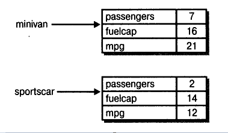

# Глава 4
# Введение в классы, объекты и методы
Основные навыки и понятия
* Основные положения о классах
* Создание объектов
* Присваивание ссылок на объекты
* Создание методов, возврат значений и использование параметров
* Применение ключевого слова return
* Возврат значения из метода
* Добавление параметров в метод
* Применение конструкторов
* Создание параметризированных конструкторов
* Представление об операторе new
* Представление о “сборке мусора” и методах завершения
* Применение ключевого слова this

Прежде чем продолжить изучение Java, следует ознакомиться с классами. Классы, по существу, составляют самые основы языка Java, поскольку класс определяет характер объекта. Следовательно, классы служат прочным основанием для объектно-ориентированного программирования на Java. В классе определяются данные и код, который выполняет действия над этими данными. Код находится внутри методов. Эта глава посвящена классам, объектам и методам, т.е. самим основам Java. Имея представление о классах, объектах и методах, вы сможете писать более сложные программы и лучше уяснить те элементы языка Java, которые будут описаны в последующих главах.

## Основные положения о классах
Все действия программ на Java производятся в пределах классов, поэтому мы вынуждены были пользоваться классами, начиная с первых же примеров программ в этой книге. Разумеется, мы ограничивались лишь самыми простыми классами и не пользовались большинством их возможностей. Как станет ясно в дальнейшем, классы — намного более эффективное языковое средство, чем можно было бы предположить, имея о них лишь самое ограниченное представление, почерпнутое из предыдущих глав.

Начнем рассмотрение классов с основных положений. Класс представляет собой шаблон, по которому определяется форма объекта. В нем указываются данные и код, который будет оперировать этими данными. В Java используется спецификация класса для построения объектов, которые являются экземплярами класса. Следовательно, класс, по существу, представляет собой ряд схематических описаний способа построения объекта. При этом очень важно подчеркнуть, что класс является логической абстракцией. Физическое представление класса появится в оперативной памяти лишь после того, как будет создан объект этого класса.

Следует также иметь в виду, что методы и переменные, составляющие класс, принято называть членами класса. А члены данных называются переменными экземпляра.

## Общая форма определения класса
Определяя класс, вы объявляете его конкретную форму и поведение. Для этого указываются содержащиеся в нем переменные экземпляра, а также методы оперирования этими переменными. Если самые простые классы могут содержать только код или только данные, то большинство настоящих классов содержат и то и другое.

Класс создается с помощью ключевого слова class. Ниже приведена упрощенная общая форма определения класса.
```
class имя_класса {
    // Объявление переменных экземпляра.
    тип переменная1;
    тип переменная2;
    //. . .
    тип переменнаяЫ;
    // Объявление методов.
    тип метод1 (параметры)  {
        // тело метода
    }
    тип метод2 (параметры) {
        // тело метода
    }
    //. . .
    тип методN (параметры) {
        // тело метода
    }
}
```
Несмотря на отсутствие соответствующего правила в синтаксисе Java, правильно сконструированный класс должен определять одну и только одну логическую сущность. Например, класс, в котором хранятся Ф.И.О. и номера телефонов, обычно не содержит сведения о фондовом рынке, среднем уровне осадков, циклах солнечных пятен или другую не относящуюся к делу информацию. Таким образом, в правильно сконструированном классе должна быть сгруппирована логически связанная информация. Если же в один и тот же класс помещается логически несвязанная информация, то структурированность кода быстро нарушается.

Классы, использовавшиеся в приведенных ранее примерах программ, содержали только один метод: main(). Но в представленной выше общей форме определения класса метод main() не указывается. Этот метод требуется указывать в классе лишь в том случае, если программа начинается с данного класса. Кроме того, в некоторых приложениях Java, в том числе в апплетах, метод main() вообще не требуется.

## Определение класса
Для того чтобы проиллюстрировать особенности создания классов, построим класс, инкапсулирующий сведения о транспортных средствах, например о легковых автомобилях, фургонах и грузовиках. Назовем этот класс Vehicle. В нем будут храниться следующие сведения: количество пассажиров, емкость топливного бака и среднее потребление топлива (в милях на галлон).

Ниже приведен первый вариант класса Vehicle. В нем определены три переменные экземпляра: passengers, fuelcap и mpg. Обратите внимание на то, что в классе Vehicle пока еще отсутствуют методы. Они будут добавлены в последующих разделах, а до тех пор в этом классе содержатся только данные.
```
class Vehicle {
    int passengers; // количество пассажиров
    int fuelcap; // емкость топливного бака
    int mpg;    // потребление топлива в милях на галлон
}
```
Объявление class указывает на создание нового типа данных. В данном случае этот тип называется Vehicle. Пользуясь этим именем, можно теперь создавать объекты типа Vehicle. Но не следует забывать, что объявление class — это всего лишь описание типа данных, а реальный объект при этом не создается. Следовательно, приведенный выше код не приводит к появлению объектов типа Vehicle.

Для того чтобы создать реальный объект Vehicle, потребуется оператор, аналогичный следующему:
```
Vehicle minivan = new Vehicle(); // создать объект minivan типа Vehicle
```
После выполнения этого оператора объект minivan станет экземпляром класса Vehicle. Иными словами, класс обретет физическое воплощение. Не пытайтесь вникнуть пока что в детали приведенного выше оператора. В дальнейшем он станет вам полностью понятным.

Всякий раз, когда создается экземпляр класса, строится объект, содержащий копии всех переменных экземпляра, определенных в классе. Иными словами, каждый объект типа Vehicle будет содержать копии переменных passengers, fuelcap и mpg. Для обращения к этим переменным используется оператор-точка (.). Этот оператор связывает имя объекта с именем члена класса. Ниже приведена общая форма записи этого оператора.
```
объект.член
```
В этой форме объект указывается слева, а член — справа от точки. Так, если переменной fuelcap из объекта minivan требуется присвоить значение 16, это можно сделать следующим образом:
```
minivan.fuelcap = 16;
```
Вообще говоря, оператором-точкой можно пользоваться для обращения как к переменным экземпляра, так и к методам.

Ниже приведен пример программы, в которой используется класс Vehicle.
```
/* Программа, в которой используется класс Vehicle.
   Присвоить ее исходному файлу имя VehicleDemo.java
*/
class Vehicle {
    int passengers; // количество пассажиров
    int fuelcap;    // емкость топливного бака
    int mpg;    // потребление топлива в милях на галлон
}
//В этом классе объявляется объект типа Vehicle,
class VehicleDemo {
    public static void main(String args[]) {
        Vehicle minivan = new Vehicle();
        int range;

        // присвоить значения полям в объекте minivan
        // Обратите внимание на применение оператора-точки
        // для доступа к переменным экземпляра данного объекта.
        minivan.passengers = 7;
        minivan.fuelcap = 16;
        minivan.mpg = 21;

        // рассчитать дальность действия транспортного средства,
        // исходя из того, что топливный бак заполнен
        range = minivan.fuelcap * minivan.mpg;
        System.out.println("Minivan can carry " + minivan.passengers +
                           " with a range of " + range);
    }
}
```
Файлу, содержащему приведенный выше код, следует присвоить имя VehicleDemo.java, поскольку метод main() находится не в классе Vehicle, а в классе VehicleDemo. В результате компиляции программы будут созданы два файла с расширением .class: один — для класса Vehicle, а другой — для класса VehicleDemo. Компилятор Java автоматически помещает каждый класс в отдельный файл с расширением .class. Совсем не обязательно, чтобы классы Vehicle и VehicleDemo находились в одном и том же исходном файле. Их можно расположить в двух файлах — Vehicle.java и VehicleDemo.java.

Для того чтобы привести эту программу в действие, следует запустить на выполнение файл VehicleDemo. class. В итоге на экране появится следующий результат:
```
Minivan can carry 7 with a range of 336
```
А теперь самое время рассмотреть следующий основополагающий принцип: каждый объект содержит свои копии переменных экземпляра, определенные в его классе. Следовательно, содержимое переменных в одном объекте может отличаться от содержимого тех же самых переменных в другом объекте. Между объектами нет никакой связи, за исключением того, что они относятся к одному и тому же типу. Так, если имеются два объекта типа Vehicle, каждый из них содержит собственную копию переменных passengers, fuelcap и mpg, причем значения одноименных переменных в этих двух объектах могут отличаться. Этот факт демонстрирует следующий пример программы (обратите внимание на то, что класс, содержащий метод main(), на этот раз назван TwoVehicles):
```
// В этой программе создаются два объекта класса Vehicle,
class Vehicle {
    int passengers; // количество пассажиров
    int fuelcap;    // емкость топливного бака
    int mpg;    // потребление топлива в милях на галлон }
}
// В этом классе объявляется объект типа Vehicle,
class TwoVehicles {
    public static void main(String args[] ) {
        // Помните, что переменные minivan и sportscar
        // ссылаются на разные объекты.
        Vehicle minivan = new Vehicle();
        Vehicle sportscar = new Vehicle();

        int rangel, range2;

        // присвоить значения полям в объекте minivan
        minivan.passengers = 7;
        minivan.fuelcap = 16;
        minivan.mpg = 21;

        // присвоить значения полям в объекте sportscar
        sportscar.passengers = 2;
        sportscar.fuelcap = 14;
        sportscar.mpg = 12;

        // рассчитать дальность действия транспортного средства,
        // исходя из того, что топливный бак заполнен
        rangel = minivan.fuelcap * minivan.mpg;
        range2 = sportscar.fuelcap * sportscar.mpg;

        System.out.println("Minivan can carry " + minivan.passengers +
                            " with a range of " + rangel);
        System.out.println("Sportscar can carry " + sportscar.passengers +
                            " with a range of " + range2);
    }
}
```
Ниже приведен результат выполнения данной программы.
```
Minivan can carry 7 with a range of 336
Sportscar can carry 2 with a range of 168
```
Как видите, данные из объекта minivan отличаются от соответствующих данных из объекта sportscar. Это обстоятельство иллюстрирует приведенный ниже рисунок.


## Порядок создания объектов
В рассмотренных ранее примерах программ для объявления объекта типа Vehicle использовалась следующая строка кода:
```
Vehicle minivan = new Vehicle();
```
Эта строка кода выполняет две функции. Во-первых, в ней объявляется переменная класса Vehicle под именем minivan. Эта переменная еще не определяет объект, она лишь имеет возможность ссылаться на объект. И во-вторых, в этой строке кода создается физическая копия объекта, а ссылка на него присваивается переменной minivan. И делается это с помощью оператора new.

Оператор new динамически (т.е. в процессе выполнения программы) выделяет память для объекта и возвращает ссылку на него. Эта ссылка, по существу, представляет собой адрес области памяти, выделяемой для объекта оператором new. Ссылка на объект сохраняется в переменной. Таким образом, память для объектов всех классов в Java выделяется динамически.

Обе упомянутые функции приведенной выше строки кода можно записать следующим образом, чтобы разделить их и показать по отдельности:
```
Vehicle minivan; // объявить ссылку на объект
minivan = new Vehicle(); // выделить память для объекта типа Vehicle
```
В первой строке кода minivan объявляется как ссылка на объект типа Vehicle. Следует иметь в виду, что minivan — это переменная, которая может ссылаться на объект, а не сам объект. В данный момент переменная minivan пока еще не ссылается на объект. Во второй строке кода создается новый объект типа Vehicle, а ссылка на него присваивается переменной minivan. С этого момента переменная minivan оказывается связанной с объектом.

## Переменные ссылочного типа и присваивание
В операции присваивания переменные ссылочного типа действуют иначе, чем переменные такого простого типа, как, например, int. Когда одна переменная простого типа присваивается другой, ситуация оказывается довольно простой. Переменная, находящаяся в левой части оператора присваивания, получает копию значения переменной, находящейся в правой части этого оператора. Когда же одна переменная ссылки на объект присваивается другой, ситуация несколько усложняется, поскольку такое присваивание приводит к тому, что переменная, находящаяся в левой части оператора присваивания, ссылается на тот же самый объект, на который ссылается переменная, находящаяся в правой части этого оператора. Сам же объект не копируется. В силу этого отличия присваивание переменных ссылочного типа может привести к несколько неожиданным результатам. В качестве примера рассмотрим следующий фрагмент кода:
```
Vehicle carl = new Vehicle();
Vehicle car2 = carl;
```
На первый взгляд, переменные carl и car2 ссылаются на совершенно разные объекты, но на самом деле это не так. Переменные carl и саг2, напротив, ссылаются на один и тот же объект. Когда переменная carl присваивается переменой саг2, в конечном итоге переменная саг 2 просто ссылается на тот же самый объект, что и переменная carl. Следовательно, этим объектом можно оперировать с помощью переменной carl или саг2. Например, после очередного присваивания
```
carl.mpg = 26;
```
оба метода println() в операторах их вызова
```
System.out.println(carl.mpg);
System.out.println(car2.mpg);
```
выводят одно и то же значение: 26.
Несмотря на то что обе переменные, carl и саг2, ссылаются на один и тот же объект, они никак иначе не связаны друг с другом. Например, в результате следующей последовательности операций присваивания просто изменяется объект, на который ссылается переменная саг2:
```
Vehicle carl    = new Vehicle();
Vehicle car2    = carl;
Vehicle carS    = new Vehicle();
car2 = сагЗ;    // Теперь переменные    car2 и сагЗ
// ссылаются на один    и   тот же  объект.
```
После выполнения этой последовательности операций присваивания переменная саг2 ссылается на тот же самый объект, что и переменная сагЗ. А ссылка на объект в переменной carl не меняется.

## Методы
Как пояснялось выше, переменные экземпляра и методы являются двумя основными составляющими классов. До сих пор класс Vehicle, рассматриваемый здесь в качестве примера, содержал только данные, но не методы. Хотя классы, содержащие толькоданные, вполне допустимы, у большинства классов должны быть также методы. Методы представляют собой подпрограммы, которые манипулируют данными, определенными в классе, а во многих случаях они предоставляют доступ к этим данным. Как правило, другие части программы взаимодействуют с классом посредством его методов.

Метод состоит из одного или нескольких операторов. В грамотно написанной программе на Java каждый метод выполняет только одну функцию. У каждого метода имеется свое имя, по которому он вызывается. В общем, методу в качестве имени можно присвоить любой действительный идентификатор. Следует, однако, иметь в виду, что идентификатор main() зарезервирован для метода, с которого начинается выполнение программы. Кроме того, в качестве имен методов нельзя использовать ключевые слова Java.

В этой книге методы именуются в соответствии с условными обозначениями, принятыми в литературе по Java. В частности, после имени метода следуют круглые скобки. Так, если методу присвоено имя getval, то в тексте книги он упоминается в следующем виде: getval(). Такая форма записи помогает отличать имена методов от имен переменных при чтении книги.

Ниже приведена общая форма объявления метода.
```
возращаемый_тип имя (список_параметров) {
// тело метода
}
```
где возращаемый_тип обозначает тип данных, возвращаемых методом. Этот тип должен быть действительным, в том числе и типом создаваемого класса. Если метод не возвращает значение, то в качестве возвращаемого для него следует указать тип void. Далее, имя обозначает конкретное имя, присваиваемое методу. В качестве имени метода может служить любой допустимый идентификатор, не приводящий к конфликтам в текущей области объявлений. И наконец, список_параметров — это последовательность пар, состоящих из типа и идентификатора и разделенных запятыми. Параметры представляют собой переменные, получающие значение аргументов, передаваемых методу при его вызове. Если у метода отсутствуют параметры, то список параметров оказывается пустым.

### Добавление метода в класс Vehicle
Как пояснялось ранее, методы класса обычно выполняют действия над данными в составе класса и предоставляют доступ к этим данным. Напомним, что метод main() в предыдущих примерах вычислял дальность действия транспортного средства, умножая емкость топливного бака на число миль, которые оно может проехать, потребив единичный объем топлива (в данном случае — галлон). И хотя такой расчет формально считается правильным, его лучше всего производить в пределах самого класса Vehicle. Аргументы в пользу такого решения очевидны: дальность действия транспортного средства зависит от потребления топлива в милях на галлон и емкости топливного бака, а обе эти величины инкапсулированы в классе Vehicle. Благодаря добавлению в класс Vehicle метода, предназначенного для расчета дальности, улучшается объектно-ориентированная структура кода.

Для того чтобы добавить метод в класс Vehicle, его следует объявить в пределах этого класса. Например, приведенный ниже вариант класса Vehicle содержит метод range(), определяющий и отображающий дальность действия транспортного средства.

// Добавление метода range в класс Vehicle,
```
class Vehicle {
    int passengers; // количество пассажиров
    int fuelcap;    // емкость топливного бака
    int mpg;    // потребление топлива в милях на галлон

    // отобразить дальность действия транспортного средства
    // Метод range() относится к классу Vehicle.
    // Обратите внимание на то, что переменные fuelcap и трд
    // указываются напрямую без имени объекта и оператора-точки.
    void range() {
        System.out.println("Range is " + fuelcap * mpg);
    }
}

class AddMeth {
    public static void main(String args[]) {
        Vehicle minivan = new Vehicle();
        Vehicle sportscar = new Vehicle();

        int rangel, range2;

        // присвоить значения полям в объекте minivan
        minivan.passengers = 7;
        minivan.fuelcap = 16;
        minivan.mpg = 21;

        // присвоить значения полям в объекте sportscar
        sportscar.passengers = 2;
        sportscar.fuelcap = 14;
        sportscar.mpg = 12;

        System.out.print("Minivan can carry " +
                          minivan.passengers + ". ");

        minivan.range(); // отобразить дальность действия мини-фургона

        System.out.print("Sportscar can carry " +
                         sportscar.passengers + ". ");

        sportscar.range(); // отобразить дальность действия спортивной машины
    }
}
```
Ниже приведен результат выполнения данной программы.
```
Minivan can carry 7. Range is 336
Sportscar can carry 2. Range is 168
```
Рассмотрим основные элементы данной программы. Начнем с метода range(). Первая строка этого метода выглядит так:
```
void range() {
```
В этой строке объявляется метод range, для которого не предусмотрены параметры. В качестве типа, возвращаемого этим методом, указано ключевое слово void. Таким образом, метод range() не возвращает никаких данных вызывающей части программы. И завершается рассматриваемая здесь строка открывающей фигурной скобкой, обозначающей начало тела метода. Тело метода range() состоит из следующей единственной строки кода:
```
System.out.println("Range is " + fuelcap * mpg);
```
В этой строке на экран выводится дальность действия транспортного средства как результат перемножения переменных fuelcap и mpg. А поскольку у каждого объекта типа Vehicle имеются свои копии переменных fuelcap и mpg, то при вызове метода range() используются данные текущего объекта.

Действие метода range() завершается по достижении закрывающей фигурной скобки его тела. При этом управление передается обратно вызывающей части программы. А теперь рассмотрим подробнее следующую строку кода в методе main():
```
minivan.range() ;
```
В этой строке кода вызывается метод range() для объекта minivan. Для вызоваметода относительно объекта перед его именем указываются имя объекта и оператор-точка. При вызове метода ему передается управление. Когда метод завершит свое действие, управление будет возвращено вызывающей части программы, и ее выполнение продолжится со строки кода, следующей за вызовом этого метода.

В данном случае в результате вызова minivan. range() отображается дальность действия транспортного средства, определяемого объектом minivan. Аналогично при вызове sportscar. range() на экран выводится дальность действия транспортного средства, определяемого объектом sportscar. При каждом вызове метода range() выводится дальность действия для указанного объекта.

Необходимо отметить следующую особенность метода range(): в нем выполняется непосредственное обращение к переменным экземпляра fuelcap и mpg, т.е. перед ними не указываются имя объекта и оператор-точка. Если в методе используется переменная экземпляра, определенная в его классе, обращаться к ней можно напрямую, не указывая объект. По зрелом размышлении следует признать, что такой подход вполне логичен, Ведь метод всегда вызывается относительно некоторого объекта своего класса, а следовательно, при вызове метода объект известен и нет никакой необходимости определять его еще раз. Это означает, что переменные fuelcap и mpg, встречающиеся в теле метода range(), неявно обозначают их копии, находящиеся в том объекте, для которого вызывается метод range().

## Возврат из метода
Возврат из метода осуществляется при выполнении одного из двух условий. Первое из них вам уже знакомо по методу range(), а именно: признаком завершения метода и возврата из него служит закрывающая круглая скобка. Вторым условием является выполнение оператора return. Существуют две разновидности оператора return: одна — для методов типа void, не возвращающих значение, а другая — для методов, возвращающих значение вызывающей части программы. Здесь мы рассмотрим первую разновидность оператора return, а о возвращаемых значениях речь пойдет в следующем разделе.

Организовать немедленное завершение метода типа void и возврат из него можно с помощью следующей формы оператора return:
```
return ;
```
При выполнении этого оператора управление будет возвращено вызывающей части программы, а оставшийся в методе код будет проигнорирован. Рассмотрим в качестве примера следующий метод:
```
void myMeth() {
    int i;
    for(i=0; i<10; i++) {
        if(i == 5) return; // завершить цикл на значении 5
        System.out.println();
    }
}
```
Здесь переменная цикла for принимает лишь значения от 0 до 5. Как только значение переменной i становится равным 5, цикл завершается и происходит возврат из метода. В одном методе допускается несколько операторов return. Необходимость в них возникает в том случае, если в методе организовано несколько ветвей выполнения, как в приведенном ниже примере,
```
void myMeth() {
// ...
if(done) return;
// ...
if(error) return;
// ...
}
```
В данном примере метод возвращает управление вызывающей части программы либо по завершении всех необходимых действий, либо при появлении ошибки. Применяя операторы return, следует соблюдать осторожность: слишком большое количество точек возврата из метода нарушает структуру кода. В грамотно написанном методе точки возврата четко определены.

Итак, метод типа void может быть завершен одним из двух способов: по достижении закрывающей фигурной скобки тела метода или при выполнении оператора return.

## Возврат значения
Несмотря на то что методы типа void встречаются довольно часто, большинство методов все же возвращают значения. Способность возвращать значение относится к одним из самых полезных свойств метода. Пример возврата значения уже встречался ранее в этой книге, когда для вычисления квадратного корня использовался метод sqrt().

В программировании возвращаемые значения применяются для самых разных целей. В одних случаях, как, например, при обращении к методу sqrt(), возвращаемое значение представляет собой результат некоторых расчетов. А в других случаях это значение лишь сообщает, успешно ли были выполнены действия, предусмотренные в методе. При этом возвращаемое значение нередко содержит код состояния. Независимо от конкретного способа применения, возвращаемые значения являются неотъемлемой частью программирования на Java.

Методы возвращают значения вызывающей части программы, используя следующую форму оператора return:
```
return значение;
```
где значение — конкретное возвращаемое значение. Данная форма оператора return может быть использована только в тех методах, тип которых отличается от типа void. Более того, подобные методы обязаны возвращать значение, используя данную форму оператора return.

Теперь мы можем немного видоизменить метод range() с учетом возвращаемых значений. Вместо того чтобы отображать дальность в методе range(), лучше ограничиться ее расчетом и возвратом полученного значения. Преимущество такого подхода заключается, в частности, в том, что возвращаемое значение может быть использовано при выполнении других расчетов. В приведенном ниже примере метод range() видоизменен, возвращая значение, которое затем выводится на экран.
```
// Использование возвращаемого значения,
class Vehicle {
    int passengers; // количество пассажиров
    int fuelcap;    // емкость топливного бака
    int mpg;    // потребление топлива в милях на галлон

    // Возврат дальности действия для заданного транспортного средства.
    int range() {
        return mpg * fuelcap;
    }
}

class RetMeth {
    public static void main(String args[]) {
        Vehicle minivan = new Vehicle();
        Vehicle sportscar = new Vehicle();

        int rangel, range2;

        // присвоить значения полям в объекте minivan
        minivan.passengers = 7;
        minivan.fuelcap = 16;
        minivan.mpg = 21;

        // присвоить значения полям в объекте sportscar
        sportscar.passengers = 2;
        sportscar.fuelcap = 14;
        sportscar.mpg = 12;

        // получить дальности действия разных транспортных средств
        // Возвращаемое методом значение присваивается переменной.
        rangel = minivan.range() ;
        range2 = sportscar.range();

        System.out.println("Minivan can carry " + minivan.passengers +
                            " with range of " + rangel + " Miles");
        System.out.println("Sportscar can carry " + sportscar.passengers +
                            " with range of " + range2 + " miles");
    }
}
```
Ниже приведен результат выполнения данной программы.
```
Minivan can carry 7 with range of 336 Miles
Sportscar can carry 2 with range of 168 miles
```
Обратите внимание на то, что вызов метода range() в данной программе указывается в правой части оператора присваивания, тогда как в левой его части — переменная, которая принимает значение, возвращаемое методом range(). Таким образом, после выполнения следующей строки кода значение дальности действия для объекта minivan сохраняется в переменной rangel:
```
rangel = minivan.range();.
```
Следует иметь в виду, что в данном случае метод range() возвращает значение типа int, т.е. вызывающая часть программы получает целочисленное значение. Тип возвращаемого значения — очень важная характеристика метода, поскольку возвращаемые данные должны соответствовать типу, указанному в определении метода. Иными словами, если метод должен возвращать значение типа double, то именно таким и следует объявить его тип.

Несмотря на то что приведенная выше программа компилируется и выполняется без ошибок, ее эффективность можно повысить. В частности, переменные rangel и range2 в ней не нужны. Вызов метода range() можно непосредственно указать в качестве параметра метода println(), как показано ниже.
```
System.out.println("Minivan can carry " + minivan.passengers +
                   " with range of " + minivan.range() + " Miles");
```
В данном случае при выполнении метода println() будет автоматически осуществляться вызов minivan. range(), а полученное в итоге значение — передаваться методу println(). Более того, к методу range() можно обратиться в любой момент, когда понадобится значение дальности действия для объекта типа Vehicle. В качестве примера ниже приведено выражение, в котором сравнивается дальность действия двух транспортных средств.
```
if(vl.range() > v2.range()) System.out.println("vl has greater range");
```
## Использование параметров
При вызове метода ему можно передать одно или несколько значений. Значение, передаваемое методу, называется аргументом. А переменная, получающая аргумент, называется формальным параметром, или просто параметром. Параметры объявляются в скобках после имени метода. Синтаксис объявления параметров такой же, как и у переменных. А областью действия параметров является тело метода. За исключением особых случаев передачи аргументов методу параметры действуют так же, как и любые другие переменные.

Ниже приведен простой пример программы, демонстрирующий использование параметров. В классе ChkNum метод isEven() возвращает логическое значение true, если значение, передаваемое при вызове этого метода, является четным числом. В противном случае метод возвращает логическое значение false. Таким образом, метод isEven() возвращает значение типа boolean.
```
// Простой пример применения параметра в методе.
class ChkNum {
    // возвратить логическое значение true,
    // если х содержит четное число
    // Здесь х — целочисленный параметр метода isEven().
    boolean isEven(int x) {
        if((x%2) == 0) return true;
        else return false;
    }
}

class ParmDemo {
    public static void main(String args[]) {
    ChkNum e = new ChkNum();

    // В следующих строках кода передаются аргументы методу isEven().
    if(е.isEven(10)) System.out.println("10 is even.");

    if (e.isEven(9)) System.out.println("9 is even.");

    if (e.isEven(8)) System.out.println("8 is even.");
    }
}
```
Выполнение этой программы дает следующий результат:
```
10 is even.
8   is even.
```
В данной программе метод isEven() вызывается трижды, и каждый раз ему передается новое значение. Рассмотрим подробнее ее исходный код. Обратите сначала внимание на то, каким образом вызывается метод isEven(). Его параметр указывается в круглых скобках. При первом вызове методу isEven() передается значение 10. Следовательно, когда метод isEven() начинает выполняться, параметр х получает значение 10. При втором вызове в качестве аргумента этому методу передается значение 9,  которое и принимает параметр х. А при третьем вызове методу isEven() передается значение 8, которое опять же присваивается параметру х. Какое бы значение ни указать при вызове метода isEven(), его все равно получит параметр х.

В методе может быть определено несколько параметров, и в этом случае они разделяются запятыми. Допустим, в классе Factor имеется метод isFactor(), который определяет, является ли первый его параметр множителем второго, как показано ниже.
```
class Factor {
    //В этом методе предусмотрены два параметра.
    boolean isFactor(int a, int b) {
        if( (b % a) == 0) return true;
        else return false;
    }
}
class IsFact {
    public static void main(String args[])  {
        Factor x = new Factor();
        // При вызове методу isFactor() передаются два аргумента.
        if(х.isFactor(2, 20)) System.out.println("2 is factor");
        if(x.isFactor(3, 20)) System.out.println("this won't be displayed");
    }
}
```
Обратите внимание на то, что при вызове метода isFactor() передаваемые ему значения также разделяются запятыми.

При использовании нескольких параметров для каждого из них определяется тип, причем типы параметров могут отличаться. Например, следующее объявление метода является корректным:
```
int myMeth(int a, double b, float с) {
// ...
```

## Добавление параметризированного метода в класс Vehicle
Параметризированный метод позволяет реализовать в классе Vehicle новую возможность: расчет объема топлива, необходимого для преодоления заданного расстояния. Назовем этот новый метод fuelneededO . Он получает в качестве параметра расстояние в милях, которое должно проехать транспортное средство, а возвращает необходимое для этого количество галлонов топлива. Метод f uelneeded() определяется следующим образом:
```
double fuelneeded(int miles) {
    return (double) miles / mpg;
}
```
Обратите внимание на то, что этот метод возвращает значение типа double. Это важно, поскольку объем потребляемого топлива не всегда можно выразить целым числом. Ниже приведен исходный код программы для расчета дальности действия транспортных средств с классом Vehicle, содержащим метод fuelneeded().
```
/*
Добавление параметризированного метода, в котором производится
расчет объема топлива, необходимого транспортному средству для
преодоления заданного расстояния.
*/
class Vehicle {
    int passengers; // количество пассажиров
    int fuelcap;    // емкость топливного бака
    int mpg;    // потребление топлива в милях на галлон

    // возвратить дальность действия транспортного средства
    int range() {
        return mpg * fuelcap;
    }

    // рассчитать объем топлива, необходимого транспортному
    // средству для преодоления заданного расстояния
    double fuelneeded(int miles) {
        return (double) miles / mpg;
    }
}

class CompFuel {
    public static void main(String args[]) {
        Vehicle minivan = new Vehicle();
        Vehicle sportscar = new Vehicle();
        double gallons;
        int dist = 252;

        // присвоить значения полям в объекте minivan
        minivan.passengers = 7;
        minivan.fuelcap = 16;
        minivan.mpg = 21;

        // присвоить значения полям в объекте sportscar
        sportscar.passengers = 2;
        sportscar.fuelcap = 14;
        sportscar.mpg = 12;

        gallons = minivan.fuelneeded(dist) ;

        System.out.println("To go " + dist + " miles minivan needs " +
                            gallons + " gallons of fuel.");

        gallons = sportscar.fuelneeded(dist);

        System.out.println("To go " + dist + " miles sportscar needs " +
                            gallons + " gallons of fuel.");
    }
}
```
Выполнение этой программы дает следующий результат:
```
То до 252 miles minivan needs 12.0 gallons of fuel.
To go 252 miles sportscar needs 21.0 gallons of fuel.
```

**Пример для опробования 4.1.**
Создание справочного класса

Если попытаться кратко выразить сущ¬
ность классов, то следовало бы сказать,
что класс инкапсулирует функциональные возможности. Иногда трудно определить, где оканчиваются одни функциональные возможности и начинаются другие. Класс должен быть стандартным блоком для компоновки приложения. Для этой цели класс необходимо спроектировать таким образом, чтобы он представлял собой одну функциональную единицу, выполняющую строго определенные действия. Следовательно, нужно стремиться к тому, чтобы классы были как можно более компактными, но в разумных пределах! Ведь классы, реализующие лишние функциональные возможности, делают код сложным для понимания и плохо структурированным, но классы со слишком ограниченными функциональными возможностями приводят к тому, что программа становится неоправданно фрагментированной. Как же найти золотую середину? В поисках ее наука программирования превращается в искусство программирования. Многие программисты считают, что такая способность приходит с опытом.

В качестве упражнения для приобретения нужных навыков работы с классами в этом проекте вам предстоит преобразовать в класс Help справочную систему, созданную в примере для опробования 3.3. Но прежде рассмотрим, какие для этого имеются основания. Во-первых, справочная система представляет собой один логический блок. Эта система лишь отображает синтаксис управляющих операторов Java. Ее функциональные возможности четко определены. Во-вторых, реализация справочной системы в виде класса представляет собой довольно изящное решение. Всякий раз, когда требуется отобразить подсказку для пользователя, достаточно создать экземпляр объекта справочной системы. И наконец, справочную информацию можно дополнить или изменить, не затрагивая остальные части программы, поскольку она инкапсулирована в классе.

Последовательность действий
1.  Создайте новый файл HelpClassDemo. j ava. Ради экономии времени и труда на ввод исходного текста скопируйте файл Help3. j ava, созданный вами во время проработки примера для опробования 3.3, и сохраните его под именем HelpClassDemo.java.
2.  Для того чтобы преобразовать справочную систему в класс, нужно сначала четко определить ее составные части. Так, в исходном файле Help3. j ava программы, реализующей справочную систему, имеется код, отвечающий за отображение меню, получение информации от пользователя, проверку достоверности ответа и отображение данных, соответствующих выбранному пункту меню. В этой программе имеется также цикл, который завершается при вводе символа q. По зрелом размышлении становится ясно, что средства организации меню, проверки достоверности ответа и отображения информации являются составными частями справочной системы. В то же время порядок получения данных от пользователя и обработки многократных запросов не имеет к системе непосредственного отношения. Таким образом, нужно создать класс, который отображает справочную информацию, меню для ее выбора и проверяет правильность сделанного выбора. Соответствующие методы класса можно назвать helpon(), showmenu() и isvalid().
3.  Создайте метод helpon(), исходный.код которого приведен ниже.
    ```
    void helpon(int what) {
        switch(what) {
            case '1':
                System.out.println("The if:\n");
                System.out.println("if(condition) statement;");
                System.out.println("else statement;");
                break;
            case '2':
                System.out.println("The switch:\n");
                System.out.println("switch(expression) {");
                System.out.println(" case constant:");
                System.out.println(" statement sequence");
                System.out.println(" break;");
                System.out.println(" // ...");
                140 Java 7: руководство для начинающих, 5-е издание
                System.out.println("}");
                break;
            case '3':
                System.out.println("The for:\n");
                System.out.print("for(init; condition; iteration)");
                System.out.println(" statement;");
                break;
            case '4':
                System.out.println("The while:\n");
                System.out.println("while(condition) statement;");
                break;
            case '5':
                System.out.println("The do-while:\n");
                System.out.println("do {");
                System.out.println(" statement;");
                System.out.println("} while (condition);");
                break;
            case '6':
                System.out.println("The break:\n");
                System.out.println("break; or break label;");
                break;
            case '7':
                System.out.println ("The continue': \n") ;
                System.out.println("continue; or continue label;");
                break;
        }
        System.out.println();
    }
    ```
4.  Далее создайте метод showmenu(), исходный код которого приведен ниже.
    ```
    void showmenu() {
        System.out.println("Help on:");
        System.out.println(" 1. if");
        System.out.println(" 2. switch");
        System.out.println(" 3. for");
        System.out.println (" 4. while");
        System.out.println(" 5. do-while");
        System.out.println(" 6. break");
        System.out.println(" 7. continue\n");
        System.out.print("Choose one (q to quit): ");
    }
    ```
5.  И наконец, создайте метод is valid(), исходный код которого приведен ниже.
    ```
    boolean isvalid(int ch) {
        if(ch < 'l1 |   ch  >   *7' & ch != fq') return false;
        else return true;
    }
    ```
6.  Добавьте созданные выше методы в класс Help, как показано ниже.
    ```
    class Help {
        void helpon(int what) {
            switch(what) {
                case '1'    :
                    System.out.println("The if:\n");
                    Глава 4. Введение в классы, объекты и методы 141
                    System.out.println("if(condition) statement;");
                    System.out.println("else statement;");
                    break;
                case '2':
                    System.out.println("The switch:\n");
                    System.out.println("switch(expression) {");
                    System.out.println(" case constant:");
                    System.out.println(" statement sequence");
                    System, out .print'ln (" break;") ;
                    System.out.println(" // ...");
                    System.out.println("}");
                    break;
                case '3':
                    System.out.println("The for:\n");
                    System.out.print("for(init; condition; iteration)");
                    System.out.println(" statement;");
                    break;
                case '4' :
                    System.out.println("The while:\n");
                    System.out.println("while(condition) statement;");
                    break;
                case '5':
                    System.out.println("The do-while:\n");
                    System.out.println("do {");
                    System.out.println(" statement;");
                    System.out.println("} while (condition);");
                    break;
                case '6':
                    System.out.println("The break:\n");
                    System.out.println("break; or break label;");
                    break;
                case '7':
                    System.out.println("The continue:\n");
                    System.out.println("continue; or continue label;");
                    break;
            }
            System.out.println();
        }

        void showmenu() {
            System.out.println("Help on:");
            System.out.println(" 1. if");
            System.out.println(" 2. switch");
            System.out.println(" 3. for");
            System.out.println(" 4. while");
            System.out.println(" 5. do-while");
            System.out.println(" 6. break");
            System.out.println(" 7. continue\n");
            System.out.print("Choose one (q to quit): ");
        }

        boolean isvalid(int ch) {
            if(ch < '1' |   ch  >   '7' &   ch  !=  fq')    return  false;
            else return true;
        }
    }
    ```
7.  Перепишите метод main() из примера для опробования 3.3 таким образом, чтобы использовать в нем новый класс Help. Сохраните новый исходный код в файле HelpClassDemo. j ava. Ниже приведен весь исходный код программы, реализующей справочную систему в файле HelpClassDemo. j ava.
    ```
    /*
        Пример для опробования 4.1.

        Преобразование в класс Help справочной системы
        из примера для опробования 3.3.
    */
    class Help {
    void helpon(int what) {
        switch(what) {
            case '1':
                System.out.println("The if:\n");
                System.out.println("if(condition) statement;");
                System.out.println("else statement;");
                break;
            case '2':
                System.out.println("The switch:\n");
                System.out.println("switch(expression) {");
                System.out.println(" case constant:");
                System.out.println(" statement sequence");
                System.out.println(" break;");
                System, out .println (" // ...");,
                System.out.println("}");
                break;
            case '3':
                System.out.println("The for:\n");
                System.out.print("for(init; condition; iteration)");
                System.out.println(" statement;");
                break;
            case '4':
                System.out.println("The while:\n");
                System.out.println("while(condition) statement;");
                break;
            case '5':
                System.out.println("The do-while:\n");
                System.out.println("do {");
                System.out.println(" statement;");
                System.out.println("} while (condition);");
                break;
            case '6':
                System.out.println("The break:\n");
                System.out.println("break; or break label;");
                break;
            case '7':
                System.out.println("The continue:\n");
                System.out.println("continue; or continue label;");
                break;
        }
        System.out.println();
    }
    void showmenu() {
        System.out.println("Help on:");
        System.out.println(" 1. if");
        System.out.println(" 2. switch");
        System.out.println(" 3. for");
        System.out.println(" 4. while");
        System.out.println(" 5. do-while");
        System.out.println(" 6. break");
        System.out.println(" 7. continue\n");
        System.out.print("Choose one (q to quit): ");
        boolean isvalid(int ch) {
            if(ch < 'l1 | ch > f 7' & ch != 'q') return false;
            else return true;
        }
    }

    class HelpClassDemo {
        public static void main(String args[])
        throws java.io.IOException {
            char choice, ignore;
            Help hlpobj = new Help();

            for (;;)    {
                do {
                    hlpobj.showmenu();
                    choice = (char) System.in.read();
                    do {
                        ignore = (char) System.in.read();
                    } while(ignore != !\n');
                } while( !hlpobj.isvalid(choice) );

                if(choice == 'q') break;

                System.out.println("\n");
                hlpobj.helpon(choice);
            }
        }
    }
    ```
Запустив эту программу на выполнение, вы увидите, что она ведет себя точно так же, как и предыдущая ее версия. Преимущество текущей ее версии заключается лишь в том, что теперь справочная система может быть использована повторно всякий раз, когда в этом возникнет потребность.

## Конструкторы
В предыдущем примере программы мы вынуждены были вручную устанавливать значения переменных экземпляра для каждого объекта типа Vehicle, как показано ниже.
```
minivan.passengers = 7;
minivan.fuelcap = 16;
minivan.mpg =21;
```
Но такой подход вообще не применяется в программах, профессионально написанных на Java, по следующим причинам. Во-первых, существует большая вероятность допустить ошибку (можно, например, забыть установить значение одного из полей). И во-вторых, существует гораздо более простой и надежный способ решения подобной задачи: использовать конструктор.

Конструктор инициализирует объект при его создании. У конструктора такое же имя, как и у его класса, а с точки зрения синтаксиса он подобен методу. Но у конструкторов нет возвращаемого типа, указываемого явно. Как правило, конструкторы используются для задания первоначальных значений переменных экземпляра, определенных в классе, или же для выполнения любых других установочных процедур, которые требуются для создания полностью сформированного объекта.

У всех классов имеются конструкторы, независимо от того, определите вы их или нет, поскольку в Java автоматически предоставляется конструктор, используемый по умолчанию и инициализирующий все переменные экземпляра их значениями по умолчанию. Для большинства типов данных значением по умолчанию является нулевое, для типа bool — логическое значение false, а для ссылочных типов — пустое значение null. Но как только вы определите свой собственный конструктор, конструктор по умолчанию больше не используется.

Ниже приведен простой пример, демонстрирующий применение конструктора.
```
// Простой конструктор.
class MyClass {
    int х;

    // Конструктор класса MyClass.
    MyClass()   {
        х = 10;
    }
}
class ConsDemo {
    public static void main(String args[]) {
        MyClass tl = new MyClass();
        MyClass t2 = new MyClass();

        System.out.println(tl.x + " " + t2.x);
    }
}
```
В данном примере конструктор класса MyClass объявляется следующим образом:
```
MyClass()  {
    х = 10;
}
```
В этом конструкторе переменной экземпляра х, определяемой в классе MyClass, присваивается значение 10. Этот конструктор вызывается оператором new при создании объекта данного класса. Ниже приведена строка кода, в которой используется оператор new.
```
MyClass tl = new MyClass();
```
В этой строке кода для объекта tl вызывается конструктор MyClass(), в котором переменной экземпляра tl. х присваивается значение 10. То же самое происходит и для объекта t2. После вызова данного конструктора переменная экземпляра t2. х также получает значение 10. Таким образом, выполнение приведенного выше примера программы дает следующий результат:
```
10 10
```

## Параметризированные конструкторы
В предыдущем примере использовался конструктор без параметров. В некоторых случаях этого оказывается достаточно, но зачастую конструктор должен принимать один или несколько параметров. В конструктор параметры вводятся таким же образом, как и в метод. Для этого достаточно объявить их в скобках после имени конструктора. Ниже приведен пример применения параметризированного конструктора класса MyClass.
```
// Параметризированный конструктор.
class MyClass {
    int х;

    //У этого конструктора имеется параметр.
    MyClass(int i) {
        х = i;
    }
}

class ParmConsDemo {
    public static void main(String args[]) {
        MyClass tl = new MyClass(10);
        MyClass t2 = new MyClass(88);

        System.out.println(tl.x + " " + t2.x);
    }
}
```
Результат выполнения данной программы выглядит следующим образом:
```
10 88
```
В данной версии программы в конструкторе класса MyClass определяется единственный параметр i, который используется для инициализации переменной экземпляра х. При выполнении следующей строки кода значение 10 сначала передается параметру i данного конструктора, а затем присваивается переменной х:
```
MyClass tl = new MyClass(10);
```

## Добавление конструктора в класс Vehicle
Теперь мы можем усовершенствовать класс Vehicle, добавив в него конструктор, в котором будут автоматически инициализироваться поля passengers, fuelcap и mpg при построении объекта. Обратите особое внимание на то, каким образом создаются объекты типа Vehicle.
```
// Добавление конструктора.
class Vehicle {
    int passengers; // количество пассажиров
    int fuelcap;    // емкость топливного бака
    int mpg;    // потребление топлива в милях на галлон

    // Это конструктор класса Vehicle.
    Vehicle(int р, int f, int m) {
        passengers = p;
        fuelcap = f;
        mpg = m;
    }

    // возвратить дальность действия транспортного средства
    int range() {
    return mpg * fuelcap;
    }

    // рассчитать объем топлива, необходимого транспортному
    // средству для преодоления заданного расстояния
    double fuelneeded(int miles) {
        return (double) miles / mpg;
    }
}

class VehConsDemo {
    public static void main(String args[]) {

        // сконструировать полностью объекты транспортных средств
        Vehicle minivan = new Vehicle(7, 16, 21);
        Vehicle sportscar = new Vehicle(2, 14, 12);
        double gallons;
        int dist = 252;

        gallons = minivan.fuelneeded(dist);

        System.out.println("To go " + dist + " miles minivan needs " +
                            gallons + " gallons of fuel.");

        gallons = minivan.fuelneeded(dist);

        System.out.println("To go " + dist + " miles sportscar needs " +
                            gallons + " gallons of fuel.");
    }
}
```
При создании объекты minivan и sportscar инициализируются конструктором Vehicle(). Каждый такой объект инициализируется параметрами, указанными в конструкторе его класса. Например, в строке кода
```
Vehicle minivan = new Vehicle(7, 16, 21);
```
значения 7, 16 и 21 передаются конструктору Vehicle() в качестве параметров при создании нового объекта minivan с помощью оператора new.

В итоге копии переменных passengers, fuelcap и mpg в объекте minivan будут содержать значения 7, 16 и 21 соответственно. Рассмотренная здесь версия программы дает такой же результат, как и ее предыдущая версия.

## Еще раз об операторе new
Теперь, когда вы ближе ознакомились с классами и их конструкторами, вернемся к оператору new, чтобы рассмотреть его более подробно. Ниже приведена общая форма этого оператора в контексте присваивания.
```
переменная_класса = new имя_класса{список_аргументов)
```
где переменная_класса обозначает тип переменной создаваемого класса, а имя_класса — конкретное имя класса, реализуемого в виде экземпляра его объекта. Имя класса и список_аргументов в скобках, который может быть пустым, обозначают конструктор этого класса. Если в классе не определен его собственный конструктор, то в операторе new будет использован конструктор, предоставляемый в Java по умолчанию. Следовательно, оператор new может быть использован для создания объекта, относящегося к классу любого типа. Оператор new возвращает ссылку на вновь созданный объект, который получает переменная_класса в результате присваивания в данной форме записи.

Оперативная память не бесконечна, и поэтому вполне возможно, что оператору new не удастся выделить память для объекта из-за нехватки доступной памяти. В этом случае возникает исключительная ситуация во время выполнения (подробнее об обработке исключительных ситуаций речь пойдет в главе 9). В примерах программ, представленных в этой книге, ситуация, связанная с исчерпанием оперативной памяти, не учитывается, но при написании реальных программ такую возможность, вероятно, придется принимать во внимание.

## "Сборка мусора" и методы завершения
Как было показано выше, при использовании оператора new свободная память для создаваемых объектов динамически выделяется из доступной буферной области оперативной памяти. Разумеется, оперативная память не бесконечна, и поэтому свободно доступная память рано или поздно исчерпывается. Это может привести к неудачному выполнению оператора new из-за нехватки свободной памяти для создания требуемого объекта. Именно по этой причине одной из главных функций любой схемы динамического распределения памяти является своевременное освобождение памяти от неиспользуемых объектов, чтобы сделать ее доступной для последующего перераспределения. Во многих языках программирования освобождение распределенной ранее памяти осуществляется вручную. Например, в C++ для этой цели служит оператор delete. Но в Java применяется другой, более надежный подход: “сборка мусора”.

Система “сборки мусора” в Java освобождает память от лишних объектов автоматически, действуя подспудно, незаметно и без всякого вмешательства со стороны программиста. “Сборка мусора” происходит следующим образом. Если ссылки на объект отсутствуют, то такой объект считается больше ненужным, и занимаемая им память в итоге освобождается. Эта утилизированная память может быть затем распределена для других объектов.

“Сборка мусора” происходит лишь время от времени по ходу выполнения программы. Она не состоится только потому, что существует один или несколько объектов, которые больше не используются. Следовательно, нельзя заранее знать или предположить, когда именно произойдет “сборка мусора”.

## Метод finalize()
Существует возможность определить метод, который будет вызван непосредственно перед окончательным удалением объекта из памяти. Этот метод называется finalize(). Он позволяет убедиться, что объект больше не существует. Этот метод можно, например, использовать для закрытия файла, открытого проверяемым объектом.

Для того чтобы добавить в класс метод завершения, достаточно определить метод finalize(). Исполняющая система Java вызовет этот метод перед фактическим удалением объекта. В теле метода finalize() следует предусмотреть действия, которые должны быть выполнены непосредственно перед удалением объекта.

Ниже приведена общая форма метода finalize().
```
protected void finalize()
{
// здесь указывается код метода завершения
}
```
Ключевое слово protected является здесь спецификатором, предотвращающим обращение к методу finalizeO за пределами класса. Этот и другие спецификаторы доступа подробнее рассматриваются в главе 6.

Следует, однако, иметь в виду, что метод finalize() вызывается непосредственно перед операцией “сборки мусора” по отношению к удаляемому объекту. Но он не вызывается в том случае, если объект оказывается за пределами области действия. Поэтому заранее невозможно предсказать, когда и при каких условиях метод finalize() будет выполнен. Так, если программа завершится до того, как будет запущена процедура “сборки мусора”, метод finalize() не будет выполнен. Таким образом, данный метод не пригоден для корректного освобождения занятых ресурсов или для других специальных целей, а тем более для нормального завершения работы программы. Короче говоря, метод finalize() имеет специальное назначение и поэтому редко требуется для завершения большинства программ.

**Пример для опробования 4.2.**
Демонстрация "сборки мусора" и завершения ко^а

В связи с тем что “сборка мусора” начинается в произвольные моменты времени и выполняется в фоновом режиме, продемонстрировать ее действие не так-то просто, но это можно все же сделать с помощью метода finalize(). Напомним, этот метод вызывается в тот момент, когда объект должен быть удален. Но, как пояснялось ранее, объект не обязательно удаляется именно тогда, когда необходимость в нем отпадает. Вместо этого система “сборки мусора” дожидается того момента, когда освобождение памяти может быть произведено наиболее эффективно. Чаще всего для этого должно накопиться достаточно большое количество неиспользуемых объектов. Поэтому для демонстрации “сборки мусора” с помощью метода finalize() нужно создать и удалить как можно больше объектов, что и предстоит сделать в данном проекте.

Последовательность действий
1. Создайте новый файл Finalize.java.
2. Создайте класс FDemo, как показано ниже.
class FDemo {
    int х;

    FDemo(int i) {
        x = i;
    }

    // вызывается при утилизации объекта
    protected void finalize()   {
    System.out.println("Finalizing " + x);
    }

    // формирует объект, который тотчас уничтожается
    void generator(int i) {
        FDemo о = new FDemo(i).;
    }
}
3.  В конструкторе данного класса устанавливается значение переменной экземпляра х, определяемое передаваемым параметром. В данном примере переменная экземпляра х служит в качестве идентификатора объекта. При утилизации объекта метод finalize() отображает значение переменной х. Обратите особое внимание на метод generator(). В нем создается объект типа FDemo, который сразу же уничтожается. Этот метод будет использован в дальнейшем.
4.  Создайте класс Finalize, как показано ниже.
    ```
    class Finalize {
        public static void main(String args[]) {
        int count;
        FDemo ob = new FDemo(0);
        /* А теперь сформировать большое количество объектов.
        В какой-то момент должна начаться "сборка мусора".
        Примечание: количество формируемых объектов, возможно,
        придется увеличить, чтобы принудить "сборку мусора". */
        for(count=l; count < 100000; count++)
            ob.generator(count);
        }
    }
    ```
5.  В классе Finalize сначала создается исходный объект ob типа FDemo. Затем из этого объекта формируется 100000 других аналогичных объектов. С этой целью вызывается метод generator() для объекта ob. На различных этапах данного процесса вступает в действие процедура “сборки мусора”. Частота активизации данной процедуры зависит от целого ряда факторов, в том числе от объема свободной памяти и типа операционной системы. Но в любом случае в какой-то момент вы увидите сообщения, выводимые на экран в процессе выполнения метода finalize(). Если ни одного сообщения не появится, попробуйте увеличить число создаваемых объектов, изменив условие завершения цикла for.
6.  Ниже приведен весь исходный код программы из файла Finalize.java.
    ```
    /*
    Пример для опробования 4.2.
    Демонстрация "сборки мусора" и метода finalize().
    */
    class FDemo {
        int x;

        FDemo(int i) {
            x = i;
        }
        // вызывается при утилизации объекта
        protected void finalize()  {
            System.out.println("Finalizing " + x) ;
        }

        // формирует объект, который тотчас уничтожается
        void generator(int i) {
            FDemo о = new FDemo(i);
        }
    }

    class Finalize {
        public static void main(String args[]) {
        int count;
        FDemo ob = new FDemo(0);
        /* А теперь сформировать большое количество объектов.
            В какой-то момент должна начаться "сборка мусора".
            Примечание: количество формируемых объектов, возможно,
            придется увеличить, чтобы принудить "сборку мусора". */
        for(count=l; count < 100000; count++)
            ob.generator(count);
        }
    }
    ```

## Ключевое слово this
И в завершение этой главы рассмотрим ключевое слово this. Когда метод вызывается, ему автоматически передается ссылка на вызывающий объект, т.е. тот объект, для которого вызывается данный метод. Эта ссылка обозначается ключевым словом this. Следовательно, ключевое слово this обозначает именно тот объект, по ссылке на который действует вызываемый метод. Для того чтобы стало яснее назначение ключевого слова this, рассмотрим сначала пример программы, в которой создается класс Pwr, в котором вычисляется результат возведения числа в некоторую целочисленную степень.
```
class Pwr {
    double b;
    int e;
    double val;

    Pwr(double base, int exp) {
        b = base;
        e = exp;

        val = 1;
        if(exp==0) return;
        for( ; exp>0; exp—) val = val * base;
    }

    double get_pwr() {
        return val;
    }
}
class DemoPwr {
    public static   void main(String args[]) {
        Pwr x = new Pwr(4.0, 2);
        Pwr у = new Pwr(2.5, 1);
        Pwr z = new Pwr (5.7, 0);

        System.out.println(x.b + "raised to the 11 + x.e +
                            " poweris " + x.get_pwr());
        System.out.println(y.b + "raised to the " + y.e +
                            " power is 11 + y.get_pwr()j;
        System.out.println(z .b + 11 raised to the " + z.e +
                            " power is " + z.get   pwr());
    }
}
```
Как вам должно быть уже известно, в теле метода можно непосредственно обращаться к другим членам класса, не указывая имя объекта или класса. Так, в методе get_pwr() имеется следующий оператор:
```
return val;
```
Он означает, что из данного метода должна быть возвращена копия значения переменной val, связанной с вызывающим объектом. Этот оператор можно переписать следующим образом:
```
return this.val;
```
где ключевое слово this ссылается на объект, для которого был вызван метод get_pwr(). Следовательно, this.val — это ссылка на копию переменной val в данном объекте. Так, если бы метод get pwr() был вызван для объекта х, ключевое слово this в приведенном выше операторе ссылалось бы на объект х. Оператор, в котором отсутствует ключевое слово this, на самом деле является не более чем сокращенной записью.

Ниже приведен исходный код класса Pwr, написанный с использованием ключевого слова this.
```
class Pwr {
    double b;
    int e;
    double val;

    Pwr(double base, int exp) {
        this.b = base;
        this.e = exp;

        this.val = 1;
        if(exp==0) return;
        for( ; exp>0; exp—) this.val = this.val * base;
    }

    double get_pwr() {
        return this.val;
    }
}
```
На самом деле ни один программирующий на Java не напишет класс Pwr подобным образом, поскольку, добавляя ключевое слово this, он не получит никаких преимуществ. В то же время стандартная форма записи тех же самых операторов выглядит намного проще. Но в ряде случаев ключевое слово this может оказаться очень полезным. Например, синтаксис языка Java не запрещает использовать имена параметров или локальных переменных, совпадающие с именами глобальных переменных. В этом случае локальная переменная или параметр скрывает переменную экземпляра. А доступ к скрытой переменной экземпляра позволяет получить ключевое слово this. Так, приведенный ниже пример конструктора класса Pwr() синтаксически правилен, но подобного стиля программирования рекомендуется все же избегать.
```
Pwr(double b, int e) {
    // Здесь ключевое слово this обозначает ссылку
    // на переменные b и е, а не на параметры,
    this.b = b;
    this.e = е;

    val = 1;
    if(е==0) return;
    for( ; е>0; е—) val = val * b;
}
```
В данной версии конструктора класса Pwr имена параметров совпадают с именами переменных экземпляра, скрывая их. А ключевое слово this используется здесь для того, чтобы “раскрыть” переменные экземпляра.

Упражнение для самопроверки по материалу главы 4
1.  В чем отличие класса от объекта?
2.  Как определяется класс?
3.  Чью собственную копию содержит каждый объект?
4.  Покажите, как объявить объект counter класса MyCounter, используя два отдельных оператора.
5.  Как должен быть объявлен метод myMeth, принимающий два параметра, а и b, типа int и возвращающий значение типа double?
6.  Как должно завершаться выполнение метода, возвращающего некоторое значение?
7.  Каким должно быть имя конструктора?
8.  Какие действия выполняет оператор new?
9.  Что такое “сборка мусора” и какие действия она выполняет? Зачем нужен метод finalize()?
10. Что означает ключевое слово this?
11. Может ли конструктор иметь один или несколько параметров?
12. Если метод не возвращает значения, то как следует объявить тип этого метода?