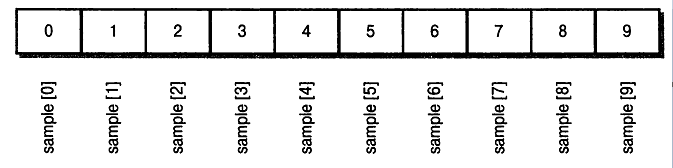
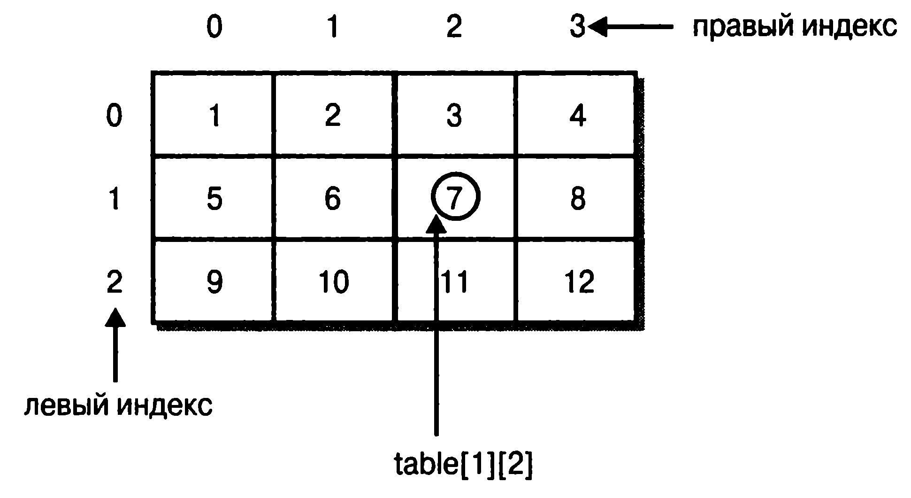

# Глава 5
# Дополнительные сведения о типах данных и операторах
Основные навыки и понятия
* Представление о массивах
* Создание многомерных массивов
* Создание нерегулярных массивов
* Представление об альтернативном синтаксисе объявления массивов
* Присваивание ссылок на массивы
* Применение переменной экземпляра length
* Использование разновидности for-each цикла for
* Манипулирование символьными строками
* Употребление аргументов командной строки
* Использование поразрядных операторов
* Применение оператора ?

В этой главе мы возвращаемся к обсуждению типов данных и операторов Java. В ней речь пойдет, в частности, о массивах, классе String, поразрядных операторах и тернарном операторе ?. Кроме того, мы рассмотрим разновидность цикла for, реализованную лишь в самых последних версиях языка. Внимание также будет уделено аргументам командной строки.

## Массивы
Массив представляет собой совокупность однотипных переменных с общим для обращения к ним именем. В Java массивы могут быть как одномерными, так и многомерными, хотя чаще всего применяются одномерные массивы. Массивы служат самым разным целям, поскольку они предоставляют удобные средства для объединения связанных вместе переменных. Например, в массиве можно хранить максимальные суточные температуры, зарегистрированные в течение месяца, перечень биржевых курсов или же названия книг по программированию из домашней библиотеки.

Главное преимущество массива — в организации данных таким образом, чтобы ими было проще манипулировать. Так, если имеется массив, содержащий дивиденды, выплачиваемые по избранной группе акций, то, организовав циклическое обращение к элементам этого массива, можно без особого труда рассчитать средний доход от этих акций. Кроме того, массивы позволяют организовать данные таким образом, чтобы легко отсортировать их.

Массивами в Java можно пользоваться практически так же, как и в других языках программирования. Тем не менее у них имеется одна особенность: они реализованы в виде объектов. Именно поэтому их рассмотрение было отложено до тех пор, пока в этой книге не были представлены объекты. Реализация массивов в виде объектов дает ряд существенных преимуществ, и далеко не самым последним среди них является возможность утилизировать неиспользуемые массивы средствами “сборки мусора”.

### Одномерные массивы
Одномерный массив представляет собой список связанных переменных. Такие списки часто применяются в программировании. Например, в одномерном массиве можно хранить учетные номера активных пользователей сети или текущие средние уровни достижений бейсбольной команды.

Для объявления одномерного массива обычно применяется следующая общая форма:
```
тип имя_массива[] = new тип[размер];
```
где тип объявляет конкретный тип элемента массива. Тип элемента, называемый также базовым, определяет тип данных каждого элемента, составляющего массив. А размер определяет число элементов массива. В связи с тем что массивы реализованы в виде объектов, создание массива происходит в два этапа. Сначала объявляется переменная, ссылающаяся на массив, затем выделяется память для массива, а ссылка на нее присваивается переменной массива. Следовательно, память для массивов в Java динамически распределяется с помощью оператора new.

Проиллюстрируем все сказанное выше на конкретном примере. В следующей строке кода создается массив типа int, состоящий из 10 элементов, а ссылка на него присваивается переменной sample:
```
int sample[] = new int[10];
```
Объявление массива происходит так же, как и объявление объекта. В переменной sample сохраняется ссылка на область памяти, выделяемую для массива оператором new. Этой памяти должно быть достаточно для размещения в ней 10 элементов типа int.

Как и объявление объектов, приведенное выше объявление массива можно разделить на две отдельные составляющие следующим образом:
```
int sample [];
sample = new int[10];
```
В данном случае сначала создается переменная sample, которая пока что не ссылается на конкретный объект. А затем переменная sample получает ссылку на конкретный массив.

Доступ к отдельным элементам массива осуществляется с помощью индексов. Индекс обозначает положение элемента в массиве. В Java индекс первого элемента массива равен нулю. Так, если массив sample содержит 10 элементов, их индексы находятся в пределах от 0 до 9. Индексирование массива осуществляется по номерам его элементов, заключенным в квадратные скобки. Например, для доступа к первому элементу массива sample следует указать sample [ 0 ], а для доступ к последнему элементу этого массива — sample [9]. В приведенном ниже примере программы в массиве sample сохраняются числа от 0 до 9.
```
// Демонстрация одномерного массива,
class ArrayDemo {
    public static void main(String args[]) {
        int sample[] = new int[10];
        int i;

        // Массивы индексируются с нуля, как показано ниже.
        for(i = 0; i < 10; i = i+1)
            sample[i] = i;

        for(i =0; i < 10; i = i+1)
            System.out.println("This is sample[" + i + "] : " + sample [i]);
    }
}
```
Результат выполнения данной программы выглядит следующим образом:
```
This is sample[0]: 0
This is sample[1]: 1
This is sample[2]: 2
This is sample[3]: 3
This is sample[4]: 4
This is sample[5]: 5
This is sample[6]: 6
This is sample[7]: 7
This is sample[8]: 8
This is sample[9]: 9
```
Структура массива sample наглядно показана на приведенном ниже рисунке.

Массивы часто употребляются в программировании, поскольку они позволяют обрабатывать в цикле большое количество переменных. Например, в результате выполнения следующего примера программы определяется минимальное и максимальное значения из всех, хранящихся в массиве nums. Элементы этого массива перебираются в цикле for.
```
// Нахождение минимального и максимального значений в массиве,
class MinMax {
    public static void main(String args[]) {
        int nums[] = new int[10];
        int min, max;

        nums[0] = 99;
        nums[l] = -10;
        nums[2] = 100123;
        nums[3] = 18;
        nums[4] = -978;
        nums[5] = 5623;
        nums[6] = 4 63;
        nums[7] = -9;
        nums[8] =287;
        nums[9] = 4 9;
        min = max = nums[0];
        for(int i=l; i < 10; i++) {
            if(nums[i] < min) min = nums[i];
            if(nums[i] > max) max = nums[i];
        }
        System.out.println("min and max: " + min + " " + max);
    }
}
```
Ниже приведен результат выполнения данной программы.
```
min and max: -978 100123
```
В приведенном выше примере программы массив nums заполняется вручную в десяти операторах присваивания. И хотя в этом нет ничего неверного, существует более простой способ решения той же самой задачи. Массивы можно инициализировать в процессе их создания. Для этой цели служит приведенная ниже общая форма инициализации массива.
```
тип имя_массива[] = {vail, val2, val3, ..., valN} ;
```
где vall-valN обозначают первоначальные значения, которые присваиваются элементам массива по очереди, слева направо и по порядку индексирования. Для хранения инициализаторов массива в Java автоматически распределяется достаточный объем памяти. А необходимость пользоваться оператором new явным образом отпадает сама собой. В качестве примера ниже приведена улучшенная версия программы, в которой определяются максимальное и минимальное значения в массиве.
```
// Применение инициализаторов массива,
class MinMax2 {
    public static void main(String args[])  {
        // Инициализаторы массива.
        int nums[] = { 99, -10, 100123, 18, -978,
                       5623, 463, -9, 287, 49 };
        int min, max;

        min = max = nums[0];
        for(int i=l; i < 10; i++) {
            if(nums[i] < min) min = nums[i];
            if(nums[i] > max) max = nums[i];
        }
        System.out.println("Min and max: " + min + " " + max);
    }
}
```
Границы массива в Java строго соблюдаются. Если границы массива не достигаются или же превышаются, при выполнении программы возникает ошибка. Для того чтобы убедиться в этом, попробуйте выполнить приведенную ниже программу, в которой намеренно превышаются границы массива.
```
// Демонстрация превышения границ массива,
class ArrayErr {
    public static void main(String args[])  {
    int sample[] = new int[10];
    int i;

    // воссоздать превышение границ массива
    for(i = 0; i < 100; i = i+1)
        sample[i] = i;
    }
}
```
Как только значение переменной i достигнет 10, будет сгенерировано исключение ArraylndexOutOfBoundsException и выполнение программы прекратится.

**Пример для опробования 5.1.**
Сортировка массива

Как пояснялось выше, данные в одномерном массиве организованы в виде индексируемого линейного списка. Такая структура как нельзя лучше подходит для сортировки. В этом проекте предстоит реализовать простой алгоритм сортировки массива. Вам, вероятно, известно, что существуют разные алгоритмы сортировки, в том числе быстрая сортировка, сортировка перемешиванием, сортировка методом Шелла. Но самым простым и общеизвестным алгоритмом является пузырьковая сортировка. Этот алгоритм не очень эффективен, но отлично подходит для сортировки небольших массивов.

Последовательность действий
1. Создайте новый файл Bubble. j ava.
2. В алгоритме пузырьковой сортировки соседние элементы массива сравниваются и меняются, если требуется, местами. При этом малые значения сдвигаются к одному краю массива, а большие значения — к другому. Этот процесс напоминает всплывание пузырьков воздуха на разные уровни в емкости с жидкостью, откуда и произошло название данного алгоритма. Пузырьковая сортировка предполагает обработку массива в несколько проходов. Элементы, взаимное расположение которых отличается от требуемого, меняются местами. Число проходов должно быть таким, чтобы все элементы непременно встали на свои места. Максимальное количество проходов должно быть на один меньше, чем число элементов в массиве.
    Ниже приведен исходный код, составляющий основу алгоритма пузырьковой сортировки. Сортируемый массив называется nums.
    ```
    // Это пример реализации алгоритма пузырьковой сортировки.
    for(a=l; а < size; а++)
        for(b=size-l; b >= a; b—)   {
            if(nums[b-l] > nums[b]) { // если требуемый порядок следования
                              // не соблюдается, поменять элементы местами
            t = nums[b—1];
            nums[b-l] = nums[b];
            nums[b] = t;
        }
    }
    ```
    Как видите, в приведенном выше фрагменте кода используются два цикла for. Во внутреннем цикле сравниваются соседние элементы массива и выявляются элементы, находящиеся не на своих местах. Если обнаружен элемент, положение которого отличается от требуемого, то два соседних элемента меняются местами. На каждом проходе наименьший элемент передвигается на один шаг в нужное положение. Внешний цикл обеспечивает повторение описанного выше процесса до тех пор, пока сортировка массива не будет завершена.
3.  Ниже приведен весь исходный код программы из файла Bubble. j ava.
    ```
    /*
    Пример для опробования 5.1.
    Демонстрация алгоритма пузырьковой сортировки.
    */
    class Bubble {
        public static void main(String args[]) {
            int nums[] = { 99, -10, 100123, 18, -978,
                           5623, 463, -9,, 287, 49 };
            int a, b, t;
            int size;

            size = 10; // Количество элементов для сортировки

            // отобразить исходный массив
            System.out.print("Original array is:");
            for(int i=0; i < size; i++)
                System.out.print(" " + nums[i]);
            System.out.println();

            // реализовать алгоритм пузырьковой сортировки
            for(a=l; а < size; а++)
                for(b=size-l; b >= a; b—) {
                    if(nums[b-l] > nums[b]) { // если требуемый порядок
                    // следования не соблюдается, поменять элементы местами
                    t = nums[b-l];
                    nums[b-l] = nums[b];
                    nums[b] = t;
                }
            }

            // отобразить отсортированный массив
            System, out .print ("Sorted array is: ");
            for(int i=0; i < size; i++)
                System.out.print(" " + nums[i]);
            System.out.println();
        }
    }
    ```
    Ниже приведен результат выполнения данной программы.
    ```
    Original array is: 99 -10 100123 18 -978 5623 463 -9 287 49
    Sorted array is: -978 -10 -9' 18 49 99 287 463 5623 100123
    ```
4.  Как упоминалось выше, пузырьковая сортировка отлично подходит для обработки мелких массивов, но при большом числе элементов массива она становится неэффективной. Более универсальным является алгоритм быстрой сортировки, но для его эффективной реализации необходимы языковые средства Java, которые рассматриваются далее в этой книге.

## Многомерные массивы
Несмотря на то что одномерные массивы употребляются чаще всего, в программировании, безусловно, применяются и многомерные (двух-, трехмерные и т.д.) массивы. В Java многомерные массивы представляют собой массивы массивов.

### Двумерные массивы
Среди многомерных массивов наиболее простыми являются двумерные массивы. Двумерный массив, по существу, представляет собой ряд одномерных массивов. Для того чтобы объявить двумерный целочисленный табличный массив table размерами 10x20, следует написать такое выражение:
```
int tablet][] = new int[10][20];
```
Обратите особое внимание на объявление этого массива. В отличие от некоторых других языков программирования, где размеры массива разделяются запятыми, в Java они заключаются в отдельные квадратные скобки. Так, для обращения к элементу массива table по индексам 3 и 5 следует указать table [ 3 ] [ 5 ].

В следующем примере двумерный массив заполняется числами от 1 до 12:
```
// Демонстрация двумерного массива,
class TwoD {
    public static void main(String args[])  {
        int t, i;
        int table [][] = new int[3][4];
        for(t=0; t < 3; ++t) {
            for(i=0; i < 4; ++i) {
                table[t][i] = (t*4)+i+l;
                System.out.print(table[t][i] + " ");
            }
            System.out.println() ;
        }
    }
}
```
В данном примере элемент table [0] [0] будет содержать значение 1, элемент table [0] [ 1 ] — значение 2, элемент table [0] [2] — значение 3 и так далее, а элемент table [2 ] [ 3 ] — значение 12. Структура данного массива наглядно показана на рис. 5.1.


## Нерегулярные массивы
Выделяя память под многомерный массив, достаточно указать лишь первый (крайний слева) размер. А память под остальные размеры массива можно выделять по отдельности. Например, в приведенном ниже фрагменте кода память выделяется только под первый размер двумерного массива table. А под второй его размер она выделяется вручную.
```
int tablet][] = new int[3][];
table[0] = new int[4];
table[1] = new int[4];
table[2] = new int[4];
```
Объявляя массив подобным образом, мы не получаем никаких преимуществ, но в некоторых случаях такое объявление оказывается вполне оправданным. Это, в частности, дает возможность установить разную длину массива по каждому индексу. Как упоминалось выше, многомерный массив реализован в виде массива массивов, что позволяет контролировать длину каждого из них. Допустим, требуется написать программу, в процессе работы которой будет сохраняться число пассажиров, перевезенных автобусом-экспрессом в аэропорт. Если автобус-экспресс делает по десять рейсов в будние дни и по два рейса в субботу и воскресенье, то массив riders можно объявить так, как показано в приведенном ниже фрагменте кода. Обратите внимание на то, что длина массива по второму размеру для первых пяти элементов равна 10, а для двух последних элементов — 2.
```
// Указать разную длину по второму размеру массива вручную,
class Ragged {
    public static void main(String args[])  {
        int riders[][] = new int[7][];
        // Для первых пяти элементов длина массива
        //по второму размеру равна 10.
        riders[0] = new int[10];
        riders[1] = new int[10];
        riders[2] = new int[10];
        riders[3] = new int[10];
        riders[4] = new int[10];
        // Для остальных двух элементов длина массива
        //по второму размеру равна 2.
        riders[5] = new int[2];
        riders[6] = new int[2];

        int i, j;

        // сформировать произвольные данные
        for(i=0; i < 5; i++)
            for(j=0; j < 10; j++)
                riders[i][j] = i + j + 10;
        for(i=5; i < 7; i++)
            for(j=0; j < 2; j++)
                riders[i][j] = i + j + 10;

        System.out.println("Riders per trip during the week:");
        for(i=0; i < 5; i++) {
            for(j =0; j < 10; j++)
                System.out.print(riders[i] [j] + " ") ;
            System.out.println() ;
        }
        System.out.println() ;

        System.out.println("Riders per trip on the weekend:");
        for(i=5; i < 7; i++) {
            for (j=0; j < 2; j++)
                System.out.print(riders[i][j] + " ");
            System.out.println();
        }
    }
}
```
Для большинства приложений использовать нерегулярные массивы не рекомендуется, поскольку это затрудняет восприятие кода другими программистами. Но в некоторых случаях такие массивы вполне уместны и могут существенно повысить эффективность программ. Так, если вам требуется создать большой двумерный массив, в котором используются не все элементы, то нерегулярный массив позволит существенно сэкономить память.

### Трехмерные, четырехмерные и многомерные массивы
В Java допускаются массивы размерностью больше двух. Ниже приведена общая форма объявления многомерного массива.
```
тип имя_массива[] []...[] = new тип[размер_1] [размер_2] . . . [размер_Ы] ;
```
В качестве примера ниже приведено объявление трехмерного целочисленного массива размерами 4x10x3.
```
int multidim[][][] = new int[4][10][3];
```

### Инициализация многомерных массивов
Многомерный массив можно инициализировать, заключая инициализирующую последовательность для каждого размера массива в отдельные фигурные скобки, как показано ниже.
```
тип имя_массива[] [] = {
{ val, val, val, ..., val },
{ val, val, val, ..., val },
{ val, val, val, .. ., val }
};
```
где val обозначает начальное значение, которым инициализируются элементы многомерного массива. Каждый внутренний блок многомерного массива соответствует отдельной строке. В каждой строке первое значение сохраняется в первом элементе подмассива, второе значение — во втором элементе и т.д. Обратите внимание на запятые, разделяющие блоки инициализаторов многомерного массива, а также на точку с запятой после закрывающей фигурной скобки.

В следующем фрагменте кода двумерный массив sqrs инициализируется числами от 1 до 10 и их квадратами:
```
// Инициализация двумерного массива,
class Squares {
    public static void main(String args[])  {
        // Обратите внимание на то, что у каждой строки свой ряд инициализаторов.
        int sqrs[][] = {
        { 1, 1 },
        { 2, 4 },
        { 3, 9 },
        { 4, 16 },
        { 5, 25 },
        { 6, 36 },
        { 7, 49 },
        { 8, 64 },
        { 9, 81 },
        { 10, 100 }
        };
        int i, j;

        for(i=0; i < 10; i++) {
            for (j=0; j < 2; j++)
                System.out.print(sqrs[i][j] + " ");
            System.out.println();
        }
    }
}
```
Выполнение этого фрагмента кода дает следующий результат:
```
1   1
2   4
3   9
4   16
5   25
6   36
7   49
8   64
9   81
10  100
```
## Альтернативный синтаксис объявления массивов
Помимо рассмотренной выше общей формы, для объявления массива можно также пользоваться следующей синтаксической конструкцией:
```
тип [ ] имя_переменной;
```
Здесь квадратные скобки указываются после спецификатора типа, а не имени переменной. Поэтому следующие два объявления равнозначны:
```
int counter[] = new int[3];
int[] counter = new int[3];
```
Равнозначными являются и приведенные ниже строки кода.
```
char table[] [] = new char[3] [4];
char[][] table = new char [3] [4];
```
Альтернативный синтаксис объявления массива оказывается удобным в тех случаях, если требуется объявить несколько массивов одного типа. Например:
```
int[] nums, nums2, nums3; // создать три массива
```
В этом объявлении создаются три переменные, ссылающиеся на массивы типа int. Тот же результат можно получить с помощью следующей строки кода:
```
int nums[], nums2[], nums3[]; // создать три массива
```
Альтернативный синтаксис объявления массива оказывается удобным и в тех случаях, если в качестве типа, возвращаемого методом, требуется указать массив. Например:
```
int[] someMeth( )   {   ...
```
В этой строке кода объявляется метод someMeth (), возвращающий целочисленный массив.

Обе рассмотренные выше формы объявления массивов широко распространены в программировании на Java, и поэтому они употребляются в примерах, представленных в этой книге.

## Присваивание ссылок на массивы
Присваивание значения одной переменной ссылки на массив другой переменной, по существу, означает, что обе переменные ссылаются на один и тот же массив, и в этом отношении массивы ничем не отличаются от любых других объектов. Такое присваивание не приводит ни к созданию копии массива, ни к копированию содержимого одного массива в другой. В качестве примера рассмотрим следующую программу:
```
// Присваивание ссылок на массивы,
class AssignARef {
    public static void main(String args[])  {
        int i;

        int numsl[] = new int[10];
        int nums2[] = new int[10];

        for(i=0; i < 10; i++)
            nums1[i] = i;
        for(i=0; i < 10; i++)
            nums2[i] = -i;

        System.out.print("Here is numsl: ");
        for(i=0; i < 10; i++)
            System.out.print(numsl[i] + " ");
        System.out.println();

        System.out.print("Here is nums2: ");
        for(i=0; i < 10; i++)
            System.out.print(nums2[i] + " ");
        System.out.println();

        // присвоить ссылку на массив
        // Теперь переменные nums2 и numsl ссылаются
        //на один и тот же массив.
        nums2 = numsl;

        System.out.print("Here is nums2 after assignment: ");
        for(i=0; i < 10; i++)
            System.out.print(nums2[i] + " ");
        System.out.println() ;

        // выполнить операции над массивом numsl
        // по ссылке на массив nums2.
        nums2[3] = 99;

        System.out.print("Here is numsl after change through nums2: ");
        for(i=0; i < 10; i++)
            System.out.print(numsl[i] + " ");
        System.out.println();
    }
}
```
Выполнение этой программы дает следующий результат:
```
Here    is  numsl: 0123456789
Here    is  nums2: 0 -1 -2 -3 -4 -5 -6  -7 -8 -9
Here    is  nums2 after assignment: 0123456789
Here    is  numsl after change through  nums2: 012  99  456789
```
Нетрудно заметить, что в результате присваивания ссылки на массив numsl переменной nums 2 обе переменные ссылаются на один и тот же массив.

## Применение переменной экземпляра length
В связи с тем что массивы реализованы в виде объектов, в каждом массиве содержится переменная экземпляра length. Значением этой переменной является число элементов, которые может содержать массив. (Иными словами, в переменной length содержится размер массива.) Ниже приведен пример программы, демонстрирующий данное свойство массивов.
```
// Использование переменной экземпляра length,
class LengthDemo {
    public static void main(String args[]) {
        int list[] = new int[10];
        int nums[] = { 1, 2, 3 };
        int tablet][] = { // таблица со строками переменной длины
            {1, 2, 3},
            { 4, 5 },
            {6, 7, 8, 9}
        };

        System.out.println("length of list is " + list.length);
        System.out.println("length of nums is " + nums.length);
        System.out.println("length of   table is    " + table.length);
        System.out.println("length of   table[0]    is  "   +   table[0].length);
        System.out.println("length of   table[l]    is  "   +   table[1].length);
        System.out.println("length of   table[2]    is  "   +   table[2].length);
        System.out.println() ;

        // использовать переменную length для инициализации списка
        // Переменная length служит для управления циклом for.
        for(int i=0; i < list.length; i++)
            list[i] = i * i;

        System.out.print("Here is list: ");
        for (int i=0; i < list.length; i++)
            System.out.print(list[i] + " ");
        System.out.println() ;
    }
}
```
Выполнение этой программы дает следующий результат:
```
length of list is 10
length of nums is 3
length of table is 3
length of table[0] is 3
length of table[1] is 2
length of table[2] is 4

Here is list: 0 1 4 9 16 25 36 49 64 81
```
Обратите особое внимание, каким образом переменная length используется в двумерном массиве. Как пояснялось ранее, двумерный массив представляет собой массив массивов. Поэтому приведенное ниже выражение позволяет определить число массивов, содержащихся в массиве table,
```
table.length
```
Число таких массивов равно 3. Для того чтобы получить длину отдельного массива, содержащегося в массиве table, потребуется выражение, аналогичное следующему:
```
table[0].length
```
Это выражение возвращает длину первого массива.

Анализируя код класса LengthDemo, следует также заметить, что выражение list. length используется в цикле for для определения требуемого количества итераций. Учитывая то, что у каждого подмассива своя длина, пользоваться таким выражением удобнее, чем отслеживать вручную размеры массивов. Но не следует забывать, что переменная length не имеет никакого отношения к количеству фактически используемых элементов массива. Она содержит лишь данные о том, сколько элементов может содержать массив.

Использование переменной экземпляра length позволяет упростить многие алгоритмы. Так, в приведенном ниже примере программы эта переменная используется при копировании одного массива в другой и предотвращает возникновение при выполнении программы исключительной ситуации в связи с превышением границ массива.
```
// Использование переменной length для копирования массивов,
class АСору {
    public static void main(String args[])  {
        int i;
        int numsl[] = new int[10];
        int nums2[] = new int[10];

        for(i=0; i < numsl.length; i++)
            numsl[i] = i;

        // копировать массив numsl в массив nums2
        // Переменная length служит для сравнения размеров массивов.
        if(nums2.length >= numsl.length)
            for(i =0; i < nums2.length; i++)
                nums2[i] = numsl[i];
        for(i=0; i < nums2.length; i++)
            System.out.print(nums2[i] + " ");
    }
}
```
В данном примере переменная экземпляра length помогает решить две важные задачи. Во-первых, позволяет убедиться в том, что размера целевого массива достаточно для хранения содержимого исходного массива. И во-вторых, с ее помощью формируется условие завершения цикла, в котором выполняется копирование массива. Конечно, в столь простом примере размеры массивов нетрудно отследить и без переменной экземпляра length, но подобный подход может быть применен для решения более сложных задач.

В данном примере переменная экземпляра length помогает решить две важные задачи. Во-первых, позволяет убедиться в том, что размера целевого массива достаточно для хранения содержимого исходного массива. И во-вторых, с ее помощью формируется условие завершения цикла, в котором выполняется копирование массива. Конечно, в столь простом примере размеры массивов нетрудно отследить и без переменной экземпляра length, но подобный подход может быть применен для решения более сложных задач.

**Пример для опробования 5.2.**
Создание класса очереди

Вам, вероятно, известно, что структура данных — это способ их организации. Одной из самых простых структур является массив, который представляет собой линейный список элементов, допускающий произвольный доступ к ним. Нередко массивы используются в качестве основания для создания более сложных структур вроде стеков или очередей. Стек — это набор элементов с организацией доступа по принципу “первым пришел — последним обслужен”, А очередь — это набор элементов с организацией доступа по принципу “первым пришел — первым обслужен”. Стек можно сравнить со стопкой тарелок на столе: первая тарелка снизу стопки используется последней. А очередь можно сравнить с выстроившейся очередью к окошку в банке: клиент, стоящий в очереди первым, обслуживается первым.

В очередях и стеках нас больше всего интересует способ хранения информации и обращения к ней. И стеки, и очереди представляют собой механизмы доступа к данным, в которых хранение и извлечение информации поддерживается самой структурой, а не реализуется в программе. Такое сочетание способов хранения и обработки данных лучше всего реализуется в рамках класса, поэтому в данном проекте предстоит создать простой класс очереди.

В очереди поддерживаются две основные операции: размещение и извлечение. При выполнении операции размещения новый элемент помещается в конец очереди, а при операции извлечения очередной элемент извлекается из начала очереди. Операции с очередью являются истощающими: элемент, однажды извлеченный из очереди, не может быть извлечен из нее повторно. Очередь может быть переполнена, когда в ней не остается места для новых элементов. Но очередь может быть и пуста, когда в ней нет ни одного элемента.

И последнее замечание: существуют два типа очередей — циклические и нециклические. В циклической очереди элементы массива, на основе которого она создана, могут использоваться повторно по мере удаления данных. Нециклическая очередь не позволяет повторно использовать элементы, поэтому со временем пространство для хранения новых элементов исчерпывается. Нециклическую очередь создать намного проще, чем циклическую, поэтому именно ее мы и реализуем в данном примере для опробования. Но если немного подумать, то нециклическую очередь можно без особого труда превратить в циклическую.

Последовательность действий
1. Создайте новый файл QDemo.java.
2. Очередь можно организовать разными способами. Мы создадим ее на основании массива, выступающего в роли хранилища данных, помещаемых в очередь. Для доступа к массиву будут использованы два индекса. Индекс размещения данных определяет, в каком месте будет размещен следующий элемент очереди. А индекс извлечения данных указывает место, откуда должен быть извлечен очередной элемент очереди. Напомним, что операция извлечения является истощающей и не позволяет извлечь один и тот же элемент дважды. Создаваемая здесь очередь предназначена для хранения символов, но та же самая логика ее организации может быть использована для размещения данных любых типов, в том числе объектов. Итак, начните создание класса очереди Queue со следующих строк кода:
    ```
    class Queue {
        char q[]; // Массив для хранения элементов очереди
        int putloc, getloc; // Индексы размещения и извлечения элементов очереди
    }
    ```
3.  Конструктор класса Queue создает очередь заданного размера. Его код приведен
ниже.
    ```
    Queue(int size) {
        q = new char[size+1]; // выделить память для очереди
        putloc = getloc = 0;
    }
    ```
    Обратите внимание на то, что размер очереди оказывается на единицу больше размера, задаваемого параметром size. Особенности реализации очереди таковы, что один элемент массива остается неиспользованным, поэтому размер массива должен быть на единицу больше размера очереди, создаваемой на его основе. Первоначально индексы размещения и извлечения данных равны нулю.
4.  Метод put (), помещающий элемент в очередь, имеет следующий вид:
    ```
    // поместить символ в очередь
    void put(char ch) {
        if(putloc==q.length-1) {
            System, out .println (11 - Queue is full.");
            return;
        }
        putloc++;
        q[putloc] = ch;
    }
    ```
    Прежде всего в теле данного метода проверяется, не переполнена ли очередь. Если значение переменной putloc соответствует последнему местоположению в массиве q, то места для размещения новых элементов в очереди нет. В противном случае переменная putloc инкрементируется и новый элемент располагается в указанном месте массива. Следовательно, переменная putloc всегда содержит индекс элемента, помещенного в очередь последним.
5.  Для извлечения элементов из очереди служит метод get (), код которого приведен ниже.
    ```
    // извлечь символ из очереди
    char get () {
        if(getloc == putloc) {
            System.out.println(" - Queue is empty.");
            return (char) 0;
        }
        getloc++;
        return q[getloc];
    }
    ```
Сначала в данном методе проверяется, пуста ли очередь. Если значения индексов в переменных getloc и putloc совпадают, то в очереди нет ни одного элемента. Именно поэтому в конструкторе Queue переменные getloc и putloc инициализируются нулевыми значениями. Если очередь не пуста, то переменная getloc инкрементируется и из нее извлекается очередной элемент. Следовательно, переменная getloc содержит индекс последнего извлеченного элемента.
6.  Ниже приведен весь исходный код программы из файла QDemo.java.
    ```
    /*
    Пример для опробования 5.2.
    Класс, реализующий очередь, для хранения символов.
    */
    class Queue {
        char q[];   //  Массив для хранения элементов очереди
        int putloc, getloc; // Индексы размещения и извлечения элементов очереди

        Queue(int size) {
            q = new char[size+1]; // выделить память для очереди
            putloc = getloc = 0;
        }

        // поместить символ в очередь
        void put(char ch) {
            if(putloc==q.length-1) {
                System.out.println(" - Queue is full.");
                return;
            }
            putloc++;
            q[putloc] = ch;
        }

        // извлечь символ из очереди
        char get() {
            if(getloc == putloc) {
                System.out.println(" - Queue is empty.");
                return (char) 0;
            }
            getloc++;
            return q[getloc];
        }
    }

    // продемонстрировать класс Queue
    class QDemo {
        public static void main(String args[])  {
            Queue bigQ = new Queue (100);
            Queue smallQ = new Queue(4);
            char ch;
            int i;

            System.out.println("Using bigQ to store the alphabet.");
            // поместить буквенные символы в очередь bigQ
            for(i=0; i < 26; i++)
                bigQ.put((char) ('A' + i));

            // извлечь буквенные символы из очереди bigQ и отобразить
            System.out.print("Contents of bigQ: ");
            for(i=0; i < 26; i++) {
                ch = bigQ.get();
                if(ch != (char) 0) System.out.print(ch);
            }
            System.out.println("\n");

            System.out.println("Using smallQ to generate errors.");
            // использовать небольшую очередь smallQ для генерации ошибок
            for(i=0; i < 5; i++) {
                System.out.print("Attempting to store " +
                                 (char) ('Z' - i));
                smallQ.put((char) ('Z1 - i));
                System.out.println();
            }
            System.out.println();

            // дополнительные ошибки при обращении к очереди smallQ
            System.out.print("Contents of smallQ: ");
            for(i=0; i < 5; i++) {
                ch = smallQ.get();

                if(ch != (char) 0) System.out.print(ch);
            }
        }
    }
    ```
7.  Ниже приведен результат выполнения данной программы.
    ```
    Using bigQ to store the alphabet.
    Contents of bigQ: ABCDEFGHIJKLMNOPQRSTUVWXYZ
    Using smallQ to generate errors.
    Attempting to store Z
    Attempting to store Y
    Attempting to store X
    Attempting to store W
    Attempting to store V - Queue is full.

    Contents of smallQ: ZYXW - Queue is empty.
    ```
8.  Попробуйте самостоятельно усовершенствовать класс Queue таким образом, чтобы в очереди можно было хранить другие типы данных, например значения типа int или double.

## Разновидность for-each цикла for
При выполнении операций с массивами очень часто возникают ситуации, когда должен быть обработан каждый элемент массива. Например, для расчета суммы всех значений, содержащихся в массиве, нужно обратиться ко всем его элементам. То же самое приходится делать при расчете среднего значения, поиске элемента и решении многих других задач. В связи с тем что задачи, предполагающие обработку всего массива, встречаются очень часто, в Java была реализована еще одна разновидность цикла for, рационализирующая подобные операции с массивами.

Вторая разновидность оператора for реализует цикл типа for-each. В этом цикле происходит последовательное обращение к каждому элементу совокупности объектов (например, массива). За последние годы циклы for-each появились практически во всех языках программирования. Изначально в Java подобный цикл не был предусмотрен и был реализован лишь в пакете JDK 5. Разновидность for-each цикла for называется также расширенным циклом for. В данной книге употребляются оба эти термина.

Ниже приведена общая форма разновидности for-each цикла for.

```
for(тип intr_var : коллекция) блок_операторов
```
где тип обозначает конкретный тип intr_var — итерационной переменной, в которой сохраняются перебираемые по очереди элементы набора данных, обозначенного как коллекция. В данной разновидности цикла for могут быть использованы разные типы коллекций, но в этой книге рассматриваются только массивы. На каждом шаге цикла очередной элемент извлекается из коллекции и сохраняется в итерационной переменной. Выполнение гщкла продолжается до тех пор, пока не будут получены все элементы коллекции. Таким образом, при обработке массива размером N в расширенном цикле for будут последовательно извлечены элементы с индексами от 0 до N—1.

Итерационная переменная получает значения из коллекции, и поэтому ее тип должен совпадать (или, по крайней мере, быть совместимым) с типом элементов, которые содержит коллекция. В частности, при обработке массива тип итерационной переменной должен совпадать с типом массива.

Для того чтобы стали понятнее причины, побудившие к внедрению разновидности for-each цикла for в Java, рассмотрим приведенный ниже фрагмент кода, в котором традиционный цикл for используется для вычисления суммы значений элементов массива.
```
int nums[] = { 1, 2, 3, 4, 5, 6, 7, 8, 9, 10 };
int sum = 0;

for(int i=0; i < 10; i++) sum += nums[i];
```
Для того чтобы вычислить упомянутую выше сумму, придется перебрать все элементы массива nums от начала до конца. Перебор элементов осуществляется благодаря использованию переменной цикла i в качестве индекса массива nums. Кроме того, нужно явно указать начальное значение переменной цикла, шаг приращения и условие завершения цикла.

При использовании разновидности for-each данного цикла некоторые перечисленные выше действия выполняются автоматически. В частности, отпадает необходимость в использовании переменной цикла, задании ее исходного значения и условия завершения цикла, а также в индексировании массива. Вместо этого массив автоматически обрабатывается в цикле от начала до конца. Код, позволяющий решить ту же самую задачу с помощью разновидности for-each цикла for, выглядит следующим образом:
```
int nums[] = { 1, 2, 3, 4, 5, 6, 7, 8, 9, 10 };
int sum = 0;

for(int x: nums) sum += x;
```

На каждом шаге этого цикла переменная х автоматически принимает значение, равное очередному элементу массива nums. Сначала ее значение равно 1, на втором шаге цикла итерации оно становится равным 2 и т.д. В данном случае не только упрощается синтаксис, но и исключается ошибка, связанная с превышением границ массива.

Ниже приведен весь исходный код программы, демонстрирующей решение описанной выше задачи с помощью разновидности for-each цикла for.
```
// Использование разновидности for-each цикла for.
class ForEach {
    public static void main(String args[]) {
        int nums[] = { 1, 2, 3, 4, 5, 6, 7, 8, 9, 10 };
        int sum = 0;

        // использовать разновидность for-each цикла for
        // для суммирования и отображения значений,
        for(int х : nums) {
            System.out.println("Value is: " + x);
            sum += x;
        }

        System.out.println("Summation: " + sum);
    }
}
```

Результат выполнения данной программы выглядит следующим образом:
```
Value is: 1
Value is: 2
Value is: 3
Value is: 4
Value is: 5
Value is: 6
Value is: 7
Value is: 8
Value is: 9
Value is: 10
Summation: 55
```
Нетрудно заметить, что в данной разновидности for-each цикла for элементы массива автоматически извлекаются один за другим в порядке возрастания индекса.

Несмотря на то что в разновидности for-each цикла for обрабатываются все элементы массива, этот цикл можно завершить преждевременно, используя оператор break. Так, в цикле, используемом в следующем примере, вычисляется сумма только пяти элементов массива nums:
```
// Суммирование первых 5 элементов массива,
for(int х : nums) {
    System.out.println("Value is: " + x);
    sum += x;
    if(x == 5) break; // прервать цикл по достижении значения 5
}
```
Следует, однако, иметь в виду одну важную особенность разновидности for-each цикла for. Итерационная переменная в этом цикле обеспечивает только чтение элементов массива, но ее нельзя использовать для записи значения в какой-либо элемент массива. Иными словами, изменить содержимое массива, присвоив итерационной переменной новое значение, не удастся. Рассмотрим в качестве примера следующую программу:
```
// Цикл for-each, предназначенный только для чтения,
class NoChange {
    public -static void main (String args [ ] ) {
        int nums[] = { l, 2, 3, 4, 5, 6, 7, 8, 9, 10 };
        for(int x : nums) {
            System.out.print(x + " ");
            // Следующая операция не оказывает никакого влияния
            // на содержимое массива nums.
            х = х * 10;
        }
        System.out.println();

        for (int x : nums)
            System.out.print(x + " ");

        System.out.println();
    }
}
```
В первом цикле for значение итерационной переменной увеличивается на 10, но это не оказывает никакого влияния на содержимое массива nums, что и демонстрирует второй цикл for. Это же подтверждает и результат выполнения программы.
```
1 2 3 4 5 6 7 8 9 10
1 2 3 4 5 6 7 8 9 10
```

### Циклическое обращение к многомерным массивам
Расширенный цикл for можно применять и при обращении к многомерным массивам. Как вам должно быть уже известно, в Java многомерный массив представляет собой массив массивов. (Например, двумерный массив — это массив, элементами которого являются одномерные массивы.) Эту особенность важно помнить, организуя циклическое обращение к многомерным массивам, поскольку на каждом шаге цикла извлекается очередной массив, а не отдельный элемент. Более того, итерационная переменная в расширенном цикле for должна иметь тип, совместимый с типом извлекаемого массива. Так, при обращении к двумерному массиву итерационная переменная должна представлять собой ссылку на одномерный массив. При использовании разновидности for-each цикла for для обработки TV-мерного массива извлекаемый объект представляет собой (Л/"—1)-мерный массив. Для того чтобы сказанное стало более понятным, рассмотрим приведенный ниже пример программы, где для извлечения элементов двумерного массива используются вложенные циклы for. Обратите внимание на то, каким образом объявляется переменная х.
```
// Использование разновидности for-each цикла for
// для обработки двумерного массива,
class ForEach2 {
    public static void main(String args[]) {
        int sum = 0;
        int nums[][] = new int[3][5];

        // ввести ряд значений в массив nums
        for(int i = 0; i < 3; i++)
            for(int j=0; j < 5; j++)
                nums[i][j] = (i+l)*(j+l);

        // использовать разновидность for-each цикла for
        // для суммирования и отображения значений
        // Обратите внимание на объявление переменной х.
        for (int х[] : nums)   {
            for(int у : x) {
                System.out.println("Value is: " + y) ;
                sum += y;
            }
        }
        System.out.println("Summation: " + sum);
    }
}
```
Выполнение этой программы дает следующий результат:
```
Value is: 1
Value is: 2
Value is: 3
Value is: 4
Value is: 5
Value is: 2
Value is: 4
Value is: 6
Value is: 8
Value is: 10
Value is: 3
Value is: 6
Value is: 9
Value is: 12
Value is: 15
Summation: 90
```
Обратите особое внимание на следующую строку кода:
```
for(int х[] :   nums) {
```
Не упустите из виду и то, как объявляется переменная х. Она представляет собой ссылку на одномерный целочисленный массив. Это очень важно, поскольку на каждом шаге цикла for из двумерного массива nums извлекается очередной массив, начиная с nums [0]. А во внутреннем цикле for перебираются элементы полученного массива и отображаются их значения.

### Применение расширенного цикла for
Разновидность for-each цикла for обеспечивает лишь последовательный перебор элементов от начала до конца массива, поэтому может создаться впечатление, будто такой цикл имеет ограниченное применение. Но это совсем не так. Данный механизм циклического обращения применяется в самых разных алгоритмах. Один из самых характерных тому примеров — организация поиска. В приведенном ниже примере программы расширенный цикл for используется для поиска значения в неотсортированном массиве. Выполнение цикла прерывается, если искомый элемент найден.
```
// Поиск в массиве с использованием разновидности for-each цикла for.
class Search {
    public static void main(String args[]) {
        int nums[] = { 6, 8, 3, 7, 5, 6, 1, 4 };
        int val = 5;
        boolean found = false;

        // использовать разновидность for-each цикла for
        // для поиска значения переменной val в массиве nums
        for(int х : nums) {
            if (x == val) {
                found = true;
                break;
            }
        }

        if(found)
            System.out.println("Value found!");
    }
}
```
В данном случае применение расширенного цикла for вполне оправданно, поскольку найти значение в неотсортированном массиве можно лишь, перебрав все его элементы. (Если бы содержимое массива было предварительно отсортировано, то лучше было бы применить более эффективный алгоритм поиска, например поиск методом дихотомии. В этом случае пришлось бы использовать другой массив.) Расширенным циклом for удобно также пользоваться для расчета среднего значения, нахождения минимального и максимального элементов множества, выявления дублирующихся значений и т.д.

Теперь, когда разновидность for-each цикла for представлена в достаточной степени, она будет еще не раз использоваться там, где это уместно, в примерах программ, представленных в остальной части книги.

## Символьные строки
В повседневной работе каждый программист обязательно встречается с объектами типа String. Объект типа String определяет символьную строку и поддерживает операции над ней. Во многих языках программирования символьная строка — это лишь массив символов, но в Java это совсем не так, где символьная строка, по существу, является объектом.

Возможно, вы и не заметили, но класс String фактически уже использовался в примерах программ, начиная с главы 1. При создании строкового литерала на самом деле строился объект типа String. Рассмотрим приведенный ниже оператор.
```
System.out.println("In Java, strings are objects.");
```

Наличие в нем символьной строки "`In Java, strings are objects.`" (B Java строки являются объектами) автоматически приводит к созданию объекта типа String. Таким образом, класс String незримо присутствовал в предыдущих примерах программ. В последующих разделах будет показано, как этим классом пользоваться явным образом. Однако в классе String предусмотрен обширный ряд методов, поэтому здесь будут рассмотрены лишь некоторые из них. Большую часть функциональных возможностей класса String вам предстоит изучить самостоятельно.

### Построение строк
Объекты типа String создаются таким же образом, как и объекты других типов. Для этой цели используется конструктор, как показано в следующем примере:
```
String str = new String("Hello");
```
В данном примере создается объект str типа String, содержащий символьную строку "Hello" (Привет). Объект типа String можно создать и на основе другого объекта такого же типа. Например:
```
String str = new String("Hello");
String str2 = new String(str);
```
После выполнения этих строк кода объект str2 будет также содержать символьную строку "Hello".

Ниже представлен еще один способ создания объекта типа String.
```
String str = "Java strings are powerful.";
```
В данном случае объект str инициализируется последовательностью символов "`Java strings are powerful.`" (Строки в Java эффективны).

Создав объект типа String, можете использовать его везде, где допускается строковый литерал (последовательность символов, заключенная в кавычки). Например, объект типа String можно передать в качестве параметра методу println () при его вызове, как показано в приведенном ниже примере программы.
```
// Представление класса String,
class StringDemo {
    public static void main(String args[]) {
        // объявить символьные строки разными способами
        String strl = new String("Java strings are objects.");
        String str2 = "They are constructed various ways.";
        String str3 = new String(str2);

        System.out.println(strl) ;
        System.out.println(str2) ;
        System.out.println(str3) ;
    }
}
```
Выполнение этой программы дает следующий результат:
```
Java strings are objects.
They are constructed various ways.
They are constructed various ways.
```

### Операции над символьными строками
Класс String содержит ряд методов, предназначенных для выполнения действий над символьными строками. Ниже описаны некоторые из них.

|                                |                                                                                                                                                                       |
|--------------------------------|-----------------------------------------------------------------------------------------------------------------------------------------------------------------------|
| `boolean equals (str)`         | Возвращает логическое значение true, если текущая строкасодержит ту же последовательность символов, что и параметр str                                                |
| `int length ()`                | Возвращает длину символьной строки                                                                                                                                    |
| `char charAt (index)`          | Возвращает символ, находящийся в строке на позиции, указываемой параметром index                                                                                      |
| `int compareTo (String str)`   | Возвращает отрицательное значение, если текущая строкаменьше строки str, нуль, если эти строки равны, и положительное значение, если текущая строка больше строки str |
| `int indexOf (String str)`     | Производит в текущей строке поиск подстроки, определяемой параметром str. Возвращает индекс первого вхождения подстроки str или -1, если поиск завершается неудачно   |
| `int lastlndexOf (String str)` | Производит в текущей строке поиск подстроки, определяемойпараметром str. Возвращает индекс последнего вхожденияподстроки str или -1, если поиск завершается неудачно  |

В приведенном ниже примере программы демонстрируется применение перечисленных выше методов, оперирующих символьными строками.
```
// Некоторые операции над символьными строками,
class StrOps {
    public static void main(String args[]) {
        String strl =
            "When it comes to Web programming, Java is #1.";
        String str2 = new String(strl);
        String str3 = "Java strings are powerful.";
        int result, idx;
        char ch;

        System.out.println("Length of strl: " +
                            strl.length());

        // отобразить строку strl посимвольно,
        for(int i=0; i < strl.length(); i++)
            System.out.print(strl.charAt(i));
        System.out.println();

        if (strl.equals(str2) )
            System.out.println("strl equals str2");
        else
            System.out.println("strl does not equal str2");

        if(strl.equals(str3))
            System.out.println("strl equals str3");
        else
            System.out.println("strl does not equal str3");

        result = strl.compareTo(str3);
        if (result == 0)
            System.out.println("strl and str3 are equal");
        else if(result < 0)
            System.out.println("strl is less than str3");
        else
            System.out.println("strl is greater than str3");

        // присвоить переменной str2 новую строку
        str2 = "One Two Three One";

        idx = str2.indexOf("One");
        System.out.println("Index of first occurrence of One: " + idx);
        idx = str2.lastlndexOf("One");
        System.out.println("Index of last occurrence of One: " + idx);
    }
}
```
Выполнение этой программы дает следующий результат:
```
Length of strl: 45
When it comes to Web programming, Java is #1.
strl equals str2
strl does not equal str3
strl is greater than str3
Index of first occurrence of One: 0
Index of last occurrence of One: 14
```
Сцепление (или объединение) двух символьных строк обеспечивает оператор +. Например, в приведенной ниже последовательности операторов присваивания переменная str4 инициализируется символьной строкой "OneTwoThree".
```
String strl = "One";
String str2 = "Two";
String str3 = "Three";
String str4 = strl +  str2 + str3;
```

### Массивы символьных строк
Подобно другим типам данных, символьные строки можно объединять в массивы.

Ниже приведен характерный тому пример.
```
// Использование массивов символьных строк,
class StringArrays {
    public static void main(String args[])  {
        // Массив символьных строк.
        String strs[] = { "This", "is", "a", "test." };

        System.out.println("Original array: ");
        for(String s : strs)
            System.out.print (s + " ");
        System.out.println("\n");

        // изменить символьную строку
        strs[l] = "was";
        strs[3] = "test, too!";

        System.out.println("Modified array: ");
        for(String s : strs)
            System.out.print(s + " ");
    }
}
```
Выполнение этого фрагмента кода дает следующий результат:
```
Original array:
This is a test.

Modified array:
This was a test, too!
```

### Постоянство строк

Как ни странно, содержимое объекта типа string не подлежит изменению. Это означает, что однажды созданную последовательность символов изменить нельзя. Но данное ограничение способствует более эффективной реализации символьных строк. Поэтому этот, на первый взгляд, очевидный недостаток на самом деле превращается в преимущество. Так, если требуется строка в качестве разновидности уже имеющейся строки, для этой цели следует создать новую строку, содержащую все необходимые изменения. А поскольку неиспользуемые строковые объекты автоматически собираются в “мусор”, то о дальнейшей судьбе ненужных строк можно даже не беспокоиться. Следует, однако, иметь в виду, что переменные ссылки на строки (т.е. объекты типа String) подлежат изменению, а следовательно, могут ссылаться на другой объект. Но содержимое самого объекта типа String не меняется после его создания.

Для того чтобы стало понятнее, почему постоянство строк не является помехой, воспользуемся еще одним методом обращения со строками из класса String. Это метод substring (), возвращающий новую строку, содержащую часть вызывающей строки. В итоге создается новый строковый объект, содержащий выбранную подстроку, тогда как исходная строка не меняется, а следовательно, соблюдается принцип постоянства строк. Ниже приведена рассматриваемая здесь общая форма объявления метода substring().
```
string substring(int начальный_индекс, int конечный_индекс)
```
где начальный_индекс обозначает начало извлекаемой подстроки, а конечный_индекс — ее окончание. Ниже приведен пример программы, демонстрирующий применение метода substringO и принцип постоянства строк.
```
// Применение метода substringO.
class SubStr {
    public static void main(String args[]) {
        String orgstr = "Java makes the Web move.";

        // сформировать подстроку
        // Здесь создается новая строка, содержащая нужную подстроку.
        String substr = orgstr.substring(5, 18);

        System.out.println("orgstr: " + orgstr);
        System.out.println("substr: " + substr);
    }
}
```
Результат выполнения данной программы выглядит следующим образом:
```
orgstr: Java makes the Web move,
substr: makes the Web
```
Как видите, исходная строка orgstr остается без изменения, а новая строка substr содержит сформированную подстроку.

### Применение строк для управления оператором switch
Как пояснялось в главе 3, до появления версии JDK 7 для управления оператором switch приходилось пользоваться константами типа int или char. Это препятствовало применению оператора switch в тех случаях, когда одно из выполняемых действий выбирается из содержимого символьной строки. В качестве выхода из этого положения зачастую приходилось обращаться к многоступенчатой конструкции if-else-if. И хотя эта конструкция семантически правильна, для организации подобного выбора более естественным было бы применение оператора switch. К счастью, этот недостаток был исправлен. После выпуска комплекта JDK 7 появилась возможность пользоваться объектами типа String для управления оператором switch. И во многих случаях это способствует написанию более удобочитаемого и рационально организованного кода.

Ниже приведен краткий пример программы, демонстрирующий управление оператором switch с помощью объектов типа String.
```
// Использование символьной строки для управления оператором switch,
class StringSwitch {
    public static void main(String args[])  {
        String command = "cancel";
        switch(command) {
            case "connect":
                System.out.println("Connecting");
                break;
            case "cancel":
                System.out.println("Canceling");
                break;
            case "disconnect":
                System.out.println("Disconnecting");
                break;
            default:
                System.out.println("Command Error!");
                break;
            }
    }
}
```
Как и следовало ожидать, выполнение этой программы приводит к следующему результату:
```
Canceling
```
Символьная строка, содержащаяся в переменной command, а в данном примере это строка "cancel" (отмена), проверяется на совпадение с символьными константами в ветвях case оператора switch. Если совпадение обнаружено, как это имеет место во второй ветви case, выполняется кодовая последовательность, связанная с данной последовательностью действий.

Использование символьных строк в операторе switch может оказаться очень удобным и позволяет сделать код более удобочитаемым. В частности, применение оператора switch, управляемого строками, является более совершенным решением по сравнению с равнозначной последовательностью операторов if/else. Но переход по символьным строкам обходится дороже с точки зрения потребляемых вычислительных ресурсов, чем переход по целочисленным значениям. Поэтому организовывать переход по символьным строкам рекомендуется лишь в тех случаях, когда управление данными уже происходит в строковой форме. Иными словами, пользоваться символьными строками в операторе switch без особой надобности не следует.

## Употребление аргументов командной строки
А теперь, когда представлен класс String, можно пояснить назначение параметра args метода main () в исходном коде большинства всех рассмотренных ранее примеров программ. Многие программы получают параметры, задаваемые в командной строке. Это так называемы аргументы командной строки. Они представляют собой данные, указываемые непосредственно после имени запускаемой на выполнение программы. Для того чтобы получить доступ к аргументам командной строки из программы на Java, достаточно обратиться к массиву объектов типа String, который передается методу main (). Рассмотрим в качестве примера программу, отображающую параметры командной строки. Ее исходный код приведен ниже.
```
// Отображение всех данных, указываемых в командной строке,
class CLDemo {
    public static void main(String args[]) {
        System.out.println("There are " + args.length +
        " command-line arguments.");
        System.out.println("They are: ");
        for(int i=0; i<args.length; i++)
            System.out.println("arg[" + i + "] : " + args[i]);
    }
}
```
Допустим, программа CLDemo была запущена на выполнение из командной строки следующим образом:
```
java CLDemo one two three
```
Тогда ее выполнение приведет к следующему результату:
```
There are 3 command-line arguments.
They are:
arg[0]: one
arg[1]: two
arg[2]: three
```
Обратите внимание на то, что первый аргумент содержится в строке, представляющей собой элемент массива с индексом 0. Для доступа ко второму аргументу следует воспользоваться индексом 1 и т.д.

Для того чтобы стало понятнее, как пользоваться аргументами командной строки, рассмотрим приведенный ниже пример программы. Эта программа принимает из командной строки один аргумент, определяющий имя абонента, а затем производит поиск имени в двумерном массиве символьных строк. Если имя найдено, программа отображает телефонный номер обнаруженного абонента.
```
// Простейший автоматизированный телефонный справочник. /
class Phone {
    public static void main(String args[]) {
        String numbers[][] = {
            { "Tom", "555-3322" },
            { "Mary", "555-8976" },
            { "Jon", "555-1037" },
            { "Rachel", "555-1400" }
        };
        int i;

        // Для того чтобы воспользоваться программой,
        // ей нужно передать один аргумент командной строки.
        if(args.length != 1)
            System.out.println("Usage: java Phone <name>");
        else {
            for(i=0; i<numbers.length; i++) {
                if(numbers[i][0].equals(args[0]))   {
                    System.out.println(numbers[i][0] + ": " +
                                       numbers[i][1]);
                    break;
                }
            }
            if(i == numbers.length)
                System.out.println("Name not found.");
        }
    }
}
```
Выполнение этой программы может дать, например, следующий результат:
```
С>java Phone Mary
Mary: 555-8976
```


## Поразрядные операторы
В главе 2 были рассмотрены арифметические и логические операторы, а также операторы отношения. Эти три вида операторов используются чаще всего, но в Java предоставляются также поразрядные операторы, которые позволяют расширить границы применения данного языка программирования. Поразрядные операторы можно применять к значениям типа long, int, short, char и byte. А над типами boolean, float, double или типами классов поразрядные операции выполнять нельзя. Эти операторы называются поразрядными потому, что они используются в основном для проверки, установки и сдвига отдельных разрядов числа. Поразрядные операции чрезвычайно важны для решения задач системного программирования, в которых требуется анализировать данные, получаемые из устройства, или формировать значения, передаваемые на устройство. Доступные в Java поразрядные операторы перечислены к табл. 5.1.

Таблица 5.1. Поразрядные операторы

| Оператор | Выполняемые действия                  |
|----------|---------------------------------------|
| &        | Поразрядное И                         |
| &vert;        | Поразрядное ИЛИ                       |
| ^        | Поразрядное исключающее ИЛИ           |
| >>       | Сдвиг вправо                          |
| >>>      | Сдвиг вправо без знака                |
| <<       | Сдвиг влево                           |
| ~        | Дополнение до 1 (унарный оператор НЕ) |

### Поразрядные операторы И, ИЛИ, исключающее ИЛИ и НЕ
Поразрядные операторы И, ИЛИ, исключающее ИЛИ и НЕ обозначаются следующим образом: &, |, А и Они выполняют те же функции, что и их логические аналоги, рассмотренные в главе 2. Но в отличие от логических операторов поразрядные операторы действуют на уровне отдельных двоичных разрядов. Ниже приведены результаты поразрядных операций с двоичными единицами и нулями.

| P | Q | P & Q | P &vert; Q | P ^ Q | ~P |
|---|---|-------|------------|-------|----|
| 0 | 0 | 0     | 0          | 0     | 1  |
| 1 | 0 | 0     | 1          | 1     | 0  |
| 1 | 1 | 1     | 1          | 0     | 0  |

С точки зрения наиболее распространенного применения поразрядную операцию И можно рассматривать как способ подавления отдельных двоичных разрядов. Это означает, что если какой-нибудь бит в любом из операндов равен 0, то соответствующий бит результата будет сброшен в 0. Например:

```
    1101 ОО11
    1010 1010
&
    1000 0010
```
Ниже приведен пример программы, демонстрирующий применение оператора 6. В этой программе строчные буквы английского алфавита преобразуются в прописные путем сброса шестого бита в коде символа. Коды ASCII и уникода (Unicode) строчных букв английского алфавита отличаются от аналогичных кодов прописных букв на вели¬ чину 32. Поэтому для преобразования строчных букв в прописные достаточно сбросить в нуль шестой бит в кодах их символов.
```
// Преобразование строчных букв английского алфавита в прописные,
class UpCase {
    public static void main(String args[]) {
        char ch;

        for(int i=0; i < 10; i++) {
            ch = (char) ('a1 + i) ;
            System.out.print(ch);

            // В следующем операторе сбрасывается шестой бит.
            // После этого в переменной ch будет храниться код
            // символа прописной буквы,
            ch = (char) ( (int) ch & 65503);

            System.out.print(ch + " ") ;
        }
    }
}
```
Результат выполнения данной программы выглядит следующим образом:
```
аА bВ сС dD еЕ fF gG hH il jJ
```
Значение 65503, используемое в операции поразрядного И, является десятичным представлением двоичного числа 1111111111011111. Таким образом, при выполнении данной операции все биты кода символа в переменой ch, за исключением шестого, остаются без изменения, а шестой бит сбрасывается в нуль.

Операция поразрядного И оказывается удобной и в том случае, если требуется выяснить, установлен или сброшен отдельный бит числа. Например, в приведенной ниже строке кода проверяется, установлен ли четвертый бит значения переменной status,
```
if(status & 8) System.out.println("bit 4 is on");
```
В данном примере число 8 использует потому, что в его двоичном представлении установлен только четвертый бит. Таким образом, в условном операторе if логическое значение true будет получено только в том случае, если четвертый бит значения переменной status также установлен. Подобный подход можно применить и для преобразования значения типа byte в двоичный формат, как показано ниже.
```
// Отображение битов, составляющих байт,
class ShowBits {
    public static void main(String args[])  {
        int t;
        byte val;

        val = 123;
        for(t=128; t > 0; t = t/2) {
            if((val & t) != 0) System.out.print("1 ");
            else System.out.print("0 ") ;
        }
    }
}
```
Выполнение этой программы дает следующий результат:
```
01111011
```
В цикле for последовательно проверяется каждый бит значения переменной val. Для того чтобы выяснить, установлен ли бит, выполняется операция поразрядного И. Если бит установлен, отображается цифра 1, иначе — 0. В примере для опробования 5.3 будет показано, как расширить этот элементарный принцип для создания класса, в котором будут отображаться биты двоичного представления целого числа любого типа.

Операция поразрядного ИЛИ выполняет действия, противоположные операции поразрядного И, и служит для установки отдельных битов. Любой бит, значение которого равно единице хотя бы в одном из двух операндов, будет равен единице и в результирующем значении. Например:
```
    1101 ОО11
    1010 1010
|
    1111 1011
```
Операцию поразрядного ИЛИ можно использовать для преобразования прописных букв английского алфавита в строчные. Ниже приведен пример программы, решающей эту задачу.
```
// Преобразование прописных букв английского алфавита в строчные,
class LowCase {
    public static void main(String args[]) {
        char ch;

        for(int i=0; i < 10; i++)   {
            ch = (char) ('A1 + i);
            System.out.print(ch);'

            // В следующем операторе устанавливается шестой бит,
            // в итоге переменная ch содержит код символа строчной буквы,
            ch = (char) ((int) ch | 32);

            System.out.print(ch + " ") ;
        }
    }
}
```
Выполнение этой программы дает следующий результат:
```
Аа Bb Сс Dd Ее Ff Gg Hh Ii Jj
```
В приведенном выше примере программы операция поразрядного ИЛИ выполняется над кодом символа и значением 32, имеющим двоичное представление 0000000000100000. Как видите, в двоичном представлении значения 32 установлен только шестой бит. Используя это значение в качестве одного операнда в операции поразрядного ИЛИ с любым другим значением в качестве другого операнда, получим результат, в котором устанавливается шестой бит, а состояние всех остальных битов остается без изменения. Таким образом, любая прописная буква будет преобразована в строчную.

Операция поразрядного исключающего ИЛИ дает результат, в котором отдельный бит устанавливается в том и только в том случае, если соответствующие биты в двух операндах имеют разные значения. Ниже приведен пример выполнения операции поразрядного исключающего ИЛИ.
```
    0111 1111
    1011 1001
^
    1100 0110
```
Операция поразрядного исключающего ИЛИ имеет одну интересную особенность, которая позволяет очень просто кодировать сообщения. Если выполнить данную oneрацию сначала над некоторыми значениями X и Y, а затем над ее результатом и значением Y, то снова получится значение X. Например, при выполнении приведенной ниже последовательности операторов переменная R2 получит то же значение, что и X. Таким образом, в результате выполнения подряд двух операций поразрядного исключающего ИЛИ восстанавливается исходное значение.
```
R1 = X А Y; R2 = R1 А Y;
```
Эту особенность операции поразрядного исключающего ИЛИ можно использовать для создания простейшей шифрующей программы, в которой некоторое целое число будет выполнять роль ключа, применяемого как при шифровании, так и дешифровании сообщений. Над всеми символами сообщения и данным числом будет выполняться операция поразрядного исключающего ИЛИ. В первый раз данная операция будет выполняться при шифровании, формируя кодированный текст, а второй раз — при дешифровании, в результате чего восстанавливается исходный текст сообщения. Ниже приведен пример простой программы, выполняющей шифрование и дешифрование коротких сообщений.
```
// Использование операции поразрядного исключающего ИЛИ
// для шифрования и дешифрования сообщений,
class Encode {
    public static void main(String args[]) {
        String msg = "This is a test";
        String encmsg = "";
        String decmsg = "";
        int key = 88;

        System.out.print("Original message: ");
        System.out.println(msg);

        // зашифровать сообщение
        for (int i=0; i < msg.length(); i++)
            // Построение зашифрованной строки сообщения,
            encmsg = encmsg + (char) (msg.charAt(i) A key);

        System.out.print("Encoded message: ");
        System.out.println(encmsg) ;

        // дешифровать сообщение
        for(int i=0; i < msg.length(); i++)
            // Построение дешифрованной строки сообщения.
            decmsg = decmsg + (char) (encmsg.charAt(i) A key);

        System.out.print("Decoded message: ");
        System.out.println(decmsg);
    }
}
```
Выполнение этой программы дает следующий результат:
```
Original message: This is a test
Encoded message: 01+xl+x9x,=+,
Decoded message: This is a test
```
Как видите, в результате двух операций поразрядного исключающего ИЛИ с одним и тем же ключом получается дешифрованное сообщение, совпадающее с исходным.

Унарная операция поразрядного НЕ (или дополнения до 1) изменяет на обратное состояние всех битов операнда. Так, если некоторая целочисленная переменная А содержит значение с двоичным представлением 10010110, то в результате поразрядной операции ~А получится двоичная комбинация 01101001.

Ниже приведен пример программы, демонстрирующий применение операции поразрядного НЕ. Эта программа отображает число и его дополнение в двоичном представлении.
```
// Демонстрация операции поразрядного НЕ.
class NotDemo {
    public static void main(String args[]) {
        byte b = -34;

        for(int t=128; t > 0; t = t/2) {
            if((b & t) != 0) System.out.print("1 ");
            else System.out.print("0 ") ;
        }
        System.out.println() ;

        // изменить на обратное состояние всех битов
        b = (byte) ~b;

        for(int t=128; t > 0; t = t/2) {
            if((b & t) != 0) System.out.print("1 ") ;
            else System.out.print("0 ");
        }
    }
}
```
Выполнение этой программы дает следующий результат:
```
1 1 0 1 1 1 1 0
0 0 1 0 0 0 0 1
```

### Операторы сдвига
В Java предусмотрена возможность сдвига битов, составляющих числовое значение, влево или вправо на заданное количество позиций. Для этой цели в Java предоставляются три перечисленных ниже оператора сдвига.

|     |                       |
|-----|-----------------------|
| <<  | Сдвиг влево           |
| >>  | Сдвиг вправо          |
| >>> | Сдвиг влево без знака |

Ниже приведена общая форма для этих операторов.
```
значение << число_битов
значение >> число_битов
значение >>> число_битов
```
где число_битов — это число позиций двоичных разрядов, на которое сдвигается указанное значение.

При сдвиге влево освободившиеся младшие разряды заполняются нулями. А при сдвиге вправо дело обстоит немного сложнее. Как известно, признаком отрицательного целого числа является единица в старшем разряде, поэтому при сдвиге вправо старший (знаковый) разряд сохраняется. Если число положительное, то в него записывается нуль, а если отрицательное — единица.

Помимо сохранения знакового разряда, необходимо помнить еще об одной особенности сдвига вправо. Отрицательные числа в Java (как, впрочем, и в других языках программирования) представлены в виде дополнения до двух. Для того чтобы преобразовать положительное число в отрицательное, нужно изменить на обратное состояние всех битов его двоичного представления, а к полученному результату прибавить единицу. Так, значение -1 имеет байтовое представление 11111111. Сдвинув это значение вправо на любое число позиций, мы снова получим -1!

Если при сдвиге вправо не требуется сохранять знаковый разряд, то можно воспользоваться сдвигом вправо без знака (оператором »>). В этом случае освободившиеся старшие разряды всегда будут заполняться нулями. Именно поэтому такая операция называется еще сдвигом с заполнением нулями. Сдвигом вправо без знака удобно пользоваться для обработки нечисловых значений, в том числе кодов состояния.

При любом сдвиге теряются те биты, которые сдвигаются. Циклический сдвиг в Java
не поддерживается, и поэтому нет возможности восстановить потерянные разряды.

Ниже приведен пример программы, демонстрирующий эффект от применения операторов сдвига влево и вправо. В двоичном представлении исходного целочисленного значения 1 установлен лишь младший разряд. К этому значению восемь раз применяется операция сдвига влево. После каждого сдвига на экран выводится восемь младших разрядов числа. Затем единица устанавливается в восьмом двоичном разряде числа и производятся его сдвиги вправо.
```
// Демонстрация операторов « и ».
class ShiftDemo {
    public static void main(String args[])  {
        int val = 1;

        for(int i = 0; i < 8; i++) {
            for(int t=128; t > 0; t = t/2)  {
                if((val & t) != 0) System.out.print("1 ");
                else System.out.print("0 ");
            }
            System.out.println() ;
            val = val « 1; // сдвинуть влево
        }
        System.out.println();

        val = 128;
        for(int i = 0; i < 8; i++) {
            for(int t=128; t > 0; t = t/2)  {
                if((val & t) != 0) System.out.print("1 ");
                else System.out.print("0 ");
            }
            System.out.println() ;
            val = val >> 1; // сдвинуть вправо
        }
    }
}
```
Результат выполнения данной программы выглядит следующим образом:
```
00000001
00000010
00000100
00001000
00010000
00100000
01000000
10000000
10000000
01000000
00100000
00010000
00001000
00000100
00000010
00000001
```
Выполняя сдвиг значений типа byte и short, необходимо соблюдать осторожность, поскольку исполняющая система Java автоматически преобразует их в тип int и лишь затем вычисляет выражение с оператором сдвига. Так, если сдвинуть вправо значение типа byte, оно будет сначала продвинуто к типу int, а результат сдвига будет также отнесен к типу int. Обычно такое преобразование не влечет за собой никаких последствий. Но если попытаться сдвинуть отрицательное значение типа byte или short, то при продвижении к типу int оно будет дополнено знаком, а следовательно, старшие его разряды будут заполнены единицами. Это вполне оправдано при обычном сдвиге вправо. Но при выполнении сдвига с заполнением нулями в байтовом представлении числа неожиданно появятся 24 единицы, которые придется дополнительно сдвинуть, прежде чем в нем появятся нули.

### Поразрядные составные операторы присваивания
 составные операторы присваивания
Все двоичные поразрядные операторы имеют укороченную форму и могут быть использованы в составных операциях присваивания. Например, в двух приведенных ниже операторах переменной х присваивается результат выполнения операции исключающее ИЛИ над первоначальным значением переменной х и числовым значением 127.
```
х = х А 127;
х А= 127;
```

**Пример для опробования 5.3.**
Создание класса ShowBits

В данном проекте предстоит создать класс ShowBits, который позволит отображать любое целочисленное значение в двоичном виде. Этот класс может оказаться очень полезным при разработке некоторых программ. Так, если требуется отладить код драйвера устройства, возможность контролировать поток данных в двоичном виде окажется весьма кстати.

Последовательность действий
1. Создайте новый файл ShowBits Demo. j ava.
2. Создайте класс ShowBits, начав его со следующего кода:
    ```
    class ShowBits {
        int numbits;

        ShowBits(int n) {
            numbits = n;
        }
    }
    ```
    Конструктор класса ShowBits позволяет создавать объекты, отображающие заданное число битов. Например, для создания объекта, отображающего 8 младших битов некоторого значения, служит следующее выражение:
    ```
    ShowBits byteval = new ShowBits(8)
    ```
    Число битов, предназначаемых для отображения, сохраняется в переменной экземпляра numbits.
3. Для вывода двоичных значений в классе ShowBits определен метод show (), код которого приведен ниже.
    ```
    void show(long val) {
        long mask = 1;

        // сдвинуть значение 1 влево на нужную позицию
        mask <<= numbits-1;

        int spacer = 0;
        for(; mask != 0; mask >>>= 1)    {
            if((val & mask) != 0) System.out.print("I");
            else System.out.print("0");
            spacer++;
            if((spacer % 8) == 0)   {
                System.out.print(" ");
                spacer = 0;
            }
        }
    }
    System.out.println();
    ```
    Обратите внимание на то, что данному методу передается один параметр типа long. Но это совсем не означает, что при вызове ему нужно всегда передавать значение типа long. Правила автоматического продвижения типов в Java допускают передавать методу show () любое целочисленное значение. А количество отображаемых битов определяется переменной numbits. Группы из 8 битов разделяются в методе show () пробелами. Это упрощает восприятие длинных двоичных комбинаций.
4.  Ниже приведен весь исходный код программы из файла ShowBit sDemo. j ava.
    ```
    /*
        Пример для опробования 5.3
        Создание класса для отображения значений в двоичном виде.
    */
    class ShowBits {
        int numbits;

        ShowBits(int n) {
            numbits = n;
        }

        void show(long val) {
            long mask = 1;

            // сдвинуть значения 1 влево на нужную позицию
            mask <<= numbits-1;

            int spacer = 0;
            for(; mask != 0; mask >>>= 1)    {
                if ((val & mask) != 0) System.out.print ("1") ;
                else System.out.print("0");
                spacer++;
                if((spacer % 8) == 0) {
                    System.out.print(" ");
                    spacer = 0;
                }
            }
            System.out.println();
        }
    }

    // продемонстрировать класс ShowBits
    class ShowBitsDemo {
        public static void main(String args[]) {
            ShowBits b = new ShowBits(8);
            ShowBits i = new ShowBits(32);
            ShowBits li = new ShowBits(64);

            System.out.println("123 in binary: ");
            b.show(123);

            System.out.println("\n87987 in binary: ");
            i.show(87987);

            System.out.println("\n237658768 in binary: ");
            li.show(237658768);

            // можно также отобразить младшие разряды любого целого числа
            System.out.println("\nLow order 8 bits of 87987 in binary: ");
            b.show(87987);
        }
    }
    ```
5. Результат выполнения программы ShowBitsDemo выгладит следующим образом:
    ```
    123 in binary:
    01111011

    87987 in binary:
    00000000 00000001 01010111 10110011

    237658768 in binary:
    00000000    00000000 00000000 00000000 00001110 00101010 01100010 10010000

    Low order 8 bits of 87987 in binary:
    10110011
    ```

## Оператор ?
Оператор ? — один из самых удобных в Java. Он часто используется вместо операторов if-else в следующей общей форме:
```
if (условие)
    var = выражение_1;
else
    var = выражение_2;
```
где значение, присваиваемое переменной var, определяет условие, управляющее выполнением оператора if. Оператор ? называется тернарным, поскольку он обрабатывает три операнда. Этот оператор записывается в следующей общей форме:
```
выражение_ 1 ? выражение_2 : выражение_3;
```
где выражение_1 должно быть логическим, т.е. возвращать тип boolean, а выражение_2 и выражение_3, разделяемые двоеточием, могут быть любого типа, за исключением void. Но типы второго и третьего выражений должны непременно совпадать.

Значение выражения ? определяется следующим образом. Сначала вычисляется выражение_1. Если оно дает логическое значение true, то вычисляется выражение_2, а его значение становится результирующим для всего выражения ?. Если же выражение_1 дает логическое значение false, то вычисляется выражение_3, а его значение стано вится результирующим для всего выражения ?. Рассмотрим пример, в котором сначала вычисляется абсолютное значение переменной val, а затем оно присваивается переменной absval.
```
absval = val < 0 ? -val : val; // получить абсолютное значение переменной val
```
В данном примере переменной absval присваивается значение переменной val, если это значение больше или равно нулю. А если значение переменной val отрицательное, то переменной absval присваивается значение val со знаком “минус”, что в итоге дает положительную величину. Код, выполняющий ту же самую функцию, но с помощью логической конструкции if-else, будет выглядеть следующим образом:
```
if(val < 0) absval = -val;
else absval = val;
```
Рассмотрим еще один пример применения оператора ?. В этом примере программы выполняется деление двух чисел, но не допускается деление на нуль:
```
// Предотвращение деления на нуль с помощью оператора ?.
class NoZeroDiv {
    public static void main(String args[]) {
        int result;

        for(int i = -5; i < 6; i++) {
            // Деление на нуль предотвращается.
            result = i != 0 ? 100 / i : 0;
            if(i != 0)
                System.out.println("100 / " + i + " is " + result);
        }
    }
}
```
Ниже приведен результат выполнения данной программы.
```
100 / -5 is -20
100 / -4 is -25
100 / -3 is -33
100 / -2 is -50
100 / -1 is -100
100 / 1 is 100
100 / 2 is 50
100 / 3 is 33
100 / 4 is 25
100 / 5 is 20
```
Обратите особое внимание на следующую строку кода:
```
result = i != 0 ? 100 / i : 0;
```
где переменной result присваивается результат деления числа 100 на значение переменной i. Но деление выполняется только в том случае, если значение переменной i не равно нулю. В противном случае переменной result присваивается нулевое значение.

Значение, возвращаемое оператором ?, не обязательно присваивать переменной. Его можно, например, использовать в качестве параметра при вызове метода. Если же все три выражения оператора ? имеют тип boolean, то сам оператор ? может быть использован в качестве условия для выполнения цикла или оператора if. Ниже приведена немного видоизмененная версия предыдущего примера программы. Ее выполнение дает такой же результат, как и прежде.
```
// Предотвращение деления на нуль с помощью оператора ?.
class NoZeroDiv2 {
    public static void main(String args[]) {
        for(int i = -5; i < 6; i++)
            if(i != 0 ? true : false)
                System.out.println("100 / " + i +
                                   " is " + 100 / i);
    }
}
```
Обратите внимание на выражение, определяющее условие выполнения оператора if. Если значение переменной i равно нулю, то оператор ? возвращает логическое значение false, что предотвращает деление на нуль, и результат не отображается. В противном случае осуществляется обычное деление.

## Упражнение для самопроверки по материалу главы 5
1.  Покажите два способа объявления одномерного массива, состоящего из 12 элементов типа double.
2.  Покажите, как инициализировать одномерный массив целочисленными значениями от 1 до 5.
3.  Напишите программу, в которой массив используется для нахождения среднего арифметического десяти значений типа double. Используйте любые десять чисел.
4.  Измените программу, написанную в примере для опробования 5.1, таким образом, чтобы она сортировала массив символьных строк. Продемонстрируйте ее работоспособность.
5.  В чем отличие методов indexOf () и lastlndexOf () из класса String?
6.  Все символьные строки являются объектами типа String. Покажите, как вызываются методы length () и charAt () для строкового литерала "I like Java" (Мне нравится Java).
7.  Расширьте класс Encode таким образом, чтобы в качестве ключа шифрования использовалась строка из восьми символов.
8.  Можно ли применять поразрядные операторы к значениям типа double?
9.  Перепишите приведенную ниже последовательность операторов, воспользовавшись оператором ?.
    ```
    if (х < 0) у = 10;
    else у = 20;
    ```
10. В приведенном ниже фрагменте кода содержится знак &. Какой оператор он обозначает: поразрядный или логический? Обоснуйте свой ответ.
    ```
    boolean а, Ь;
    // ...
    if (а & Ь) ...
    ```
11. Является ли ошибкой превышение верхней границы массива? Является ли ошибкой использование отрицательных значений для доступа к элементам массива?
12. Как обозначается оператор сдвига вправо без знака?
13. Перепишите рассмотренный ранее в этой главе класс MinMax таким образом, чтобы в нем использовалась разновидность for-each цикла for.
14. В примере для опробования 5.1 была реализована пузырьковая сортировка. Можно ли в программе из этого примера заменить обычный цикл for его разновидностью for-each? Если нельзя, то почему?
15. Можно ли управлять оператором switch с помощью объектов типа String?