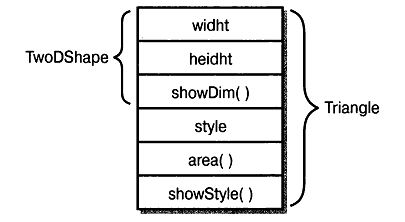

# Глава 7
# Наследование
Основные навыки и понятия
* Основы наследования
* Вызов конструктора суперкласса
* Обращения к членам суперкласса с помощью ключевого слова super
* Создание многоуровневой иерархии классов
* Порядок вызова конструкторов
* Представление о ссылках на объекты подкласса из переменной суперкласса
* Переопределение методов
* Применение переопределяемых методов для организации динамического доступа
* Абстрактные классы
* Использование ключевого слова final
* Представление о классе Object

Наследование является одним из трех основополагающих принципов объектно-ориентированного программирования, поскольку оно допускает создание иерархических классификаций. Благодаря наследованию можно создать общий класс, в котором определяются характерные особенности, присущие множеству связанных элементов. От этого класса могут затем наследовать другие, более конкретные классы, добавляя в него свои индивидуальные особенности.

В языке Java наследуемый класс принято называть суперклассом, а наследующий от него класс — подклассом. Следовательно, подкласс — это специализированный вариант суперкласса. Он наследует все переменные и методы, определенные в суперклассе, дополняя их своими элементами.

## Основы наследования
Наследование одних классов от других отражается в Java при объявлении класса. Для этой цели служит ключевое слово extends. Подкласс дополняет суперкласс, расширяя его.

Рассмотрим простой пример программы, демонстрирующий некоторые свойства наследования. В этой программе определен суперкласс TwoDShape, хранящий сведения о ширине и высоте двумерного объекта. Там же определен и его подкласс Triangle. Обратите внимание на то, что в определении подкласса присутствует ключевое слово extends.
```
// Простая иерархия классов.
// Класс, описывающий двумерные объекты,
class TwoDShape {
    double width;
    double height;

    void showDim() {
        System.out.println("Width and height are " +
                           width + " and " + height);
    }
}

// Подкласс класса TwoDShape для представления треугольников.
// Класс Triangle наследует от класса TwoDShape
class Triangle extends TwoDShape {
    String style;
    double area() {
        //Из класса Triangle можно обращаться к членам класса
        // TwoDShape таким же обраэом, как и к собственным членам.
        return width * height / 2;
    }

    void showStyle() {
        System.out.println("Triangle is " + style);
    }
}

class Shapes {
    public static void main(String args[])  {
        Triangle tl = new Triangle();
        Triangle t2 = new Triangle();

        // Все члены класса Triangle, даже унаследованные от класса
        // TwoDShape, доступны из объектов типа Triangle.
        tl.width = 4.0;
        tl.height = 4.0;
        tl.style = "isosceles";

        t2.width = 8.0;
        t2.height = 12.0;
        t2.style = "right";

        System.out.println("Info for tl: ");
        tl.showStyle();
        tl.showDim();
        System, out .println ("Area is " + tl.area());

        System.out.println();

        System.out.println("Info for t2: ");
        t2.showStyle();
        t2.showDim();
        System.out.println("Area is " + t2.area());
    }
}
```
Ниже приведен результат выполнения данной программы.
```
Info for tl:
Triangle is isosceles
Width and height are 4.0 and  4.0
244 Java 7: руководство для начинающих, 5-е издание
Area is 8.0

Info for t2:
Triangle is right
Width and height are 8.0 and 12.0
Area is 48.0
```
Здесь в классе TwoDShape определены атрибуты обобщенной двумерной фигуры, конкретным воплощением которой может быть квадрат, треугольник, прямоугольник и т.д. Класс Triangle представляет конкретную разновидность объекта типа TwoDShape, в данном случае — треугольник. Класс Triangle включает в себя все элементы класса TwoDObject, а в дополнение к ним — поле style и методы area () и showStyle (). Описание треугольника хранится в переменной экземпляра style, метод area () вычисляет и возвращает площадь треугольника, а метод showStyle () отображает геометрическую форму треугольника.

В класс Triangle входят все члены суперкласса TwoDShape, и поэтому в теле метода area () доступны переменные экземпляра width и height. Кроме того, с помощью объектов tl и t2 в методе main () можно непосредственно обращаться к переменным width и height, как будто они принадлежат классу Triangle. На рис. 7.1 схематически показано, каким образом суперкласс TwoDShape включается в состав класса Triangle.



Рис. 7.1. Схематическое представление класса Triangle

Несмотря на то что TwoDShape является суперклассом для класса Triangle, он по-прежнему остается независимым классом. Тот факт, что один класс является суперклассом другого класса, совсем не означает, что он не может быть использован самостоятельно. Например, следующий фрагмент кода считается вполне допустимым:
```
TwoDShape shape = new TwoDShape();

shape.width = 10;
shape.height = 20;

shape.showDim();
```
Разумеется, объекту типа TwoDShape ничего не известно о подклассах своего класса TwoDShape, и он не может даже обратиться к ним.

Ниже приведена общая форма объявления класса, наследующего от суперкласса.
```
class имя_подкласса extends имя_суперкласса {
// тело класса
}
```
Для каждого создаваемого подкласса можно указать только один суперкласс. Множественное наследование в Java не поддерживается, т.е. у подкласса не может быть несколько суперклассов. (Этим Java отличается от языка C++, где можно создать класс, производный сразу от нескольких классов. Об этом не следует забывать, преобразуя код C++ в код Java.) С другой стороны, вполне допустима многоуровневая иерархия, в которой один подкласс является суперклассом другого подкласса. И конечно же, класс не может быть суперклассом для самого себя.

Главное преимущество наследования заключается в следующем: как только будет создан суперкласс, в котором определены общие для множества объектов атрибуты, он может быть использован для создания любого числа более конкретных подклассов. А в каждом подклассе может быть точно выстроена своя собственная классификация. В качестве примера ниже приведен еще один подкласс, производный от суперкласса TwoDShape и инкапсулирующий прямоугольники.
```
// Подкласс класса TwoDShape, представляющий прямоугольники,
class Rectangle extends TwoDShape {
    boolean isSquareO {
        if(width == height) return true;
        return false;
    }

    double area() {
        return width * height;
    }
}
```
В класс Rectangle входят все члены класса TwoDShape. Кроме того, он содержит метод is Square (), определяющий, является ли прямоугольник квадратом, а также метод area (), вычисляющий площадь прямоугольника.

### Доступ к членам класса и наследование
Как пояснялось в главе 6, члены класса зачастую объявляются закрытыми, чтобы исключить их несанкционированное или незаконное использование. Но наследование класса не отменяет ограничения, накладываемые на доступ к закрытым членам класса. Поэтому если в подкласс и входят все члены его суперкласса, то в нем все равно оказываются недоступными те члены суперкласса, которые являются закрытыми. Так, если сделать закрытыми переменные экземпляра width и height в классе TwoDShape, они станут недоступными в классе Triangle, как показано ниже.
```
// Закрытые члены класса не наследуются.

// Этот код не подлежит компиляции.

// Класс, описывающий двумерные объекты,
class TwoDShape {
    private double width; // Теперь эти переменные
    private double height; // объявлены как закрытые.

    void showDim()  {
        System.out.println("Width and height are " +
                           width + " and " + height);
    }
}
// Подкласс, производный от класса TwoDShape,
// для представления треугольников.,
class Triangle extends TwoDShape {
    String style;

    double area() {
        // Обратиться к членам суперкласса, объявленным
        // как закрытые, нельзя.
        return width * height / 2; // Ошибка! Доступ запрещен.
    }

    void showStyle()    {
        System.out.println("Triangle is " + style);
    }
}
```
Класс Triangle не будет скомпилирован, поскольку ссылки на переменные экземпляра width и height в методе area () нарушают правила доступа. Эти переменные объявлены закрытыми (private), и поэтому они доступны только членам собственного класса. А его подклассам запрещено обращаться к ним.

Напомним, что член класса, объявленный закрытым (private), недоступен за пределами своего класса. Это ограничение распространяется и на подклассы.

На первый взгляд, ограничение на доступ к закрытым членам суперкласса из подкласса кажется трудно преодолимым, поскольку оно не дает во многих случаях возможности пользоваться закрытыми членами этого класса. Но на самом деле это не так. Как пояснялось в главе 6, для обращения к закрытым членам класса в программах на Java обычно используются специальные методы доступа. Ниже в качестве примера приведены видоизмененные классы TwoDShape и Triangle, в которых обращение к переменным экземпляра width и height осуществляется с помощью специальных методов доступа.
```
// Применение методов доступа для установки и
/// получения значений закрытых переменных.

// Класс, описывающий двумерные объекты,
class TwoDShape {
    private double width; // Теперь эти переменные
    private double height; // объявлены как закрытые.

    // Методы доступа к переменным экземпляра width и height.
    double getWidth() { return width; }
    double getHeight() { return height; }
    void setWidth(double w) { width = w; }
    void setHeight(double h) { height = h; }

    void showDim() {
        System.out.println("Width and height are " +
                           width + " and " + height);
    }
}

// Подкласс, производный от класса TwoDShape,
// для представления  треугольников.
class Triangle extends TwoDShape {
    String style;

    double area() {
        // Применение методов доступа, предоставляемых суперклассом.
        return getWidth() * getHeightO / 2;
    }

    void showStyle() {
        System.out.println("Triangle is " + style);
    }
}

class Shapes2 {
    public static void main(String args[]) {
        Triangle tl = new Triangle();
        Triangle t2 = new Triangle();

        tl.setWidth(4.0);
        tl. setHeight(4.0) ;
        tl.style = "isosceles";

        t2.setWidth(8.0);
        t2.setHeight(12.0);
        t2.style = "right";

        System.out.println("Info for tl: ");
        tl.showStyle();
        tl.showDim();
        System.out.println ("Area is " + tl.areaO);

        System.out.println() ;

        System.out.println("Info for t2: ") ;
        t2.showStyle();
        t2.showDim();
        System.out.println("Area is " + t2.area());
    }
}
```

## Конструкторы и наследование
В иерархии классов допускается, чтобы у суперклассов и подклассов были свои собственные конструкторы. В связи с этим возникает следующий резонный вопрос: какой конструктор отвечает за построение объекта подкласса: конструктор суперкласса, конструктор подкласса или же оба вместе? На этот вопрос можно ответить так: конструктор суперкласса конструирует родительскую часть объекта, а конструктор подкласса — производную часть этого объекта. И в этом есть своя логика, поскольку суперклассу неизвестны и недоступны любые элементы подкласса, а следовательно, их конструирование должно происходить раздельно. В приведенных выше примерах данный вопрос не возникал, поскольку они опирались на автоматическое создание конструкторов, используемых в Java по умолчанию. Но на практике конструкторы определяются явным образом в большинстве классов. Ниже будет показано, каким образом разрешается подобная ситуация.

Если конструктор определен только в подклассе, то все происходит очень просто: конструируется объект подкласса, а родительская часть объекта автоматически конструируется конструктором суперкласса, используемым по умолчанию. В качестве примера ниже приведен переработанный вариант класса Triangle, в котором определяется конструктор, а член style этого класса делается закрытым, так как теперь он устанавливается конструктором.
```
// Добавление конструктора в класс Triangle.

// Класс, описывающий двумерные объекты,
class TwoDShape {
    private double width; // Теперь эти переменные
    private double height; // объявлены как закрытые.

    // Методы доступа к переменным экземпляра width и height.
    double getWidth() { return width; }
    double getHeight() { return height; }
    void setWidth(double w) { width = w; }
    void setHeight(double h) { height = h; }

    void showDim() {
        System.out.println("Width and height are " +
                           width + " and " + height);
    }
}

// Подкласс, производный от класса TwoDShape,
// для представления треугольников,
class Triangle extends TwoDShape {
    private String style;

    // Конструктор.
    Triangle(String s, double w, double h) {
        // Инициализация родительской части объекта,
        // соответствующей классу TwoDShape.
        setWidth(w);
        setHeight(h);
        style = s;
    }

    double area() {
        return getWidth() * getHeightO / 2;
    }

    void showStyle() {
        System.out.println("Triangle is " + style);
    }
}

class Shapes3 {
    public static void main(String args[]) {
        Triangle tl = new Triangle("isosceles", 4.0, 4.0);
        Triangle t2 = new Triangle("right", 8.0, 12.0);

        System.out.println("Info for tl: ");
        tl.showStyle();
        tl.showDim();
        System.out.println ("Area is " + tl.areaO);

        System.out.println() ;

        System.out.println("Info for t2: ");
        t2.showStyle();
        t2.showDim();
        System.out.println("Area is " + t2.area());
    }
}
```
Здесь конструктор класса Triangle, помимо поля style, инициализирует также унаследованные члены класса TwoDClass.

Если конструкторы объявлены как в подклассе, так и в суперклассе, то дело несколько усложнятся, поскольку должны быть выполнены оба конструктора. В таком случае на помощь приходит ключевое слово super, доступное в двух общих формах. С помощью первой формы вызывается конструктор суперкласса. А вторая форма служит для доступа к членам суперкласса, скрываемым членами подкласса. Рассмотрим первое применение ключевого слова super.

### Применение ключевого слова super для вызова конструктора суперкласса
Для вызова конструктора суперкласса служит следующая общая форма ключевого слова super:
```
super (список_параметров);
```
где список_параметров обозначает параметры, необходимые для нормальной работы конструктора суперкласса. Вызов конструктора super () должен быть первым оператором в теле конструктора подкласса. Для того чтобы лучше понять особенности вызова super (), рассмотрим вариант класса TwoDShape из следующего примера программы, где определен конструктор, инициализирующий переменные экземпляра width и height:
```
// Добавление конструкторов в класс TwoDShape.
class TwoDShape {
    private double width;
    private double height;

    // Параметризированный конструктор объектов класса TwoDShape.
    TwoDShape(double w, double h) {
        width = w;
        height = h;
    }

    // Методы доступа к переменным экземпляра width и height.
    double getWidth() { return width; }
    double getHeight() { return height; }
    void setWidth(double w) { width = w; }
    void setHeight(double h) { height = h; }

    void showDim()  {
        System.out.println("Width and height are " +
                           width + " and " + height);
    }
}

// Подкласс, производный от класса TwoDShape,
// для представления треугольников,
class Triangle extends TwoDShape {
    private String style;

    Triangle(String s, double w, double h) {
        // Использование оператора super () для вызова
        // конструктора класса TwoDShape.
        super(w, h); // вызвать конструктор суперкласса

        style = s;
    }

    double area() {
        return getWidth() * getHeight() / 2;
    }

    void showStyle() {
        System.out.println("Triangle is " + style);
    }
}

class Shapes4 {
    public static void main(String args[]) {
        Triangle tl = new Triangle("isosceles", 4.0, 4.0);
        Triangle t2 = new Triangle("right", 8.0, 12.0);

        System.out.println("Info for tl: ") ;
        tl.showStyle();
        tl.showDim();
        System.out.println ("Area is " + tl.areaO);

        System.out.println();

        System.out.println("Info for t2: ") ;
        t2.showStyle();
        t2.showDim();
        System.out.println("Area is " + t2.area());
    }
}
```
В конструкторе Triangle присутствует вызов конструктора super () с параметрами w и h. В результате управление получает конструктор TwoDShape (), инициализирующий переменные width и height значениями, передаваемыми ему в качестве параметров. Теперь класс Triangle уже не занимается инициализацией элементов суперкласса. Он должен инициализировать только собственную переменную экземпляра style. Конструктору TwoDShape () предоставляется возможность построить соответствующий подобъект так, как требуется для данного класса. Более того, в суперклассе TwoDShape можно реализовать функции, о которых не будут знать его подклассы. Благодаря этому код становится более устойчивым к ошибкам.

Любая форма конструктора, определенного в суперклассе, может быть вызвана с помощью оператора super (). Для выполнения выбирается тот вариант конструктора, который соответствует указываемым аргументам. В качестве примера ниже приведена расширенная версия классов TwoDShape и Triangle, содержащих конструкторы по умолчанию и конструкторы, принимающие один или более аргумент.
```
// Добавление дополнительных конструкторов в класс TwoDShape.
class TwoDShape {
    private double width;
    private double height;

    // Конструктор по умолчанию.
    TwoDShape() {
        width = height = 0.0;
    }

    // Параметризированный конструктор.
    TwoDShape(double w, double h) {
        width = w;
        height = h;
    }

    // Конструирование объекта с одинаковыми значениями
    // переменных экземпляра width и height.
    TwoDShape(double х) {
        width = height = x;
    }

    // Методы доступа к переменным экземпляра width и height.
    double getWidth() { return width; }
    double getHeight() { return height; }
    void setWidth(double w) { width = w; }
    void setHeight(double h) { height = h; }

    void showDim()  {
        System.out.println("Width and height are " +
                           width + " and " + height);
    }
}

// Подкласс, производный от класса TwoDShape,.
// для представления треугольников,
class Triangle extends TwoDShape {
    private String style;

    // Использование оператора super () для вызова
    // разных вариантов конструктора TwoDShape() .
    // Конструктор по умолчанию.
    Triangle() {
        super(); // вызвать конструктор суперкласса по умолчанию
        style = "null";
    }

    // Параметризированный конструктор.
    Triangle(String s, double w, double h) {
        super(w, h); // вызвать конструктор суперкласса с двумя аргументами
        style = s;
    }

    // Конструктор с одним аргументом.
    Triangle(double х) {
        super(х); // вызвать конструктор суперкласса с одним аргументом
        style = "isosceles"
    }

    double area() {
        return getWidth() * getHeight() / 2;
    }

    void showStyle() {
        System.out.println("Triangle is " + style);
    }
}

class Shapes5 {
    public static   void main(String args[]) {
        Triangle tl = new Triangle();
        Triangle t2 = new Triangle("right", 8.0, 12.0);
        Triangle t3 = new Triangle(4.0);

        tl = t2;

        System.out.println("Info for tl: ");
        tl.showStyle();
        tl.showDim();
        System.out.println ("Area is " + tl.areaO);

        System.out.println() ;

        System.out.println("Info for t2: ");
        t2.showStyle();
        t2.showDim();
        System.out.println("Area is " + t2.area());

        System.out.println();

        System.out.println("Info for t3: ");
        t3.showStyle();
        t3.showDim();
        System.out.println("Area is " + t3.area());

        System.out.println();
    }
}
```
Выполнение этой версии программы дает следующий результат:
```
Info for tl:
Triangle is right
Width and height are 8.0 and 12.0
Area is 48.0

Info for t2:
Triangle is right
Width and height are 8.0 and 12.0
Area is 48.0

Info for t3:
Triangle is isosceles
Width and height are 4.0 and 4.0
Area is 8.0
```
Еще раз напомним основные свойства вызова конструктора super (). Когда этот вызов присутствует в конструкторе подкласса, происходит обращение к конструктору его непосредственного суперкласса. Таким образом, вызывается конструктор того класса, который непосредственно породил вызывающий класс. Это справедливо и при многоуровневой иерархии. Кроме того, вызов конструктора super () должен быть первым оператором в теле конструктора подкласса.

### Применение ключевого слова super для доступа к членам суперкласса
Существует еще одна общая форма ключевого слова super, которая применяется подобно ключевому слову this, но ссылается на суперкласс данного класса. Эта общая форма обращения к члену суперкласса имеет следующий вид:
```
super.член_класса
```
где член_класса обозначает метод или переменную экземпляра.

Данная форма ключевого слова super применяется в тех случаях, если член подкласса скрывает член суперкласса. Рассмотрим следующий пример несложной иерархии классов:
```
// Применение ключевого слова super для предотвращения сокрытия имен.
class А {
    int i;
}

// создать подкласс, расширяющий класс А.
class В extends А {
    int i; // Эта переменная i скрывает переменную i из класса А.

    В (int a, int b) {
        // Оператор super.i ссылается на переменную i из класса А.
        super.i = а; // переменная i из класса А
        i = b;  // переменная i из класса В
    }

    void show() {
        System, out .println ("i in superclass: 11 + super, i);
        System.out.println("i in subclass: " + i);
    }
}

class UseSuper {
    public static void main(String args[]) {
        В subOb = new В (1, 2)*;

        subOb.show();
    }
}
```
Результат выполнения данной программы выглядит следующим образом:
```
i in superclass: 1
i in subclass: 2
```
Несмотря на то что переменная экземпляра i в классе В скрывает одноименную переменную в классе А, ключевое слово super позволяет обращаться к переменной i из суперкласса. Аналогичным образом ключевое слово super можно использовать для вызова методов суперкласса, скрываемых методами подкласса.

**Пример для опробования 7.1.**
Расширение класса Vehicle

Для того чтобы продемонстрировать возможности наследования, расширим класс Vehicle, созданный в главе 4. Напомним, что класс Vehicle инкапсулирует данные о транспортных средствах и, в частности, сведения о количестве пассажиров, объеме топливного бака и потреблении топлива. Воспользуемся классом Vehicle в качестве заготовки для создания более специализированных классов. Например, транспортным средством, помимо прочих, является грузовик. Одной из важных характеристик грузовика является его грузоподъемность. Поэтому для создания класса Truck можно расширить класс Vehicle, добавив переменную экземпляра, хранящую сведения о допустимом весе перевозимого груза. В этом проекте переменные экземпляра будут объявлены в классе Vehicle как закрытые (private), а для обращения к ним будут созданы специальные методы доступа.

Последовательность действий
1. Создайте новый файл TruckDemo.java и скопируйте в него исходный код последней версии класса Vehicle, разработанной в главе 4.
2. Создайте класс Truck, исходный код которого приведен ниже.
    ```
    // Расширение класса Vehicle для грузовиков,
    class Truck extends Vehicle {
        private int cargocap; // грузоподъемность в фунтах

        // Конструктор класса Truck.
        Truck(int p, int f, int m, int c) {
            /* Инициализация переменных из класса Vehicle
               с помощью вызываемого конструктора этого класса. */
            super(р, f, m);
            cargocap = с;
        }

        // Методы доступа к переменной cargocap.
        int getCargo() { return cargocap; }
        void putCargo(int c) { cargocap = c; }
    }
    ```
    Здесь класс Truck наследует от класса Vehicle. В класс Truck добавлены новые члены cargocap, getCargo () и putCargo (). Кроме того, класс Truck содержит все элементы, определенные в классе Vehicle.
3. Объявите закрытыми переменные экземпляра в классе Vehicle, как показано ниже.
    ```
    private int passengers; // количество пассажиров
    private int fuelcap;    // объем топливного бака в галлонах
    private int mpg;        // потребление топлива в милях на галлон
    ```
4.  Ниже приведен весь исходный код программы, в которой демонстрируется класс Truck.
    ```
    // Пример для опробования 7.1.
    //
    // Создание подкласса класса Vehicle для грузовиков.
    class Vehicle   {
        private int passengers; // количество пассажиров
        private int fuelcap;    // объем топливного бака в галлонах
        private int mpg;        // потребление топлива в милях на галлон

        // Конструктор класса Vehicle.
        Vehicle(int р, int f, int m) {
            passengers = p;
            fuelcap = f;
            mpg = m;
        }

        // возвратить дальность действия транспортного средства
        int range() {
            return mpg * fuelcap;
        }

        // рассчитать объем топлива, требующегося
        // для прохождения заданного пути
        double fuelneeded(int miles) {
            return (double) miles / mpg;
        }

        // Методы доступа к переменным экземпляра,
        int getPassengers() { return passengers; }
        void setPassengers(int p) { passengers = p; }
        int getFuelcapO { return fuelcap; }
        void setFuelcap(int f) { fuelcap = f; }
        int getMpgO { return mpg; }
        void setMpg(int m) { mpg = m; }
    }

    // Расширение класса Vehicle для грузовиков,
    class Truck extends Vehicle {
        private int cargocap; // грузоподъемность в фунтах

        // Конструктор класса Truck.
        Truck(int p, int f, int m, int c) {
            /* Инициализация переменных из класса Vehicle
               с помощью вызываемого конструктора этого класса. */
            super(р, f, m); '
            cargocap = с;
        }

        // Методы доступа к переменной cargocap.
        int getCargo() { return cargocap; }
        void putCargo(int c) { cargocap = c; }
    }

    class TruckDemo {
        public static void main(String args[]) {
            // построить ряд новых объектов типа Truck
            Truck semi = new Truck(2, 200, 7, 44000);
            Truck pickup = new Truck(3, 28, 15, 2000);
            double gallons;
            int dist = 252;
            gallons = semi.fuelneeded(dist);
            System.out.println("Semi can carry " + semi.getCargo() +
            " pounds.");
            System.out.println("To go " + dist + " miles semi needs " +
                               gallons + " gallons of fuel.\n");
            gallons =  pickup.fuelneeded(dist);
            System.out.println("Pickup can carry " + pickup.getCargo() +
                               " pounds.");
            System.out.println("To go " + dist + " miles pickup needs " +
            gallons + " gallons of fuel.");
        }
    }
    ```
5. Ниже приведен результат выполнения данной программы.
    ```
    Semi can carry 44000 pounds.
    То go 252 miles semi needs 36.0 gallons of fuel.
    Pickup can carry 2000 pounds.
    To go 252 miles pickup needs 16.8 gallons of fuel.
    ```
6.  От класса Vehicle можно породить немало других подклассов. Например, в приведенной нщке заготовке класса, описывающего внедорожники, предусмотрена переменная, содержащая величину дорожного просвета для автомобиля.
    ```
    // Создание класса, описывающего внедорожники,
    class OffRoad extends Vehicle {
        private int groundClearance; // дорожный просвет в дюймах

        // ...
    }
    ```
    Итак, имея в своем распоряжении суперкласс, определяющий общие свойства некоторых объектов, можно создать на его основе специализированные подклассы. Каждый подкласс дополняет свойства суперкласса собственными уникальными свойствами. В этом и состоит вся сущность наследования.

## Создание многоуровневой иерархии классов
В представленных до сих пор примерах программ использовались простые иерархии классов, состоявшие только из суперкласса и подкласса. Но в Java можно также строить иерархии, состоящие из любого числа уровней наследования. Как упоминалось выше, многоуровневая иерархия идеально подходит для использования одного подкласса в качестве суперкласса для другого подкласса. Так, если имеются три класса, А, в и С, то класс С может наследовать от класса В, а тот, в свою очередь, от класса А. В таком случае каждый подкласс наследует характерные особенности всех своих суперклассов. В частности, класс С наследует все члены классов В и А.

Для того чтобы стало понятнее назначение многоуровневой иерархии, рассмотрим следующий пример программы. В этой программе подкласс Triangle выступает в роли суперкласса для класса ColorTriangle. Класс ColorTriangle наследует все свойства классов Triangle и TwoDShape, а также содержит поле color, определяющее цвет треугольника.
```
// Многоуровневая иерархия,
class TwoDShape {
    private double width;
    private double height;

    // Конструктор по умолчанию.
    TwoDShape() {
        width = height = 0.0;
    }

    // Параметризированный конструктор.
    TwoDShape(double w, double h) {
        width = w;
        height = h;
    }

    // построить объект с одинаковыми значениями
    // переменных экземпляра width и height
    TwoDShape(double х) {
        width = height = x;
    }

    // Методы доступа к переменным экземпляра width и height.
    double getWidth() { return width; }
    double getHeight() { return height; }
    void setWidth(double w) { width = w; }
    void setHeight(double h) { height = h; }

    void showDim() {
        System.out.println("Width and height are " +
        width + " and " + height);
    }
}

// Подкласс, производный от класса TwoDShape.
class Triangle extends TwoDShape {
    private String style;

    // Конструктор по умолчанию.
    Triangle() {
        super();
        style = "null";
    }

    Triangle(String s, double w, double h) {
        super(w, h); // вызвать конструктор суперкласса

        style = s;
    }

    // Конструктор с одним аргументом для построения треугольника.
    Triangle(double х) {
        super(х); // вызвать конструктор суперкласса
        style = "isosceles";
    }

    double area() {
        return getWidth() * getHeightO / 2;
    }

    void showStyle() {
        System.out.println("Triangle is " + style);
    }
}

// Подкласс, производный от класса Triangle.
// Класс ColorTriangle является подклассом,
// производным от класса Triangle, который, в
// свою очередь, расширяет класс TwoDShape.
// Следовательно, в класс   ColorTriangle   входят  переменные
// и методы как из класса   Triangle,   так из  класса  TwoDShape.
class ColorTriangle extends Triangle {
    private String color;

    ColorTriangle(String c, String s,
    double w,   double h)   {
        super(s, w, h);
        color = c;
    }

    String get.Color() { return color; }

    void showColor() {
        System.out.println("Color is " + color);
    }
}

class Shapes6 {
    public static void main(String args[ ]) {
        ColorTriangle tl =
            new ColorTriangle("Blue", "right", 8.0, 12.0);
        ColorTriangle.t2 =
            new ColorTriangle("Red", "isosceles", 2.0, 2.0);

        System.out.println("Info for tl: ");
        tl.showStyle();
        tl.showDim();
        tl.showColor();
        System.out.println ("Area is " + tl.areaO);

        System.out.println ();

        System.out.println("Info for t2: ");
        // Из объекта типа ColorTriangle можно вызывать как его
        // собственные методы, так и методы его суперклассов.
        t2.showStyle ();
        t2.showDim();
        t2.showColor ();
        System.out.println("Area is " + t2.area());
    }
}
```
Результат выполнения данной программы выглядит следующим образом:
```
Info for tl:
Triangle is right
Width and height are 8.0 and 12.0
Color is Blue
Area is 48.0

Info for t2:
Triangle is isosceles
Width and height are 2.0 and 2.0
Color is Red
Area is 2.0
```
Благодаря наследованию в классе ColorTriangle можно использовать ранее определенные классы Triangle и TwoDShape, дополняя их лишь данными, необходимыми для конкретного применения класса ColorTriangle. Таким образом, наследование способствует повторному использованию кода.

Данный пример демонстрирует еще одну важную деталь: оператор super () всегда обращается к конструктору ближайшего суперкласса. Иными словами, оператор super () в классе ColorTriangle означает вызов конструктора класса Triangle, а в классе Triangle — вызов конструктора класса TwoDShape. Если в иерархии классов для конструктора суперкласса предусмотрены параметры, то все суперклассы должны передавать их вверх по иерархической структуре. Это правило действует независимого от того, нужны ли параметры самому подклассу или не нужны.

## Порядок вызова конструкторов
В связи с изложенным выше в отношении наследования и иерархии классов может возникнуть следующий резонный вопрос: когда создается объект подкласса и какой конструктор выполняется первым: тот, что определен в подклассе, или же тот, что определен в суперклассе? Так, если имеется суперкласс А и подкласс В, то вызывается ли конструктор класса А раньше конструктора класса В, или же наоборот? Ответ на этот вопрос состоит в том, что в иерархии классов конструкторы вызываются по порядку выведения классов: от суперкласса к подклассу. Более того, оператор super () должен быть первым в конструкторе подкласса, и поэтому порядок, в котором вызываются конструкторы, остается неизменным, независимо от того, используется ли оператор super () или нет. Если оператор super () отсутствует, то выполняется конструктор каждого суперкласса по умолчанию (т.е. конструктор без параметров). В следующем примере программы демонстрируется порядок вызова конструкторов:
```
// Демонстрация порядка вызова конструкторов.

// создать суперкласс
class А {
    А() {
        System.out.println("Constructing A.") ;
    }
}

// создать подкласс путем расширения класса А
class В extends А {
    ВО {
        System.out.println("Constructing В.");
    }
}

// создать подкласс путем расширения класса В
class С extends В {
    СО {
        System.out.println("Constructing С.") ;
    }
}

class OrderOfConstruction {
    public static void main(String args[])  {
        С с = new С();
    }
}
```
Ниже приведен результат выполнения данной программы.
```
Constructing А.
Constructing В.
Constructing С.
```
Как видите, конструкторы вызываются по порядку выведения их классов.

По зрелом размышлении можно прийти к выводу, что вызов конструкторов по порядку выведения их классов имеет определенный смысл. Ведь суперклассу ничего не известно ни об одном из производных от него подклассов, и поэтому любая инициализация, которая требуется его членам, осуществляется совершенно отдельно от инициализации членов подкласса, а возможно, это и необходимое условие. Следовательно, онадолжна выполняться первой.

## Ссылки на суперкласс и объекты подклассов
Как вам должно быть уже известно, Java является строго типизированным языком программирования. Помимо стандартных преобразований и автоматического продвижения простых типов данных, в этом языке строго соблюдается принцип совместимости типов. Это означает, что переменная ссылки на объект класса одного типа, как правило, не может ссылаться на объект класса другого типа. В качестве примера рассмотрим следующую простую программу:
```
// Этот код не подлежит компиляции,
class X {
    int а;

    X(int i) { а = i; }
}

class Y {
    int a;

    Y(int i) { a = i; }
}

class IncompatibleRef {
    public static void main(String args[])  {
        X x = new X(10);
        X x2;
        Y   у = new Y(5);

        x2 = x; // Допустимо, так как обе переменные одного типа.

        х2 = у; // Ошибка, так как переменные разных типов.
    }
}
```
Несмотря на то что классы X и Y содержат одинаковые члены, переменной типа X нельзя присвоить ссылку на объект типа Y, поскольку типы объектов отличаются. Вообще говоря, переменная ссылки на объект может указывать только на объекты своего типа.

Но из этого строгого правила соблюдения типов имеется следующее важное исключение: переменной ссылки на объект суперкласса может быть присвоена ссылка на объект любого производного от него подкласса. Следовательно, по ссылке на объект суперкласса можно обращаться к объекту подкласса. Ниже приведен соответствующий пример.
```
// Обращение к объекту подкласса по ссылке на объект суперкласса,
class X {
    int а;

    X(int i) { а = i; }
}

class Y extends X {
    int b;

    Y(int i, int j) {
        super(j) ;
        b = i;
    }
}

class SupSubRef {
    public static void main(String args[]) {
        X x = new X(10);
        X x2;
        Y у = new Y(5, 6) ;

        x2 = x; // Допустимо, так как обе переменные одного типа.
        System.out.println("х2.а: " + х2.а);

        // Класс Y является подклассом X, поэтому переменные х2 и у 1
        // могут ссылаться на один и тот же объект производного класса.
        х2 = у; // По-прежнему допустимо по указанной выше причине.
        System.out.println("х2.а: " + х2.а);

        // В классе X известны только члены класса X.
        х2.а = 19; // Допустимо.
        //х2.b=27; // Ошибка, так как переменная Ь не является членом класса X.
    }
}
```
В данном примере класс Y является подклассом X. Следовательно, переменной х2 можно присвоить ссылку на объект типа Y.

Следует особо подчеркнуть, что доступ к конкретным членам класса определяется типом переменной ссылки на объект, а не типом объекта, на который она ссылается. Это означает, что если ссылка на объект подкласса присваивается переменной ссылки на объект суперкласса, то доступ разрешается только к тем частям этого объекта, которые определяются суперклассом. Именно поэтому переменной х2 недоступен член b класса Y, когда она ссылается на объект этого класса. И в этом есть своя логика, поскольку суперклассу ничего не известно о тех членах, которые добавлены в производный от него подкласс. Именно поэтому последняя строка кода в приведенном выше примере была закомментирована.

Несмотря на кажущийся несколько отвлеченным характер приведенных выше рассуждений, им можно найти ряд важных применений на практике. Одно из них рассматривается ниже, а другое — далее в этой главе, когда речь пойдет о переопределении методов.

Один из самых важных моментов для присваивания ссылок на объекты подкласса переменным суперкласса наступает тогда, когда конструкторы вызываются в иерархии классов. Как вам должно быть уже известно, в классе нередко определяется конструктор, принимающий объект своего класса в качестве параметра. Благодаря этому в классе может быть сконструирована копия его объекта. Этой особенностью можно выгодно воспользоваться в подклассах, производных от такого класса. В качестве примера рассмотрим очередные версии классов TwoDShape и Triangle. В оба класса добавлены конструкторы, принимающие объект своего класса в качестве параметра.
```
class TwoDShape {
    private double width;
    private double height;

    // Конструктор по умолчанию.
    TwoDShape() {
        width = height = 0.0;
    }

    // Параметризированный конструктор.
    TwoDShape(double w, double h) {
        width = w;
        height = h;
    }

    // построить объект с одинаковыми значениями
    // переменных экземпляра width и height
    TwoDShape(double х) {
        width = height = x;
    }

    // Построение одного объекта на основании другого объекта.
    TwoDShape(TwoDShape ob) {
        width = ob.width;
        height = ob.height;
    }

    // Методы доступа к переменным width и height,
    double getWidth() { return width; }
    double getHeight() { return height; }
    void setWidth(double w) { width = w; }
    void setHeight(double h) { height = h; }

    void showDim()  {
        System.out.println("Width and height are " +
                           width + " and " + height);
    }
}

// Подкласс класса TwoDShape для треугольников,
class Triangle extends TwoDShape {
    private String style;

    // Конструктор по умолчанию.
    Triangle()  {
        super();
        style = "null";
    }

    // Конструктор класса Triangle.
    Triangle(String s, double w, double h) {
        super(w, h); // вызвать конструктор суперкласса

        style = s;
    }

    // Конструктор с одним аргументом для построения треугольника.
    Triangle(double х) {
        super(х); // вызвать конструктор суперкласса

        style = "isosceles";
    }

    // построить один объект на основании другого объекта
    Triangle(Triangle ob) {
        // Передача ссылки на объект Triangle конструктору класса TwoDShape.
        super(ob);
        style = ob.style;
    }

    double area() {
        return getWidth() * getHeight() / 2;
    }

    void showStyle()   {
        System.out.println("Triangle is " + style);
    }
}

class Shapes7 {
    public static void main(String args[])  {
        Triangle tl =
            new Triangle("right", 8.0, 12.0);

        // создать копию объекта tl
        Triangle t2 = new Triangle(tl);

        System.out.println("Info for tl: ");
        tl.showStyle();
        tl.showDim();
        System.out.println ("Area is " + tl.areaO);

        System.out.println() ;

        System.out.println("Info for t2: ");
        t2.showStyle();
        t2.showDim();
        System.out.println("Area is " + t2.area());
    }
}
```
В приведенном выше примере программы объект t2 конструируется на основании объекта tl, и поэтому они идентичны. Результат выполнения данной программы выглядит следующим образом:
```
Info for tl:
Triangle is right
Width and height are 8.0 and 12.0
Area is 48.0

Info for t2:
Triangle is right
Width and height are 8.0 and 12.0
Area is 48.0
```
Обратите внимание на конструктор класса Triangle, код которого приведен ниже.
```
// построить один объект на основании другого объекта
Triangle(Triangle ob) {
    // Передача ссылки на объект Triangle конструктору класса TwoDShape.
    super(ob);
    style = ob.style;
}
```
В качестве параметра данному конструктору передается объект Triangle, который затем с помощью вызова super () передается конструктору TwoDShape, как показано ниже.
```
// Построение одного объекта на основании другого объекта.
TwoDShape(TwoDShape ob) {
    width = ob.width;
    height = ob.height;
}
```
Следует заметить, что конструктор TwoDshape () должен получить объект типа TwoDShape, но конструктор Triangle () передает ему объект типа Triangle. Тем не менее никаких недоразумений не возникает. Ведь, как пояснялось ранее, переменная ссылки на суперкласс может ссылаться на объект производного от него подкласса. Следовательно, конструктору TwoDShape () можно передать ссылку на экземпляр подкласса, производного от класса TwoDShape. Конструктор TwoDShape () инициализирует лишь те части передаваемого ему объекта подкласса, которые являются членами класса TwoDShape, и поэтому не имеет значения, содержит ли этот объект дополнительные члены, добавленные в производных подклассах.

## Переопределение методов
В иерархии классов часто присутствуют методы с одинаковой сигнатурой и одинаковым возвращаемым значением как в суперклассе, так и в подклассе. В этом случае говорят, что метод суперкласса переопределяется в подклассе. Если переопределяемый метод вызывается из подкласса, то всегда выбирается тот вариант метода, который определен в подклассе. А вариант метода, определенный в суперклассе, скрывается. Рассмотрим в качестве примера следующий фрагмент кода:
```
// Переопределение метода,
class А {
    int i, j;

    A(int a, int b) {
        i = a;
        j = b;
    }

    // отобразить переменные i и j
    void show() {
        System.out.println("i and j: " + i + " " + j) ;
    }
}

class В extends A {
    int k;

    В(int a, int b, int c) {
        super(a, b);
        k = c;
    }

    // Отображение переменной к. Данный метод переопределяет
    // метод show() из класса А.
    void show() {
        System.out.println("k: " + к);
    }
}

class Override {
    public static void main(String args[])  {
        В subOb = new B(l, 2, 3) ;

        subOb.show(); // вызвать метод show() из класса В
    }
}
```
Выполнение этого фрагмента кода дает следующий результат:
```
к: 3
```
Когда метод show () вызывается для объекта типа В, выбирается вариант этого метода, определенный в классе В. Таким образом, вариант метода show () в классе В переопределяет вариант одноименного метода, объявленный в классе А.

Если требуется обратиться к исходному варианту переопределяемого метода, т.е. тому, который определен в суперклассе, следует воспользоваться ключевым словом super. Например, в приведенном ниже варианте класса В из метода show () вызывается вариант того же метода, определенный в суперклассе. При этом отображаются все переменные экземпляра.
```
class В extends А {
    int к;

    В(int a, int b, int с) {
        super (а, Ь);
        к = с;
    }

    void show() {
        // Использование ключевого слова super для
        // вызова метода show(), определенного в классе А.
        super.show();
        System.out.println("k: " + k);
    }
}
```
Если подставить новый вариант метода show () в предыдущую версию рассматриваемого здесь фрагмента кода, результат его выполнения изменится и будет иметь следующий вид:
```
i and j: 1 2
k: 3
```
В данном случае super. show () — это вызов метода show (), определенного в суперклассе.

Переопределение метода происходит только в том случае, если сигнатуры переопределяемого и переопределяющего методов совпадают. В противном случае происходит обычная перегрузка методов. Рассмотрим следующую видоизмененную версию предыдущего примера:
```
/* Методы с разными сигнатурами не переопределяются,
а перегружаются. */
class А {
    int i, j;

    A(int a, int b) {
        i = a;
        j = b;
    }

    // отобразить переменные i и j
    void show() {
        System.out.println("i and j: " + i + " " + j) ;
    }
}

// создать подкласс путем расширения класса Л
class В extends А {
    int к;

    В (int a, int b, int с) {
        super(а, Ь);
        к = с;
    }

    // Сигнатуры данного метода и метода show() из класса А отличаются,
    // поэтому вместо переопределения происходит перегрузка метода.
    void show(String msg) {
        System.out.println(msg + k);
    }
}

class Overload {
    public static void main(String args[])  {
        В subOb = new В(1, 2, 3);

        subOb.show("This is k: "); // вызывается метод show() из класса В
        subOb.show(); // вызывается метод show() из класса А
    }
}
```
Выполнение этого фрагмента кода дает следующий результат:
```
This is k: 3
i and j: 1 2
```
На этот раз в варианте метода show () из класса В предусмотрен строковый параметр. И благодаря этому сигнатура данного метода отличается от сигнатуры метода show () из класса А, для которого параметры не предусмотрены. В результате переопределение метода не происходит.

### Поддержка полиморфизма
в переопределяемых методах
Примеры из предыдущего раздела демонстрируют переопределение методов, но по ним трудно судить, насколько богатые возможности предоставляет этот механизм. В самом деле, если переопределение методов используется только для соблюдения соглашений о пространствах имен, то его можно рассматривать как любопытную, но почти бесполезную особенность языка программирования. Но это совсем не так. Переопределение методов лежит в основе одного из наиболее эффективных языковых средств Java: динамической диспетчеризации методов, представляющей собой механизм вызова переопределяемых методов, когда выбор конкретного метода осуществляется не на этапе компиляции, а в процессе выполнения программы. Динамическая диспетчеризация методов имеет очень большое значение, поскольку именно с ее помощью принцип полиморфизма реализуется на стадии выполнения программ на Java.

Прежде всего напомним один очень важный принцип: переменная ссылки на суперкласс может ссылаться на объект подкласса. В Java этот принцип используется для вызова переопределяемых методов во время выполнения. Если переопределяемый метод вызывается по ссылке на суперкласс, то исполняющая система Java определяет по типу объекта, какой именно вариант метода следует вызвать, причем делает это во время выполнения программы. Если ссылки указывают на разные типы объектов, то и вызываться будут разные версии переопределенных методов. Иными словами, вариант переопределенного метода для вызова определяет не тип переменной, а тип объекта, на который она ссылается. Так, если суперкласс содержит метод, переопределяемый в подклассе, то вызывается метод, соответствующий тому типу объекта, на который указывает переменная ссылки на суперкласс.

Ниже приведен простой пример, демонстрирующий динамическую диспетчеризацию методов в действии.
```
// Демонстрация динамической диспетчеризации методов.
class Sup {
    void who()  {
       System.out.println("who() in Sup");
    }
}

class Subl extends Sup {
    void who() {
        System.out.println("who() in Subl");
    }
}

class Sub2 extends Sup {
    void who()  {
        System.out.println("who() in Sub2");
    }
}
class DynDispDemo {
    public static void main(String args[])  {
        Sup superOb = new Sup();
        Subl subObl = new Subl();
        Sub2 sub0b2 = new Sub2();

        Sup supRef;

        // В каждом из приведенных ниже вызовов конкретный вариант
        // метода who () выбирается во время выполнения по типу
        // объекта, на который делается ссылка.
        supRef = superOb;
        supRef.who();

        supRef = subObl;
        supRef.who();

        supRef = sub0b2;
        supRef.who();
    }
}
```
Результат выполнения данной программы выглядит следующим образом:
```
who() in Sup
who () in Subl
who() in Sub2
```
В данном примере программы определяются суперкласс Sup и два его подкласса Subl и Sub2. В классе Sup объявляется метод who (), переопределяемый в его подклассах. В методе main () создаются объекты типа Sup, Subl и Sub2. Там же объявляется переменная supRef ссылки на объект типа Sup. Затем переменной supRef в методе main () поочередно присваиваются ссылки на объекты разного типа, и далее эти ссылки используются для вызова метода who (). Как следует из результата выполнения данной программы, вызываемый вариант метода who () определяется типом объекта, на который ссылается переменная supRef в момент вызова, а не типом самой этой переменной.

### Причины для переопределения методов
Как упоминалось выше, переопределяемые методы обеспечивают соблюдение принципа полиморфизма при выполнении программ на Java. Полиморфизм в объектно-ориентированных программах имеет большое значение потому, что благодаря ему появляется возможность объявить в суперклассе методы, общие для всех его подклассов, а в самих подклассах — определить специфические реализации всех этих методов или некоторых из них. Переопределение методов — один из способов, которыми в Java реализуется принцип полиморфизма “один интерфейс — множество методов”.

Залогом успешного применения полиморфизма является, в частности, понимание того, что суперклассы и подклассы образуют иерархию в направлении от меньшей специализации к большей. Если суперкласс организован правильно, он предоставляет своему подклассу все элементы, которыми тот может пользоваться непосредственно. В нем также определяются те методы, которые должны быть по-своему реализованы в порожденных классах. Таким образом, подклассы получают достаточную свободу определять собственные методы, реализуя в то же время согласованный интерфейс. Сочетая наследование с переопределением методов, в суперклассе можно определить общую форму методов для использования во всех его подклассах.

### Демонстрация механизма переопределения методов на примере класса TwoDShape Для того чтобы стало понятнее, насколько эффективным является механизм переопределения методов, продемонстрируем его на примере класса TwoDShape. В приведенных ранее примерах в каждом классе, порожденном от класса TwoDShape, определялся метод area (). Теперь мы знаем, что в этом случае имеет смысл включить метод area () в состав класса TwoDShape и позволить каждому его подклассу переопределить этот метод: в частности, реализовать вычисление площади в зависимости от конкретного типа геометрической фигуры. Именно такой подход и воплощен в приведенном ниже примере программы. Для удобства в класс TwoDShape добавлено поле name, упрощающее написание демонстрационных программ.
```
// Применение динамической диспетчеризации методов.
class TwoDShape {
    private double width;
    private double height;
    private String name;

    // Конструктор по умолчанию.
    TwoDShape() {
        width = height = 0.0;
        name = "null";
    }

    // Параметризированный конструктор.
    TwoDShape(double w, double h, String n) {
        width = w;
        height = h;
        name = n;
    }

    // построить объект с одинаковыми значениями
    // переменных экземпляра width и height
    TwoDShape(double х, String n) {
        width = height = x;
        name = n;
    }

    // построить один объект на основании другого объекта
    TwoDShape(TwoDShape ob) {
        width = ob.width;
        height = ob.height;
        name = ob.name;
    }

    // Методы доступа к переменным width и height,
    double getWidth() { return width; }
    double getHeightO { return height; }
    void setWidth(double w) { width = w; }
    void setHeight(double h) { height = h; }
    String getName() { return name; }

    void showDim()  {
        System.out.println("Width and height are " +
                           width + " and " + height);
    }

    // Метод area() определен в классе TwoDShape.
    double area() {
        System.out.println("area() must be overridden");
        return 0.0;
    }
}

// Подкласс, производный от класса TwoDShape,
// для представления треугольников,
class Triangle extends TwoDShape {
    private String style;

    // Конструктор по умолчанию.
    Triangle() {
        super();
        style = "null";
    }

    // Конструктор класса Triangle.
    Triangle(String s, double w, double h) {
        super(w, h, "triangle");

        style = s;
    }

    // Конструктор с одним аргументом для построения треугольника
    Triangle(double х) {
        super(х, "triangle"); // вызвать конструктор суперкласса

        style = "isosceles";
    }

    // построить один объект на основании другого объекта
    Triangle(Triangle ob) {
        super(ob); // передать объект конструктору класса TwoDShape
        style = ob.style;
    }

    // Переопределение метода area() для класса Triangle.
    double area()   {
        return getWidth() * getHeight() / 2;
    }

    void showStyle()    {
        System.out.println("Triangle is " + style);
    }
}

// Подкласс, производный от класса TwoDShape,
// для представлёния прямоугольников,
class Rectangle extends TwoDShape {
    // Конструктор по умолчанию.
    Rectangle() {
        super();
    }

    // Конструктор класса Rectangle.
    Rectangle(double w, double h) {
        super(w, h, "rectangle"); // вызвать конструктор суперкласса
    }

    // построить квадрат
    Rectangle(double х) {
        super(х, "rectangle"); // вызвать конструктор суперкласса
    }

    // построить один объект на основании другого объекта
    Rectangle(Rectangle ob) {
        super(ob); // передать объект конструктору класса TwoDShape
    }

    boolean isSquare() {
        if (getWidth () == getHeightO) return true;
       return false;
    }

    // Переопределение метода area() для класса Rectangle.
    double area() {
        return getWidth () * getHeightO;
    }
}

class DynShapes {
    public static void main(String args[]) {
        TwoDShape shapes[] = new TwoDShape[5];

        shapes[0] = new Triangle("right", 8.0, 12.0);
        shapes[1] = new Rectangle(10);
        shapes[2] = new Rectangle(10, 4);
        shapes[3] = new Triangle(7.0);
        shapes[4] = new TwoDShape(10, 20, "generic");

        for (int i=0; i < shapes.length; i++)   {
            System.out.println("object is " + shapes[i].getName());
            // Требуемый вариант метода area() вызывается
            // для каждой геометрической фигуры в отдельности.
            System.out.println("Area is " + shapes[i].area());
            System.out.println ();
        }
    }
}
```
Ниже приведен результат выполнения данной программы.
```
object is triangle
Area is 48.0

object is rectangle
Area is 100.0

object is  rectangle
Area is 40.0

object is triangle
Area is 24.5

object is generic
area() must be overridden
Area is 0.0
```
Рассмотрим код данной программы более подробно. Теперь, как и предполагалось при написании программы, метод area () входит в состав класса TwoDShape и переопределяется в классах Triangle и Rectangle. В классе TwoDShape метод area () играет роль заполнителя и лишь уведомляет пользователя о том, что этот метод должен быть переопределен в подклассе. При каждом переопределении метода area () в нем реализуются средства, необходимые для того типа объекта, который инкапсулируется в подклассе. Так, если требуется реализовать класс для эллипсов, метод area () придется переопределить таким образом, чтобы он вычислял площадь этой фигуры.

У рассматриваемой здесь программы имеется еще одна важная особенность. Обратите внимание на то, что в методе main () геометрические фигуры объявляются как массив объектов типа TwoDShape. Но на самом деле элементами массива являются ссылки на объекты Triangle, Rectangle и TwoDShape. Это вполне допустимо. Ведь, как пояснялось ранее, переменная ссылки на суперкласс может ссылаться на объект его подкласса. В этой программе организован перебор элементов массива в цикле и вывод сведений о каждом объекте. Несмотря на всю простоту данного примера, он наглядно демонстрирует потенциальные возможности как наследования, так и переопределения методов. Тип объекта, на который указывает переменная ссылки на суперкласс, определяется на этапе выполнения программы и обрабатывается соответствующим образом. Если объект является производным от класса TwoDShape, его площадь вычисляется при вызове метода area (). Интерфейс для данной операции оказывается общим и не зависит от того, с какой именно геометрической фигурой приходится иметь дело каждый раз.

## Применение абстрактных классов
Иногда требуется создать суперкласс, в котором определяется лишь самая общая форма для всех его подклассов, а наполнение ее деталями предоставляется каждому из этих подклассов. В таком классе определяется лишь характер методов, которые должны быть конкретно реализованы в подклассах, а не в самом суперклассе. Подобная ситуация возникает, например, в связи с невозможностью получить содержательную реализацию метода в суперклассе. Именно такая ситуация была продемонстрирована в варианте класса TwoDShape из предыдущего примера, где метод area () был просто определен как заполнитель. Такой метод не вычисляет и не выводит площадь двумерной геометрической формы любого типа.

Создавая собственные библиотеки классов, вы можете сами убедиться в том, что у метода зачастую отсутствует содержательное определение в контексте его суперкласса. Подобное затруднение разрешается двумя способами. Один из них, как показано в предыдущем примере, состоит в том, чтобы просто выдать предупреждающее сообщение. И хотя такой способ может пригодиться в некоторых случаях, например при отладке, в практике программирования он обычно не применяется. Ведь в суперклассе могут быть объявлены методы, которые должны быть переопределены в подклассе, чтобы этот класс стал содержательным. Рассмотрим для примера класс Triangle. Он был бы неполным, если бы в нем не был переопределен метод area (). В подобных случаях требуется какой-то способ, гарантирующий, что в подклассе действительно будут переопределены все необходимые методы. И такой способ в Java имеется. Он состоит в использовании абстрактного метода.

Абстрактный метод создается с помощью указываемого модификатора типа abstract. У абстрактного метода отсутствует тело, и поэтому он не реализуется в суперклассе. Это означает, что он должен быть переопределен в подклассе, поскольку его вариант из суперкласса просто непригоден для использования. Для определения абстрактного метода служит приведенная ниже общая форма,
```
abstract тип имя (список_параметров);
```
Как видите, у абстрактного метода отсутствует тело. Модификатор abstract может применяться только к обычным методам, но не к статическим методам (static) и конструкторам.

Класс, содержащий один или более абстрактный метод, должен быть также объявлен как абстрактный, для чего перед его объявлением class указывается модификатор abstract. А поскольку реализация абстрактного класса не определяется полностью, то у него не может быть объектов. Следовательно, попытка создать объект абстрактного класса с помощью оператора new приведет к ошибке во время компиляции.

Когда подкласс наследует абстрактный класс, в нем должны быть реализованы все абстрактные методы суперкласса. В противном случае подкласс должен быть также определен как abstract. Таким образом, атрибут abstract наследуется до тех пор, пока не будет достигнута полная реализация класса.

Используя абстрактный класс, мы можем усовершенствовать рассматривавшийся ранее класс TwoDShape-Для неопределенной двумерной геометрической фигуры понятие площади не имеет никакого смысла, поэтому в приведенной ниже версии предыдущей программы метод area () и сам класс TwoDShape объявляются как abstract. Это, конечно, означает, что во всех классах, производных от класса TwoDShape, должен быть переопределен метод area ().
```
// Создание абстрактного класса.
// Теперь класс TwoDShape является абстрактным.
abstract class TwoDShape {
    private double width;
    private double height;
    private String name;

    // Конструктор no умолчанию.
    TwoDShape() {
        width = height = 0.0;
        name = "null";
    }

    // Параметризированный конструктор.
    TwoDShape(double w, double h, String n) {
        width = w;
        height = h;
        name = n;
    }

    // построить объект с одинаковыми значениями
    // переменных экземпляра width и height
    TwoDShape(double х, String n) {
        width = height = x;
        name = n;
    }

    // построить один объект на основании другого объекта
    TwoDShape(TwoDShape ob) {
        width = ob.width;
        height = ob.height;
        name = ob.name;
    }

    // Методы доступа к переменным width и height,
    double getWidth() { return width; }
    double getHeightO { return height; }
    void setWidth(double w) { width = w; }
    void setHeight(double h) { height = h; }
    String getName() { return name; }

    void showDim()  {
        System.out.println("Width and height are " +
                           width + " and " + height);
    }

    // Теперь метод area () является абстрактным.
    abstract double area();
}

// Подкласс, производный от класса TwoDShape,
// для представления треугольников,
class Triangle extends TwoDShape {
    private String style;

    // Конструктор по умолчанию.
    Triangle()  {
        super () ;
        style = "null";
    }

    // Конструктор класса Triangle.
    Triangle(String s, double w, double h) {
        super(w, h, "triangle");

        style = s;
    }

    // Конструктор с одним аргументом для построения треугольника.
    Triangle(double х) {
        super(х, "triangle"); // вызвать конструктор суперкласса
        style =  "isosceles";
    }

    // построить один объект на основании другого объекта
    Triangle(Triangle ob) {
        super(ob); // передать объект конструктору класса TwoDShape
        style = ob.style;
    }

    double area() {
        return getWidth() * getHeight() / 2;
    }

    void showStyle()    {
        System.out.println("Triangle is " + style);
    }
}

// Подкласс, производный от класса TwoDShape,
// для представления прямоугольников.
class Rectangle extends TwoDShape {
    // Конструктор по умолчанию.
   Rectangle() {
        super();
    }

    // Конструктор класса Rectangle.
    Rectangle(double w, double h) {
        super(w, h, "rectangle"); // вызвать конструктор суперкласса
    }

    // построить квадрат
    Rectangle(double х) {
        super(х, "rectangle"); // вызвать конструктор суперкласса
    }

    // построить один объект на основании другого объекта
    Rectangle(Rectangle ob) {
        super(ob); // передать объект конструктору класса TwoDShape
    }

    boolean isSquare() {
        if (getWidth () == getHeightO) return true;
        return false;
    }

    double area() {
        return getWidth () * getHeightO;
    }
}

class AbsShape {
    public static void main(String args[]) {
        TwoDShape shapes[] = new TwoDShape[4];
        shapes[0] = new Triangle("right", 8.0, 12.0);

        shapes[1] = new Rectangle(10);
        shapes[2] = new Rectangle(10, 4);
        shapes[3] = new Triangle(7.0);

        for(int i=0; i < shapes.length; i++)    {
            System.out.println("object is " +
                               shapes[i].getName());
            System.out.println("Area is " + shapes[i].area());
            System.out.println();
        }
    }
}
```
Как показывает представленный выше пример программы, во всех подклассах, производных от класса TwoDShape, метод area () должен быть непременно переопределен. Убедитесь в этом сами, попробовав создать подкласс, в котором не переопределен метод area (). В итоге вы получите сообщение об ошибке во время компиляции. Конечно, возможность создавать ссылки на объекты типа TwoDShape по-прежнему существует, и это было сделано в приведенном выше примере программы, но объявлять объекты типа TwoDShape уже нельзя. Именно поэтому массив shapes сокращен в методе main () до 4 элементов, а объект типа TwoDShape для общей двумерной геометрической формы больше не создается.

И еще одно, последнее замечание. Обратите внимание на то, что в классе TwoDShape по-прежнему присутствуют определения методов showDim () и getName () и перед их именами нет модификатора abstract. В абстрактные классы вполне допускается (и часто практикуется) включать конкретные методы, которые могут быть использованы в своем исходном виде в подклассе. А переопределению в подклассах подлежат только те методы, которые объявлены как abstract.

## Использование ключевого слова final
Какие бы богатые возможности ни представляли механизмы наследования и переопределения методов, иногда требуется запретить их действие. Допустим, создается класс, в котором инкапсулированы средства управления некоторым устройством. Кроме того, в этом классе пользователю может быть разрешено инициализировать устройство, чтобы воспользоваться некоторой секретной информацией. В таком случае пользователи данного класса не должны иметь возможность переопределять метод инициализации устройства. Для этой цели в Java предоставляется ключевое слово final, позволяющее без труда запретить переопределение метода или наследование класса.

### Предотвращение переопределения методов
Для того чтобы предотвратить переопределение метода, в начале его объявления нужно указать модификатор доступа final. Переопределять объявленные подобным образом методы нельзя. Ниже приведен фрагмент кода, демонстрирующий использование ключевого слова final для подобных целей.
```
class А {
    final void meth() {
       System.out.println("This is a final method.");
    }
}
class В extends А {
    void meth() { // Ошибка! Переопределить метод нельзя.
        System.out.println("Illegal!") ;
    }
}
```
Поскольку метод meth () объявлен как final, его нельзя переопределить в классе В. Если вы попытаетесь сделать это, возникнет ошибка при компиляции программы.

### Предотвращение наследования
Предотвратить наследование класса можно, указав в определении класса ключевое слово final. В этом случае считается, что данное ключевое слово применяется ко всем методам класса. Очевидно, что не имеет никакого смысла применять ключевое слово final к абстрактным классам. Ведь абстрактный класс не завершен по определению, и объявленные в нем методы должны быть реализованы в подклассах.

Ниже приведен пример класса, подклассы которого создавать запрещено.
```
final class А {
    // ...
}

// Следующее определение класса недопустимо.
class В extends А { // Ошибка! Создать подкласс от класса А нельзя.
    // . . .
}
```
Как следует из комментариев к данному примеру, недопустимо, чтобы класс В наследовал от класса А, так как последний определен как final.
### Применение ключевого слова final к переменным экземпляра

Помимо рассмотренных ранее примеров использования, ключевое слово final можно применять и к переменным экземпляра. Подобным способом создаются именованные константы. Если имени переменной предшествует модификатор final, то значение этой переменной не может быть изменено на протяжении всего времени выполнения программы. Очевидно, что подобным переменным нужно присваивать начальные значения. В главе 6 был рассмотрен простой класс ErrorMsg для обработки ошибок. В нем устанавливается соответствие между кодами ошибок и символьными строками сообщений об ошибках. Ниже приведен усовершенствованный вариант этого класса, в котором для создания именованных констант применяется модификатор final. Теперь, вместо того чтобы передавать методу getErrorMsg () числовое значение, например 2, достаточно указать при его вызове именованную целочисленную константу DISKERR.
```
// Возврат объекта типа String,
class ErrorMsg {
    // Коды ошибок.
    // Константы объявляются с помощью ключевого слова final.
    final int OUTERR = 0;
    final int INERR = 1;
    final int DISKERR = 2;
    final int INDEXERR = 3;
    String msgs[] = {
        "Output Error",
        "Input Error",
        "Disk Full",
        "Index Out-Of-Bounds"
    };

    // возвратить сообщение об ошибке
    String getErrorMsg(int i) {
        if(i >=0 & i < msgs.length)
            return msgs[i];
        else
            return "Invalid Error Code";
    }
}

class FinalD {
    public static void main(String args[]) {
        ErrorMsg err = new ErrorMsg();

        // При вызове метода используются константы,
        // объявленные с помощью ключевого слова final.
        System.out.println(err.getErrorMsg(err.OUTERR));
        System.out.println(err.getErrorMsg(err.DISKERR));
    }
}
```
Обратите внимание на то, как используются константы в методе main (). Они являются членами класса ErrorMsg, и поэтому для доступа к ним требуется ссылка на объект этого класса. Разумеется, константы могут быть унаследованы подклассами и непосредственно доступными в них.

Многие программирующие на Java пользуются именами констант типа final, составленными полностью из прописных букв, как в предыдущем примере. Но это не строгое правило, а только принятый стиль программирования.

## Класс Object
В Java определен специальный класс Object. По умолчанию он считается суперклассом всех остальных классов. Иными словами, все классы являются подклассами, производными от класса Object. Это означает, что переменная ссылки на объект типа Object может ссылаться на объект любого класса. Более того, переменная ссылки на объект типа Object может также ссылаться на любой массив, поскольку массивы реализованы в виде классов.

В классе Object определены перечисленные ниже методы, доступные в любом объекте.

| Метод                                                                                           | Назначение                                                                            |
|-------------------------------------------------------------------------------------------------|---------------------------------------------------------------------------------------|
| `Object clone ()`                                                                               | Создает новый объект, аналогичный клонируемому объекту                                |
| `boolean equals (Object объект)`                                                                | Определяет равнозначность объектов                                                    |
| `void finalize ()`                                                                              | Вызывается перед тем, как неиспользуемый объект будет удален системой "сборки мусора" |
| `Class<?> getClass()`                                                                           | Определяет класс объекта во время выполнения                                          |
| `int hashCode ()`                                                                               | Возвращает хеш-код, связанный с вызывающим объектом                                   |
| `void notify()`                                                                                 | Возобновляет работу потока, ожидающего уведомления от вызывающего объекта             |
| `void notifyAll()`                                                                              | Возобновляет работу всех потоков, ожидающих уведомления от вызывающего объекта        |
| `String toString()`                                                                             | Возвращает символьную строку, описывающую объект                                      |
| `void wait ()`                                                                                  | Ожидает исполнения другого потока                                                     |
| `void wait (long миллисекунды)`                                                                 | Ожидает исполнения другого потока                                                     |
| `void wait (long миллисекунды, int наносекунды)`                                                | Ожидает исполнения другого потока                                                     |

Методы getClass(), notify(), notifyAll() и wait() объявлены как final,
а остальные методы можно переопределять в подклассах. Некоторые из этих методов будут описаны далее в этой книге. Два из них — equals () и toString () — заслуживают особого внимания. Метод equals () сравнивает два объекта. Если объекты равнозначны, то он возвращает логическое значение true, иначе — логическое значение false. Метод toString () возвращает символьную строку, содержащую описание того объекта, которому принадлежит этот метод. Он автоматически вызывается в том случае, если объект передается методу println() в качестве параметра. Во многих классах этот метод переопределяется. В этом случае описание специально подбирается для конкретных типов объектов, которые в них создаются.

Обратите внимание на необычный синтаксис, описывающий значение, возвращаемое методом getClass (). Это обобщенный тип. С помощью обобщений в Java можно указывать в качестве параметра тип данных, используемый в классе или методе. Более подробно обобщения рассматриваются в главе 13.

## Упражнение для самопроверки по материалу главы 7
1.  Имеет ли суперкласс доступ к членам подкласса? Имеет ли подкласс доступ к членам суперкласса?
2.  Создайте подкласс Circle, производный от класса TwoDShape. В нем должен быть определен метод area (), вычисляющий площадь круга, а также конструктор с ключевым словом super для инициализации членов, унаследованных от класса TwoDShape.
3.  Как предотвратить обращение к членам суперкласса из подкласса?
4.  Опишите назначение и два варианта использования ключевого слова super.
5.  Допустим, имеется следующая иерархия классов:
    ```
    class Alpha { ...
    class Beta extends Alpha { ...
    Class Gamma extends Beta { ...
    ```
    В каком порядке вызываются конструкторы этих классов при создании объекта класса Gamma?
6.  Переменная ссылки на суперкласс может указывать на объект подкласса. Объясните, почему это важно и как это связано с переопределением методов?
7.  Что такое абстрактный класс?
8.  Как предотвратить переопределение метода? И как предотвратить наследование класса?
9.  Объясните, каким образом механизмы наследования, переопределения методов и абстрактные классы используются для поддержки полиморфизма.
10. Какой класс является суперклассом всех остальных классов?
11. Класс, который содержит хотя бы один абстрактный метод, должен быть объявлен абстрактным. Верно или не верно?
12. Какое ключевое слово следует использовать для создания именованной константы?